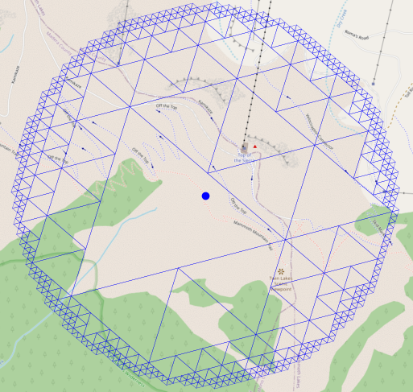
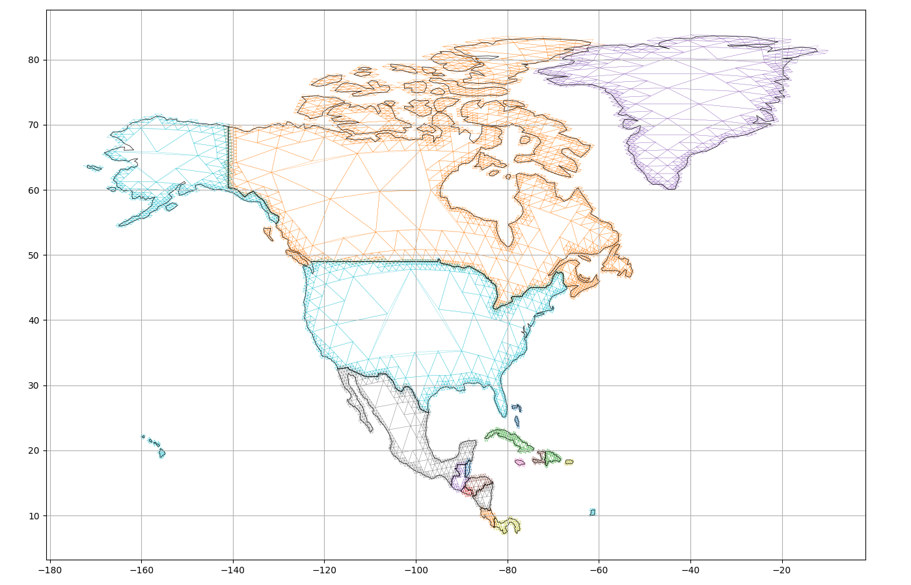
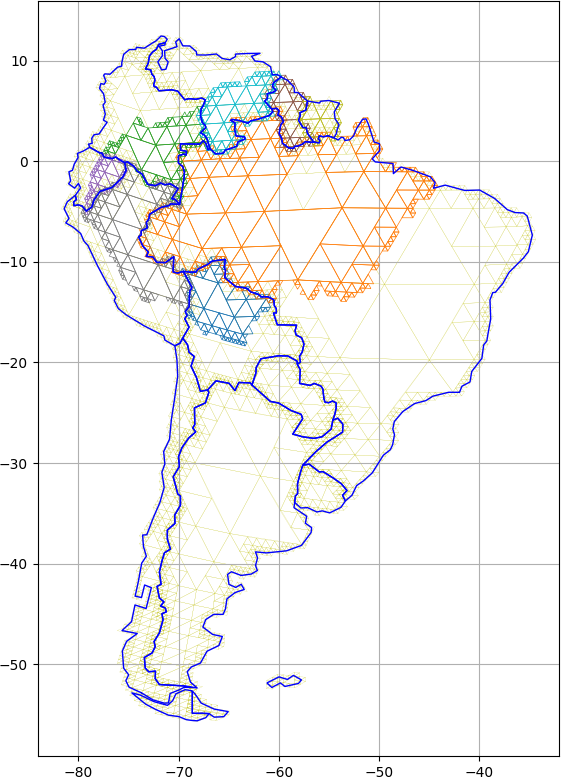

# Glossary

- Dataset
- Geospatial dataset: A dataset in which space is a dimension.
- Join / Spatial join
- Remote sensing Product

# Abstract
\pagebreak

# Introduction / Motivation

Geospatial data analysis extends conventional data analysis by introducing the special attribute of geolocation. This allows us to associate geolocalized observations with other geospatial objects and data, providing insights into phenomena that would otherwise appear unrelated. In the historic textbook example, Dr. John Snow graphically superimposed the locations of cholera clusters with the locations of water wells to identify the source of a 1854 cholera outbreak in London. In contemporary uses, we might associate whale injuries with shipping lanes, car accidents with road conditions, blackout locations with local public policies, NDVI measurements with plots of land, or estimations of snow water equivalent with watersheds. The ability to spatially associate datasets is predicated on the ability to evaluate spatial relations. We want to associate data that fulfill some spatial criteria; e.g., distance, intersection, or containment. As humans, we use spatial intuition to evaluate the relations of spatial objects: we may say: "Santa Barbara is in California", enabling us to associate data located in Santa Barbara with California. Computationally, we represent locations as geometric objects in a coordinate system, allowing us to compute spatial relations of arbitrary spatial objects.


At the beginning of any spatial analysis, we use the ability to evaluate collocation to find and extract relevant data: We define a spatiotemporal region of interest (ROI) and use this definition in a search query to extract data that (for example) intersects our region of interest. We then convert the extracted data to spatial objects  convenient for analysis, and apply spatial (and other) operators to these objects.

Unfortunately, these steps are seldom seamless in real-world analysis. In the 1992 sci-fi novel _Snow Crash_ [@stephensonSnow], Neal Stephenson envisages an information system called _CIC Earth_, a central user interface to access every bit of spatial data. There are some attempts to mimic this concept in, e.g., multiple virtual globe or Digital Earth projects  (e.g., Google Earth, NASA WorldWind, Microsoft TerraServer, VGIS [@Faust2000]), as well as in data repository interfaces such as NASA's Distributed Active Archive Centers (DAACs). In reality, there is no single querying and access mechanism for *all* spatial data. Instead, geospatial data is distributed by many actors across many repositories. Since no universal method exists to represent locations (specifically for locations having a spatial extent), repositories use local mechanisms for spatial data discovery and extraction. Some repositories may allow querying canonical or standardized place names (such as countries and states or survey site identifiers). Others may allow specifying the spatial ROI as rings, bounding boxes, or even polygons. Things are more complicated if the spatial ROI is dynamic, i.e., changing over time. Examples of evolving spatial ROI are events such as storms or wildfires.

Since there is no unified representation of data in general and geolocation in particular, repositories will deliver data in many possible container formats (*files*) and in many possible geospatial representations. Locations may be expressed in spherical or ellipsoidal geographic coordinate systems, and/or in two-dimensional projected (Cartesian) coordinate systems at varying resolutions.

Consequently, users have to step through an iterative process called Extract, Transform, and Load (ETL) rather than simply searching for and retrieving data. During ETL, data first has to be discovered, then extracted, subsequently transformed into a unified ("harmonized") representation, and finally loaded into a system in which the analysis operations can be carried out (i.e., a desktop GIS, such as ArcGIS; a database, such as PostGIS; and/or a programming language, such as MATLAB, Python, or R). The harmonization process is typically time-consuming, computationally expensive, and bespoke to a particular analysis environment[^0]. The analyst has to balance computational performance and data fidelity: An appropriate geographic or projected coordinate system, as well as a spatiotemporal resolution, has to be chosen, both of which have an implication on the preservation of spatial properties (areas, distances, shapes) and computational performance. While any commonly used geospatial relation test can theoretically be computed in both geographic and projected coordinate systems, operations are cheaper and thus more performant in projected 2D coordinate systems. Further, none of the commonly used desktop GISs (ArcGIS, QGIS) or programming libraries (`geopandas`, `sf`) supports spherical or ellipsoidal computations. Only within recent years, technologies that gracefully allow performing geospatial analysis in geographic coordinate systems ([S2geometries](https://s2geometry.io/), [PostGIS geographies](http://postgis.net/workshops/postgis-intro/geography.html), SphereGIS) have become available. Thus, geographic information systems and their users will typically harmonize the data by projecting all relevant data into a single (locally) appropriate coordinate system. Note that projecting geographic locations into a 2D space may not be an option if the ROI has a sufficiently large spatial extent.

[^0]: Anecdotally, consuming the majority of the time.


In the analysis of remote sensing data, two factors complicate the ETL process and the map operations. Firstly, remote sensing observations are overwhelming in volume: A single remote sensing instrument will register thousands of individual observations (instantaneous field of views (iFOVs)) per second. Since mission durations often span multiple years, a single space-born sensor may accumulate trillions of observations during its lifetime. (Even at its coarsest resolution MODIS aboard Terra has made over 6 trillion individual observations (observation is here to be understood as the registration of a spectrum) within its 22 years of operation; VIIRS aboard suomii registers about 1 trillion observations per year).

Secondly, remote sensing data is inherently irregular: Subject to the nonlinearity in the dynamics of the space- or aircraft trajectory, the optical properties of the atmosphere, and the topography of the Earth's surface, remote sensing observations are irregularly spaced. Thus every single observation has to be considered to have a unique location. The irregular spacing is only exacerbated for sensors with wide scan angles in which successive observations are registered under constantly changing viewing angles leading to intravariablity within a single set of observations.

The combination of irregularity and volume makes it impossible for data repositories to allow users to query and extract individual observations subject to arbitrarily defined regions of interest[^1]; it is infeasible to perform trillions of spatial relation tests ad-hoc using conventional technologies. Therefore, repositories bin observations into spatial grid tiles and/or temporal chunks (aka granules). The choice of the size of grid tiles and temporal chunks is relatively arbitrary and may differ vastly for individual products. Rather than actually querying observations, users thus query bins that intersect their region of interest. For the repositories, this has the advantage of performing far fewer spatial relation tests. However, it coarsens the level of spatial queryability. Rather than extracting the intersection of the data of interest and the ROI, users extract bins that intersect the ROI. This, in turn, means that users extract far more data than they need (leading to a transfer overhead) and requiring the users themselves to extract the data of interest from the bins.

[^1]: Exceptions may be technologies like OPeNDAP or WCS, which are mainly used as middleware and not (yet) designed for end-users


Though the user will have extracted only a small subset of the entire data by extracting only the intersecting bins, they are still faced with having to execute potentially trillions of spatial relation tests both to spatially subset and extract the data and to map the data to other geospatial objects. In most cases, this remains impossible, and even seemingly simple tasks such as clipping or cropping quickly become challenging in conventional geographic information systems and libraries such as QGIS, ArcGIS, PostGIS, R-Spatial, or `GeoPandas`. Since repositories are aware of these limitations, they will offer datasets in which the irregularly spaced locations of the observations are discretized into a (two-dimensional) grid subject to a sampling or aggregation function. In NASA terminology, those datasets are referred to as Level 3 products. The grid dimensions now function as an index and proxy to the geolocation of the observations. While it is often the only possible way for users to process remote sensing data that has been spatially discretized, this approach comes at a cost:

1. The precision of the geolocation of remotely sensed observations may be orders of magnitude higher than the selected discretized grid resolution (e.g., MODIS geolocation is approximately 50 m at NADIR [@Wolfe2002], whereas data is gridded into 500 m cells). Thus, discretization introduces a significant loss of precision in geolocation.
2. Since the repository performs discretization, the sampling function may be obscure, if not opaque to the users. This voids transparency and complicates the provenance trace. In some cases, users may favor a sampling function that differs from the one used to generate the gridded data. (A classic example may be that the MOD09GA sampling algorithm favors snow-free observation; being counterproductive if, e.g., snow-covered areas are investigated).
3. Not all remote sensing observations are available as gridded datasets (e.g., MODIS thermal anomalies MO/YD14*, VIIRS Day/Night band VNP02DNB), leaving those datasets inaccessible to users solely able to process gridded datasets.
4. The gridded data is a redundant representation of the observations, meaning that information is duplicated and thus storage space wasted


In summary: The goal of geospatial data analysis is to extract information about spatial objects, which is achieved by evaluating spatial relations, requiring spatial representations to be harmonized. However, data harmonization is tedious and non-trivial because of the multitude of container formats and data representations. Finally, evaluating spatial relation tests on large volumes of irregularly spaced data is a disabling bottleneck, currently only circumventable by discretizing locations, resulting in decreased observation fidelity.

> Frew note: Avoid using a "/" instead of "and" or "or".

# Towards a solution
The conflict between processibility and fidelity can only be resolved through technologies that can __performantly__ determine geospatial coincidence of extensive collections of irregularly spaced locations without needing data discretization. In this paper, I present a collection of software built around the Spatio Temporal Resolution Encoding (STARE) [@Kuo2017; @Rilee2018; @Rilee2019; @Rilee2020a; @Rilee2021], which drastically simplifies remote sensing data processing and empowers scientists to utilize the full fidelity of the data. STARE serves as a harmonizing location representation allowing for cheap spatial relation tests between arbitrarily shaped geospatial objects.

STARE is a universal geolocation encoding that obviates the need for gridding and resampling data. It is a geospatiotemporal indexing and representation scheme based on a hierarchical triangular mesh (HTM) [@Kunszt2001; @Dutton1996; @Goodchild1992; @ Fekete1990a], which recursively subdivides the Earth's surface into nested quadtrees, allowing triangular regions ("trixels") as small as \SI{0.01}{\meter\squared} to be identified with a single integer value. The nesting properties of STARE trixels are an elegant solution for aligning multi-resolution Earth science data. The geospatial coincidence between two trixels can be evaluated by comparing their paths in the STARE tree structure. STARE allows not only to express the location of a point/location (including its spatial uncertainty or resolution) but also arbitrarily shaped areas (polygons) through a trixel tessellation. The resolution is encoded into the STARE index, making it possible to evaluate spatial coincidences of data of differing and/or varying resolutions. This is a required feature to express the location of, e.g., instantaneous fields-of-view (iFOVs) of wide-scan swath data, which is characterized by considerable variations of the footprints of pixels at nadir vs. the footprint of pixels at the end of a scan. Data represented with STARE thus becomes interoperable without resampling and gridding. [@Rilee2021] describes the underlying principles of STARE and the reference implementation of the STARE API, which is exposed through Python bindings in the PySTARE library.


STARE has the potential to be used as a unifying representation for any geospatial data. However, STARE alone does not enable a researcher to work with diverse data seamlessly. Instead, a collection of software and abstractions are required to make STARE an opaque technology hidden in the backend of software and services. Thus, we created a collection of software that enables STARE-based geospatial analysis, allowing users to scale analyses in variety and volume. To enable a complete STARE-based geospatial workbench, we identified the need for the following capabilities:

- Represent features, such as points, lines, (convex and nonconvex) rings, polygons, and collections thereof, with STARE.
- Determine spatial relations between spatial objects in STARE representation to perform spatial subsetting and spatial associations.
- Associate location and attributes and in a unified data model.
- Use an API with functions and idioms similar to familiar geoprocessing software.
- Visualization capabilities.
- File I/O methods to read and convert commonly used feature- and raster data packages (shapefiles, geopackages, GeoTIFF, PostGIS) to STARE representations.
- Persist datasets in STARE representations.


Specifically for working with remote sensing data where data volumes and data variety makes ETL a significant burden, we additionally identified the following needs:

- Create STARE representations from conventional geolocations of remote sensing products, and storing them. I.e., making data STARE-ready.
- File I/O methods to read remote sensing data files (granules).
- Subset extensive local collections of remote sensing granules.

With the increased importance of cloud computing, we further addressed the need to store and access remote sensing data in cloud buckets and designed a parallel optimized data storage that allows aligning geospatial data in storage.

The remainder of the paper will discuss the following topics:

1. A brief summary of STARE and its capabilities for evaluating spatial coincidence.
2. The STARE base library and its Python bindings PySTARE, which stand at the bottom of our software stack.
3. Software to convert collections of remote sensing data from legacy/conventional representations to STARE representations (STAREMaster).
5. A high-level data abstraction and processing API (STAREPandas).
6. Storage mechanisms and backends for geospatial data in STARE representation (STARELite, PostSTARE, STAREPods).
7. A set of use cases that demonstrate the opportunities in STARE-based geospatial analysis.
8. An outlook on future developments of STARE software collection and services.
9. Conclusion.

# STARE
Using hierarchical data structures to represent or index geospatial data has been explored for decades [@Dutton1996; @Samet1988]. Hierarchical data structures are based on the recursive decomposition of an initial planar or solid and can, for example, be implemented as quadtrees [@Samet1988].

The initial applications of quadtrees in the geospatial domain have mainly focused on the representation of two-dimensional data in terms of visualization and image processing and were typically based on the tessellation of squares [@Lugo1995].

An early example of the use of quadtrees to represent the globe three-dimensionally is [@Dutton1984], who proposed the establishment of a Geodesic Elevation Model in which locations of elevation measurements are encoded or indexed in a quadtree. [@Dutton1989] suggests using this quadtree for general indexing of planetary data and envisages a replacement of coordinates in geospatial data with geocodes, given that the community could agree on a standard method to generate geocodes.

In parallel efforts [@Fekete1990; @Fekete1990a], and [@Goodchild1992] (and later also [@Lugo1995]) implemented the Quaternary Triangular Mesh (QTM) initially suggested by [@Dutton1984]. While [@Goodchild1992] used an octahedron as the initial regular solid, [@Fekete1990; @Fekete1990a] used an icosahedron. The resulting structures allow us to geospatially index every feature object on the planet. Contrary to [@Dutton1984], [@Fekete1990; @Fekete1990a; @Goodchild1992; @Lugo1995] tessellate each triangle into four triangles, allowing them to store each tessellated triangle with two bits. [@Goodchild1992] point out that the length of a trixel address (i.e., the index), which corresponds to the level/depth in the hierarchy, simultaneously indexes the size (or spatial uncertainty) of the indexed object.

[@Dutton1996] explored the tradeoffs of the choices of the initial solid (Tetrahedron, Octahedron, icosahedron) and with this empathizes the advantages of an octahedron for practical reasons: It is straightforward to orient an octahedron so that cardinal points (the poles) occupy vertices and cardinal lines (equator, prime meridian) align with edges; and when so oriented, most vertices lie in oceans or sparsely populated land areas.

The idea of indexing spherical data with a quadtree was picked up again by [@Barret1995] and further adapted by [@Kunszt2000; @Kunszt2001; @Szalay2005], who developed an indexing schema for the Sloan Digital Sky Survey (SDSS), which would later be implemented into the SkyServer[^31] [@Szalay2002; @Thakar2003]. The authors coined the term Hierarchical Triangular Mesh (HTM).

[^31]: The SkyServer was built by Tom Barclay, Jim Gray, and Alex Szaley from the TerraServer [@Barclay1998; @Slutz1999] source code. The latter was a project demonstrating the real-world scalability of MS SQL Server and Windows NT Server.

All nodes of the [HTM]{acronym-label="HTM" acronym-form="singular+short"} quad-tree are spherical triangles. The quadtree is created by recursively dividing triangles into four new triangles by using the parent-triangle corners and the midpoints of the parent triangle sides as corners for the new triangles. The name of a new node (triangle) is the concatenation of the name of the parent triangle and an index 1 through 4.Thus, node names increase in length by two bits for every level. The authors distinguish between [HTM]{acronym-label="HTM" acronym-form="singular+short"} names and the [HTM]{acronym-label="HTM" acronym-form="singular+short"} IDs, which is the 64 bit-encoded integer of the [HTM]{acronym-label="HTM" acronym-form="singular+short"} name. [@Kondor2014] use and extend the [HTM]{acronym-label="HTM" acronym-form="singular+short"} implementation to tessellate complex regions on the earth's surface.

[@Doan2016] emphasize the importance of indexes on the database performance as they govern data placement alignment and suggests [HTM]{acronym-label="HTM" acronym-form="singular+short"} as a promising approach.

[@Rilee2016] advanced the HTM implementation from right-justified mapping to left-justified mapping: In a right-justified mapping, trixels that are in proximity but at different levels are mapped to separate
locations on the number line. 

For example, the trixel **S0123** has binary HTM code `1 00 01 10 11` and thus HTM id 283, while the trixel **S01230** has the binary HTM code of `1 00 01 10 11 00` and thus HTM id 1132. The ids are far from each other while the both trixels share the same first 5 digits in their name prefix (and thus are contained in each other). 

Left justified mapping respects geometric containment by right-padding HTM binary codes with zeros. The level (in right-justified mapping implicitly given) is specified by the last digits of the name. In left justified mapping, the two trixels above would be named **S0123004** and **S01230005** (the last digits of the name (`4` and `5`) indicate level 4/5) which would translate to the binary HTM code of `1 00 01 10 11 00 00 100` and `1 00 01 10 11 00 00 101` and thus HTM ID 36228 and 36229. 

Therefore, co-located indexes are in similar index ranges regardless of the resolution. [@Kuo2017] extend the implementation with a temporal component and name the resulting universal geoscience data representation the SpatioTemporal Resolution encoding STARE.


# STARE Software collections

## STARE library API and Pstare

We implemented the left justified HTM encoding, extensively described in [@Rilee2021; @Rilee2020a; @Rilee2019; @Rilee2016; @Kuo2017 ] in the STARE C++[^STARE_base] base library, which stands at the base of the STARE software stack. Its functionality encompasses:

[^STARE_base]: [https://github.com/SpatioTemporal/STARE](https://github.com/SpatioTemporal/STARE)

1. Lookup of STARE spatial identifiers (SIDs) for points and regions.
3. Methods for interrogating and manipulating SIDs.
4. Conversion of SIDs to trixel node locations (edges and center points).
5. Perform intersection tests between SIDs and sets of SIDs.

The STARE library has no file I/O capabilities, nor does it directly support geographic objects or collection of geographic objects. It is thus agnostic to data formats. Geographic locations are passed as arrays of pairs of floating point WGS84 longitudes and latitudes, while STARE index values are passed as arrays of 64-bit integers.

In STARE, two notions of location exist: points and contiguous regions. A point is represented as a single SID, while a contiguous region is represented as a set of SIDs. A single SID simultaneously encodes a location and a level of uncertainty or resolution. A SID directly corresponds to a trixel, having three vertices, a center point, and a calculable area. The conversion of a point described as a single (latitude, longitude) pair is achieved by finding the trixel (at the specified quadfurcation level) that intersects the point. The lookup of the set of SIDs corresponding to a contiguous region is achieved by finding all trixels (of the specified quadfurcation level) with at least one vertex within the contiguous area.


STARE can look up SIDs for two types of contiguous regions: convex hulls and non-convex rings. For convex hulls, each edge of the hull is treated as a great circle (represented as its normal vector) that constrains the hull. A (trixel-) vertex (represented as an Earth-centered, Earth-fixed coordinate system (ECEF) vector) is found to be inside a hull if it is inside all constraints. For a hull with *n* edges, *n* dot products are thus required to determine if a vertex is inside the hull. In a recent addition, STARE can now also look up the SIDs of (non-convex) rings. The algorithm is based on SphereGIS' [^20] spherical ray-casting point-in-polygon (more accurately: point-in-ring) tests which are adapted from [@Bevis1989; @Chamberlain2007]: Each of the ring's edges is a great circle segment, which is represented as triplets of great circles: One to represent the edge's line and direction, one for the 'left' terminator and one for the 'right' terminator. To test if a vertex is inside the ring, we cast a ray from the vertex to another random point of the sphere.

The ray itself, thereby, is a great circle. Since the great circle ray wraps around the sphere, it will intersect the ring's edges either not at all or an even number of times. We, therefore, cannot merely count the number of intersections but instead have to distinguish how many times a ray _enters_ the ring. We know a ray intersects an edge if the intersection of the ray with the edge's great circle is between the edge's terminators. The terminators are represented as great circles perpendicular to both the edge and the node. Since the ray does not have a direction, we determine if a ray *enters* (rather than exits) the ring by first determining on which side of the edge the vertex in question is (i.e., calculating the dot product of the edge's great circle norm vector and the vertex). If the point is on the side of the edge's hemisphere, the ray exits the ring when it crosses the edge. If a point is inside the ring, the ray will exit it more often than it enters it. For a ring with *n* edges, a maximum of *n* cross products and 3 *n* dot products must be performed to determine if a given vertex is within a ring.

[^20]: [https://github.com/NiklasPhabian/SphereGIS](https://github.com/NiklasPhabian/SphereGIS)


![Spherical visualization of the point-in-ring test: The green great circle is the edge of a ring, with its two terminators (thin green vectors) and thick green normal vector. The point in question is the magenta vector. The ray is the red great circle which intersects the edge's great circle at the red vector. The intersection appears between the two terminators. Therefore we declare the ray to intersect the edge. Since the point is on the edge's hemisphere (positive dot product between magenta and thick green vector), we declare the ray to exit the polygon at the intersection.](images/C2/edge_intersect.png)


For convenience, STARE can further look up the sets of SIDs that cover a circular region around a given latitude and longitude, subject to a radius. STARE also allows for interrogation and manipulation of the STARE level of individual SIDs and calculating the area that the trixel denoted by a SID covers. The library further provides methods to look up the latitudes and longitudes of the vertices and center points of a trixel denoted by a SID. Those methods have proven helpful in creating visualizations of STARE-based geospatial analysis. Finally, STARE can evaluate spatial coincidence/overlap of two individual SIDs and between two sets of SIDs.



## PySTARE
While the C++ base library's API contains a minimum set of methods to perform STARE-based geospatial analysis, we recognize that geospatial analysis is often performed in an exploratory and ad-hoc manner in higher-level programming languages. Using SWIG, we therefore created Python bindings to a subset of the base libraries' API and exposed them in a Pythonic API in the `PySTARE` project [^30]

[^30]: Github: [https://github.com/SpatioTemporal/pystare](https://github.com/SpatioTemporal/pystare); \newline Readthedocs: [https://pystare.readthedocs.io](https://pystare.readthedocs.io/en/latest/).

Python became a convenient choice since it is commonly used and popular in geospatial analysis. Various Python libraries exist to read data formats commonly used in the geospatial analysis (e.g., HDF4, HDF5, NetCDF, SQL, CSV, shapefiles, geopackages) and to visualize geospatial data (matplotlib, GeoPandas). PySTARE is intended to be the primary user inter interface to STARE. The development, therefore, focuses on complete documentation, tight adherence to PEP style guides, test-driven continuous integration, and a simple path for installation: We provide pre-compiled wheels distributed through PyPi, allowing PySTARE and all its dependencies to be installed with a single command.

The following code snippet demonstrates how points and rings are converted to SIDs and how the spatial relations between sets of SIDs can be evaluated with PySTARE.

```python
import numpy
import pystare

points_lats = [52.52063377345684, 48.86507804019062]
points_lons = [13.40137845762151, 2.3357209301448676]
points_sids = from_lonlat(lons, lats, level)
			 

ring_lats = [53.75702912049104, 54.98310415304803, 53.69393219666267, 
 		     50.128051662794235, 49.01778351500333, 47.62058197691181, 
 		     47.467645575544, 50.266337795607285, 53.75702912049104]	
 		     
ring_lons = [14.119686313542559, 9.921906365609118, 7.100424838905269, 
			 6.043073357781111, 8.099278598674744, 7.466759067422231, 
			 12.932626987365948, 12.240111118222558, 14.119686313542559]
			 
sids_ring =  pystare.cover_from_ring(lat, lon, 5)

pystare.intersects(cover, sids, method='binsearch')
array[True, False]
```


## STAREMaster and STARE sidecar files
Currently, the locations of remote sensing observations are represented either as geolocated iFOV features, where each observation is associated with an Earth location (usually WGS84 longitude and latitude), or as gridded and projected fields of observations, in which the grid indices can be converted to geolocations. In order to perform STARE-based geospatial analysis on these data, the spatiotemporal index values for each observation or grid cell have to be calculated. Since these calculations involve expensive transcendental functions, the index values are calculated once and then stored.

STAREMaster_py[^32] is a library and set of command line tools that allow looking up the STARE representation of common remote sensing products and storing those STARE representations into companion ("sidecar") files [@Gallagher2021a], which are intended to be read together with the data files during the analysis. STAREMaster_py is written to be easily extendable to allow ingestion of other products. It handles a subset of MODIS, VIIRS, and various microwave products. STAREMaster_py further includes convenience utilities to verify the integrity of local granule+sidecar collections (e.g, to detect missing sidecars.)

[^32]: Github: [https://github.com/SpatioTemporal/STAREmaster_py](https://github.com/SpatioTemporal/STAREmaster_py)

During the SID lookup for each observation, the STARE quadfurcation level of each SID is adapted so that the corresponding trixel area matches the extent of the observation's iFOV as closely as possible.


STAREMaster_py can also create sidecar files for gridded products, such as the MODIS level 3 surface reflectance product MOD09GA[^MOD09GA]. MOD09GA uses a sinusoidal projection and the MODIS sinusoidal grid divides the earth into 460 nonoverlaping "tiles" of approximate \SI{10}{\degree} x \SI{10}{\degree}. MODIS observations are spatially binned into those tiles. This makes accessing data for a given region simple: A user only once has to evaluate in which tiles cover the ROI and then request data for those tiles. Each tile contains 2400x2400 cells (at 500 m resolution) into which individual overservations are further binned. Even though the individual observations are irregularily spaced, the cells remain fixed. This means that all granules of the same tile can share a single sidecar file. Or in other words: Only one sidecar for each of the 460 tiles has to be created once.

[^MOD09GA]: 10.5067/MODIS/MOD09GA.006

Besides looking up the SIDs for each observation, STAREMaster_py also computes the set of SIDs that cover the footprint of the granule (the "STARE cover"). For granules that do not contain extent information, the STARE cover is computed by dissolving the set of the SIDs of the observations. "Dissolving" means that if a set contains four child nodes of the same parent, the four child nodes get replaced by the parent node.

The following conde snippet shows the command line interface of STAREMasters_py's `creat_sidecar_files.py` program. A user will either specify individual granules or a folder containing a collection of granules for which sidecars should be created. Alternatively, the user can specify a grid, such as a MODIS tile, for which a sidecar should be created. The user can further optionally specify where the sidecars should be create, provide a hint for what product the granules are, how many workers should be used in parallel, and if a sidecar archive should be created. The sidecar archive contains a list of all created sidecars. This can be particularily useful to avoid re-creation of sidecar files e.g. for a granule collection which is increasing over time.


```bash
usage: create_sidecar_files.py [-h] [--folder folder]

[--files file1 [file2 ...]] [--grid files] [--out_path OUT_PATH]
[--product product] [--cover_res cover_res]
[--workers n_workers] [--archive archive] [--parallel_files]

Creates Sidecar Files

options:

 -h, --help              show this help message and exit
 --folder folder         the folder to create sidecars for
 --files file1 [file2 ...] the files to create a sidecar for
 --grid files            the grid to create a sidecar for (e.g. IMERG)
 --out_path OUT_PATH     the folder to create sidecars in;
                         default: next to granule
 --product product       product (e.g. cldmsk_l2_viirs, hdfeos,
                         l2_viirs, mod05, mod09, vj102dnb,
                         vj103dnb, vnp02dnb, vnp03dnb, ssmi)
 --cover_res cover_res   max STARE level of the cover.
                         Default: min resolution of IFOVs
 --workers n_workers    use n_workers (local) dask workers
 --archive archive      Create sidecars only for granules
                        not listed in the archive file.
                        Record all create sidecars and their
                        corresponding granules in it.
 --parallel_files       Process files in parallel rather than
                        looking up SIDs in parallel
```


STARE sidecar files are written out in netCDF format, containing the following variables:

- The SID for each observation or grid cell. If a granule contains more than one resolution (such as the MODIS surface reflectance product MOD09, containing \SI{250}{\meter}, \SI{500}{\meter}, and \SI{1000}{\meter} resolution) one SID variable is create for each resolution.
- The set of spatial index values that cover the footprint of the granule (STARE Cover)
- Optionally, the latitudes and longitudes; one variable for each resolution

Ultimately, we expect STARE sidecar files will be distributed along with the corresponding data, by the data producers. Until then, the generation of sidecar files will remain the first step a user must perform in the STARE-based data harmonization process. Since we recognize that the generation of sidecar files is a compute-intensive but parallelizable process, we implemented `STAREMaster_py` to natively support multiprocessing, either for calculating multiple SIDs in parallel for observations in a single granule, or for processing multiple granules in parallel. The multiprocessing is handled by the dask[^34] library. Currently, a local dask cluster is started, but `STAREMaster_py` can be adapted to use any (remote) dask cluster. To avoid (accidental) redundant creation of sidecar files, we added an archive option that will register all granules for which a sidecar has successfully been created. This is particularly helpful for growing collections, or when the sidecar creation of an extensive collection gets interrupted.

[^34]: [https://www.dask.org/](https://www.dask.org/)


## STAREPandas

STAREPandas[^35] is a Python library that provides a high-level interface to STARE and a unified data representation. It allows users to perform STARE-based spatial operations and related tests on sets of features that would otherwise require more extensive tooling; e.g., by using a STARE-extended spatial database or geographic information system (GIS).

[^35]: [https://github.com/SpatioTemporal/STAREPandas](https://github.com/SpatioTemporal/STAREPandas); [https://starepandas.readthedocs.io](https://starepandas.readthedocs.io)


### Introduction
The geographic information system (GIS) literature [@bolstad2002gis; @worboys2004gis; @mitchell1999esri; @green2017imagery; @wise2003gis; @law2015getting; @rigaux2002spatial] conventionally distinguishes between two types of spatial data: raster and vector. Vector data describes locations and shapes using coordinates to represent points or the vertices of lines, rings, and polygons. Raster data, on the other hand, represent locations as cells of a rectangular array ("grid"). The geolocation of a grid cell is implicitly given by the array indices (the row and column coordinates) of the cell and a transformation (matrix) that may be used to translate the array indices into geospatial (geographic or projected) coordinate system. Vector datasets are often conceptually represented as tables where each row corresponds to a feature and each column to an attribute. For raster datasets, identically shaped arrays are stacked as bands to associate multiple attributes with a single cell. Both vector and raster data may be used to describe discrete features, such as roads, houses, or the outline of countries, and to represent spatially continuous phenomena such as land use, elevation, or surface temperature. However, vector data are typically used to represent feature data, while raster data represent continuous phenomena. Since raster data discretizes locations, the determination of spatial coincidence between two raster datasets is trivial: two cells are coincident if they share the same indices. On the other hand, determining spatial coincidence between two vector datasets requires potentially expensive point-in-ring calculations.

Geolocated swath data[^21] fall in neither the feature data category nor the raster data category. Even though swath data is stored in arrays, which may seem raster-like, rather than using a transformation matrix, swath data use *maps*: two ancillary arrays of the same shape as the data (one containing latitudes, the other containing longitudes) to provide individual (center) coordinates for each cell. There are arguments to be made for interpreting swath data as raster data; after all, swath observations are usually continuously recorded, and neighboring array cells represent neighboring observations. The EarthDB project[@Planthaber2012; @Planthaber2012b] as well as [@Tan2017] and [@Krcal2015] demonstrate the challenges with processing geolocated remote sensing swath data as rasters. In their approaches, data is indexed through integerized latitude-longitudes grids, requiring re-indexing and compromises between array sparseness and data fidelity. On the other hand, one may argue that it is merely an artifact that swath data is represented in 2-D arrays. Since the geolocation of a cell cannot be implicitly calculated from the indices (row and column numbers) but must be retrieved from the map, geolocated swath data may just as well be represented in flattened 1-D arrays or tables, making them appear much more feature-like.

[^21]: NASA Earth-observing System Data and Information System EOSDIS distinguishes between 5 processing levels (0 through 5). Levels 1 and 2 are data "at full resolution, time-referenced, and annotated with[..] georeferencing parameters", which is what we reference with swath data. [https://www.earthdata.nasa.gov/engage/open-data-services-and-software/data-information-policy/data-levels](https://www.earthdata.nasa.gov/engage/open-data-services-and-software/data-information-policy/data-levels)

STARE removes the need for distinguishing between vector and raster datasets. Since a single SID encodes both location and extent, STARE can be used to express grid cells, iFOVs, points, and arbitrarily shaped areas or points. The dilemma of conceptualizing swath data as raster or vector is thus resolved.


### Data Structure
STAREPandas provides a uniform data structure to hold any geospatial data type. It represents any location (point, polygon, grid cell, iFOV) as an single feature, making geospatial data truly interoperable. STAREPandas extends GeoPandas[^36] with a STARE spatial type. It inherits GeoPandas' relational model to tie together locations and attributes of collections of features. STAREPandas exposes STARE functionality using extensions to the GeoPandas API, lowering technical hurdles for Python programmers to perform STARE-based geospatial analysis.

[^36]: [geopandas.org](https://geopandas.org/); [https://github.com/geopandas/geopandas](https://github.com/geopandas/geopandas)

In contrast to GeoPandas' `GeoDataFrames`, where geometries are represented as simple features ([ISO 19125-1:2004](https://www.iso.org/standard/40114.html)), STAREPandas' `STAREDataFrames` represent geometries as SIDs, corresponding to trixels of variable sizes and resolutions. Polygons are represented as sets of SIDs whose corresponding trixels cover the polygon, while points are represented as individual trixels at the HTM tree's leaf resolution. Single SIDs represent grid cells and features such as sensor fields-of-view (FOVs) at a quadfurcation level corresponding to the cell's/iFOV's spatial extent/area.

A `STAREDataFrame` has one row per feature and one column per attribute. The `STAREDataFrame` has the special SID column, which holds the STARE representation of the location and on which all STARE-based geospatial operations are executed.

### Conversions and I/O

#### Read feature data

Using GeoPandas' I/O capabilities, STAREPandas can read most vector-based data formats. `STAREPandas` can then convert between GeoPandas' internal simple feature representation of geometries such as points, polygons, and multipolygons and STARE's spatial SID representations. While PySTARE has methods to convert points, convex hulls, and rings to SIDs, it cannot handle more complex geometries such as "swiss cheese" polygons (polygons with holes) or multipart geometries (which may be discontiguous). STAREPandas adds those capabilities.

[Reference: make_sids()](https://starepandas.readthedocs.io/en/latest/docs/reference/api/starepandas.read_geotiff.html#starepandas.make_sids)

Since GeoPandas can read and write most geospatial feature data formats, STAREPandas is a convenient way of converting geospatial feature data (e.g., shapefiles) to STARE representations.




#### Read Raster Data

STAREPandas extends GeoPandas' capabilities to load raster data from GeoTIFFs. STAREPandas will extract the transformation matrix from the GeoTIFF's metadata and compute the WGS84 coordinates of each grid cell center. It then computes the SID for each grid cell center and adapts the STARE quadfurcation level so that the trixel area will match the cell area as closely as possible. Each cell is then represented as a feature with all band values as attributes. A user may additionally choose to add the latitudes and longitudes, the array coordinates, or the projected coordinates as attributes. STAREPandas' ability to read raster data may be compared to a vectorization operation of a conventional GIS. However, while vectorization of a grid is expensive and results in increased storage requirement, STARE naturally collapses the two spatial dimensions into one.

[Reference: read_geotiff()](https://starepandas.readthedocs.io/en/latest/docs/reference/api/starepandas.read_geotiff.html#starepandas.read_geotiff)


### Read Granules

While fundamentally the same data structures are used in disseminating remotely sensed data (points, arrays), data products often idiosyncratically represent differences in orbits, viewing strategies, spatial and temporal resolutions, etc. [@Kuo2017]. As a result, each sensor's product requires specific domain knowledge and tailor-made tools to load and interpret the data, and especially the location information. To facilitate working with remote sensing data STAREPandas adds methods to load selected gridded remote sensing data and geolocated swath data into a `STAREDataFrame`. The STARE representations can either be generated on-the-fly during loading or read from a pre-generated STARE "sidecar" file. The read_granules() facilities are designed to be easily extensible to support additional products.

[Reference: read_granule()](https://starepandas.readthedocs.io/en/latest/docs/reference/api/starepandas.read_granule.html)

A user can choose to add the WGS84 latitudes and longitudes, as well as the array coordinates as attributes. Keeping the array indices as attributes can be of interest to maintain the neighborhood of each observation, or (for scanning sensors) to calculate viewing geometries. Finally, the array indices can be used to reconstruct the original array from the dataframe.

[Reference: to_array()](https://starepandas.readthedocs.io/en/latest/docs/reference/api/starepandas.STAREDataFrame.to_array.html).

Similarly to reading raster data, all variables (in hdf4 terms: scientific datasets) of the granule will be read and added as attributes for each feature. For granules containing multiple resolutions, a user chooses a single resolution to be read at a time. This means that each resolution is read in separately into a separate `STAREDataFrame`.

#### Read Folders / Create Catalogs

Maintaining, searching, and subsetting large local collections of granules can become a challenge. We thus implemented a method to catalog local collections to perform a spatial searches and subsetting using `STAREPandas` and STARE sidecar files. The catalogs contain one row per granule, and each row contains the path of the granule and the sidecar, the granule acquisition timestamp, and the stare representation of the granule's cover (as read from the sidecar file). Creating such a catalog dataframe for extensive local collections of granules is helpful in quickly identifying granules that intersect a potentially complex ROI or finding multiple granules that intersect each other.

[Reference: folder2catalog()](https://starepandas.readthedocs.io/en/latest/docs/reference/api/starepandas.read_granule.html)

#### Persisting STAREDataFrames

Like any other Python object, `STAREDataFrames` can be serialized and stored as pickles or HDF5 files using the inherited Pandas methods. STAREPandas additionally extends Pandas' database functionality to read and write to/from SQLite, Postgresql, and SciDB. The STARE software collection includes STARE extensions to all three databases (STARELite[^STARELite], PostSTARE[^PostSTARE], SciDB-STARE[^SciDB-STARE]). STAREPandas can function as a convenient pivot format for loading data into STARE-enabled databases.

[^STARELite]: [https://github.com/SpatioTemporal/STARELite](https://github.com/SpatioTemporal/STARELite)

[^PostSTARE]: [https://github.com/SpatioTemporal/StarePostgresql](https://github.com/SpatioTemporal/StarePostgresql)

[^SciDB-STARE]: [https://github.com/NiklasPhabian/SciDB-STARE](https://github.com/NiklasPhabian/SciDB-STARE)

STAREPandas additionally implements its own storage mechanism based on STARE-PODS (Parallel optimized data structure). A PODS spatially shards data at a user-defined HTM quadfurcation level. Each shard is a trixel at this user-defined quafuraction level and contains only data that lie within this trixel. To write a `STAREDataFrame` into a PODS, it is first split into shards. Each row of a single shard shares the same SID prefix. E.g. if a PODS is created at quafurcation level 4, all data in a single shard are contained with the same level 4 trixel. Thus all SIDs within the same shard share the same first 8 bits. The individual shards are then written out to files.


[Reference: write_pods()](https://starepandas.readthedocs.io/en/latest/docs/reference/api/starepandas.STAREDataFrame.write_pods.html)

A PODS can, in turn, be read back into a `STAREDataFrame` using STAREPandas' `read_pods()` method.

[Reference: read_pods()](https://starepandas.readthedocs.io/en/latest/docs/reference/api/starepandas.STAREDataFrame.read_pods.html)


### STARE-based spatial operations
STAREPandas allows us to perform the STARE-based geospatial relation tests 'intersects' and 'disjoint.' Those functionalities enable STARE-based spatial subsetting and spatial joins, which are common bottlenecks when working with large collections of irregularly spaced data. They function analogously to GeoPandas [intersects()](https://geopandas.org/en/stable/docs/reference/api/geopandas.GeoSeries.intersects.html) and [disjoint()](https://geopandas.org/en/stable/docs/reference/api/geopandas.GeoSeries.disjoint.html) methods. The relation tests are wrapped in the STARE-based join method [stare_join()](https://starepandas.readthedocs.io/en/latest/docs/reference/api/starepandas.stare_join.html?highlight=join#starepandas.stare_join), which can spatially join two dataframes.

References: [stare_intersects()](https://starepandas.readthedocs.io/en/latest/docs/reference/api/starepandas.STAREDataFrame.stare_intersects.html), [stare_disjoint()](https://starepandas.readthedocs.io/en/latest/docs/reference/api/starepandas.STAREDataFrame.stare_disjoint.html)

The following code snippets demonstrates how a `STAREDataFrame` can be bootstrapped from a `GeoDataFrame` and how STARE-based intersects tests can be performed. The data is visualized in figure 15.

```python

import geopandas
import starepandas

world = geopandas.read_file(geopandas.datasets.get_path("naturalearth_lowres"))
n_america = world[world.continent=='North America'].reset_index()
n_america = starepandas.STAREDataFrame(n_america)
n_america = n_america.set_sids(n_america.make_sids(level=9))

santa_barbara_sid = pystare.from_lonlat([-119.81100397568609], 
										[34.44687326105255], 
										level=15)

n_america[n_america.stare_intersects(santa_barbara_sid)].name
United States of America
```


> Frew note: stopped here 2022-10-21

Illustrative uses cases are:
- Determining the overlap of complex geographic regions
- Finding granule footprints that intersect an ROI (i.e., searching for granules)
- Spatially associating data from heterogeneous collections of observations
- Cross calibration (i.e., finding coincident observations in two irregularly spaced datasets)
- Finding spatially (but not temporally) coinciding observations from the sensor (helpful, e.g., to find baseline observations for spectral unmixing)
- Classifying or subsetting extensive collections of points/iFOVs to complex geographic regions e.g.
- Mapping VIIRS nightlight intensity to political boundary
- Mapping MODIS/VIIRS NVDI to crop fields

The indexed data structure of STAREPandas and STARE's nesting properties offers a convenient speedup for intersection tests: Consider an extensive collection of iFOVs, each represented by a single SID at varying levels and a complex geographic region represented by a set of SID and the objective to find all iFVOs that intersect the ROI. To speed up the intersect test, we implemented the following algorithm:

1. All iFOVs with a SID smaller than the smallest SID of the ROI and all iFOVs with a SID larger than the largest SID of the ROI are not intersecting the ROI. This may significantly reduce our search space.
2. We determine the highest STARE level of all the SIDs representing the ROI and the highest STARE level of all the SIDs representing the iFOVs. The lower one of the two is the STARE level at which we perform the intersects tests. We can ignore all location bits beyond the intersects level.
3. Since we can ignore the location bits beyond the intersects level, we can take the *set* of all iFOV SIDs at this level. This set will likely be orders of magnitude smaller than all SIDs representing the iFOVs.
4. We now merely need to perform the stare spatially intersects tests on this set of SIDs.

STAREPandas also provides APIs to query and manipulate the SID level:


- [hex()](https://starepandas.readthedocs.io/en/latest/docs/reference/api/starepandas.STAREDataFrame.hex.html#) returns the SIDs in hexadecimal representation for each feature.
- [spatial_resolution()](https://starepandas.readthedocs.io/en/latest/docs/reference/api/starepandas.STAREDataFrame.spatial_resolution.html) returns the STARE level of each feature.
- [trixel_area()](https://starepandas.readthedocs.io/en/latest/docs/reference/api/starepandas.STAREDataFrame.trixel_area.html) returns the approximate area of the trixel represented by the SID for each feature.
- [to_stare_resolution()](https://starepandas.readthedocs.io/en/latest/docs/reference/api/starepandas.STAREDataFrame.to_stare_resolution.html) lets the user set the STARE resolution. The user can choose if the location bits beyond the resolution should be cleared (set to 0) or not.
- [clear_to_resolution()](https://starepandas.readthedocs.io/en/latest/docs/reference/api/starepandas.STAREDataFrame.clear_to_resolution.html) clears the location bits beyond the resolution.

In Pandas dataframes, map-reduce is carried out by using the [grouby()](https://pandas.pydata.org/pandas-docs/stable/reference/api/pandas.DataFrame.groupby.html) method to map/group rows and then applying an aggregate function to the groups to reduce them. Since conventional aggregate functions (mean, max, sum) cannot be applied to (simple feature) geometries, GeoPandas implements the abstracted map-reduce function [dissolve()](https://geopandas.org/en/stable/docs/reference/api/geopandas.GeoDataFrame.dissolve.html), which will yield a `GeoDataframe` in which geometries are aggregated using a spatial [unary_union](https://geopandas.org/en/stable/docs/reference/api/geopandas.GeoSeries.unary_union.html). Seminally, STAREPandas implements the STARE-based map-reduce function [stare_dissolve()](https://starepandas.readthedocs.io/en/latest/docs/reference/api/starepandas.STAREDataFrame.stare_dissolve.html) that will aggregate SIDs using a stare_union. The stare_union on a collection of SIDs is created by taking the set of those SIDs and then recursively replacing any four SIDs in that set that shares the same parent node with the parent node. Note: Both GeoPandas' `dissolve()` and STAREPandas' `stare_dissolve()` can dissolve by `None`, yielding a dataframe dissolved into a single feature, unionizing all geometries/SIDs.




Finally, STAREPandas implements a [stare_intersection()](https://starepandas.readthedocs.io/en/latest/docs/reference/api/starepandas.STAREDataFrame.stare_intersection.html) method, which yields the spatial intersection of two STAREDataFrames.

### Plotting

Using STARE's ability to look up the trixel vertices for SIDs, STAREPandas converts SIDs and collections of SIDs to simple feature geometries. A feature with a single SID, e.g., representing an iFOV or a point, will be converted into a single triangular simple feature polygon, while features with a set of SIDs, e.g., representing a cover, are converted into a simple feature multipolyon of trixels. The `STAREDataFrame` method [make_trixels()](https://starepandas.readthedocs.io/en/latest/docs/reference/api/starepandas.STAREDataFrame.make_trixels.html) generates a GeoPandas `GeoSeries` of the same length of the dataframe with each row containing the simple feature geometry of the trixels. This `GeoSeries` may be attached back to the `GeoDataFrame`. STAREPandas can then use `GeoPandas'` rich plotting library to plot the trixels.

The ability to plot features in trixel representation has proven immensely helpful in exploring and communicating STARE-based geospatial analysis.

### Parallelized /dask
Akin to [dask-geopandas](https://github.com/geopandas/dask-geopandas), STAREPandas uses Dask to parallelize performance bottleneck functions. We implemented parallelized methods for spatial coincidence tests (intersects, disjoint), for the lookup of SIDs from latitudes and longitudes and shapely objects, and the generation of trixels from SIDs.

## STARELite and PostSTARE
The SDSS SkyServer [@Szalay2002; @Thakar2004; @Thakar2003; @Budavari2010] is based on an MS SQL server extended to use HTM as spatial indices. [@Kondor2014] adapt the concept to perform the classification of geospatial (rather than celestial) objects. Similarly, we created extensions for PostgreSQL and SQLite to utilize STARE.

STARELite[^STARELite] and PostSTARE[^PostSTARE] are SQLite and PostgreSQL STARE extensions allowing us to perform a subset of STARE-based geospatial operations within the relational databases SQLite and PostgreSQL. STARELite/PostSTARE allow converting conventional representations of locations specified as latitude and longitude table columns or as *WKB blobs* (used by SpatiaLite, GeoPackages, and PostGIS) of points or polygons to their STARE representation. They can further perform spatial relation tests, allowing STARE-based spatial joins of tables.

Ample use of STARELite is cataloging volumes of remote sensing granules that researchers often possess in their local storage. This application uses STARELite to determine subsets of granules intersecting arbitrary ROIs. Further, STARELite can be used for the inverse search problem: Determining all spatially coincident granules of an individual granule. STARELite and STAREMaster may leverage other components of the STARE ecosystem; namely STARE sidecars, which hold the trixel index values of each iFOV and a set of trixels representing the cover of each granule; STAREMaster, which is used to generate STARE sidecar files; and STAREPandas, used to load data into the databases.


## STARE-Pods (yet another DGG)

STARE-PODS (Parallel optimized data structure) [@2021AGUFMIN32A; @Rilee2022] is an approach for geospatial sharding, i.e., chunking geospatial data into geospatial bins. For STARE-PODS, each bin is a geographical region defined by a trixel at a relatively low level. On traditional filesystems, a bin (a POD) may be a filesystem directory named after the SID it represents and contains all data chunks that are within the trixel. For Cloud Object Stores (lacking directories), each chunk will be stored in an object whose name/key is prepended with the SID of the bin it falls into.


To implement STARE-PODS, we first generate STARE indices for all observations of all granules (using `STAREMaster`). If we decide, e.g., to use quadfurcation level 4 for partitioning the data, we then repackage data elements within each quadfurcation 4 trixel into a file as a STARE chunk. If we use a directory structure to implement the STARE hierarchy, all spatially close chunks and thus observations will be in the same respective level 4 directory. In cloud object stores, all chunks would share the same POD-name prefix. Finding the overlaps between two or more datasets thus becomes trivial and scalable. Since our STARE API can convert arbitrary (spherical) polygons into STARE covers at any given quadfurcation level, finding overlaps between an ROI and any STARE chunk is also trivial.


We have prototyped STARE-PODS with STARE-based data partitioning and organization on a traditional file system. This prototype uses three 1-month cross-calibrated microwave radiometer/imager datasets produced by the NASA Precipitation Processing System for NASA Precipitation Measurement Missions, which include (cross-)calibrated brightness temperatures from 18 satellite-borne microwave radiometer/imager instruments in NASA's Global Precipitation Measurement (GPM) mission era, such as AMSR2, ATMS, GMI, MHS, or SSMIS. This set of data products exhibits not only data varieties across the products of different instruments but, due to different iFOV resolutions for different microwave frequencies, also within the same product of the same instrument.

For convenience, we built a catalog on top of the PODS. The catalog is a STARELite database containing one row per chunk. This makes, e.g., finding all chunks that spatiotemporal intersects trivial.


In a testing environment, we retrieved one month's worth of XCAL SSMIS data from F16, F17, and F18 for the period of 2021-01-10 to 2021-02-09; a total of 1314 granules. We created STARE sidecar files for each of those granules. Each sidecar contains the SID of each observation/iFOV/pixel of the granule as well as a set of SIDs representing the spatial coverage of the entire granule.

We then loaded the collection of granule/sidecar pairs into a level 4 PODS, using STAREPods_py. A level 4 PODS shards data at the 4th STARE quadfurcation level. Considering the initial solid with 8 faces, this means that a level 4 PODS has 2048 PODs. The 1314 original granules are split into 3,675,403 chunks distributed over the 2048 PODs. On average, each POD contains about 1800 chunks, though their distribution varies. The size of the chunks varies between 10 kB to 100 kB. Each chunk is a pickled `STAREDataFrame` containing the latitude, longitude, timestamp, SID, as well as the measurements for each observation.

As a benchmarking test, we evaluated the performance of loading all SSMIS data that intersects a complex spatiotemporal bounding box. As the complex spatiotemporal bounding box, we used the extent of a precipitation event over the south western US lasting from the 2021-01-24 until the 2021-01-27. Our testing environment is a m5.x4large AWS instance with both the granules and sidecars as well as the PODS residing on a flexFS[^flexfs] volume.

[^flexfs]: https://www.paradigm4.com/technology/flexfs/


In the conventional approach, we utilize the granule naming convention to temporarily subset the granules to the temporal bounding box. This reduces the number of granules from 1314 to 170 candidate granules. We then iteratively read the STARE cover from each sidecar of the candidate granules and verify if the granule spatially intersects our ROI. If not, we discard the candidate. If yes, we load the entire granule into a `STAREDataFrame` and spatially subset it to the ROI (using STARE). Out of the 170 candidate granules, 70 granules spatially intersect the ROI. Finally, we concatenate all subsetted granule `DataFrames`. The whole process takes a total time of 46.2 s  102 ms (mean  std. dev. of 10 runs) on our testing server.

  
  

We extended the conventional approach by making use of a granule catalog. A granule catalog is a database containing the paths of granules and their sidecars, the start and beginning times of the granules as well as the spatial coverages of the granules. Using the catalog, we can immediately query for the granules that intersect the spatiotemporal ROI. We can then only load those granules and spatially subset them to our ROI. Using the catalog, we slightly improve the runtime to 44.1 s  103 ms (mean  std. dev. of 10 runs)

In the STAREPods approach, we first find all the PODs that may contain chunks intersecting the ROI. We can simply achieve this by converting the SIDs of STARE cover of our ROI to level 4 (the level of our PODS) and then take the set of those SIDs. Only 29 of the 2048 PODs do intersect our ROI. We then utilize STAREPandas `read_pods()` function to load the chunks into a single `STAREDataFrame`.  The function `read_pods()` iterates through the candidate PODs and loads all chunks whose name contains a specified pattern. Again, we utilize the granule naming convention and specify a pattern corresponding to our temporal bounding box. We finally subset the loaded `STAREDataFrame` to our ROI since it contains observations that coincide with the ROI at level 4, but not at the ROI at its original resolution (level 9). The whole process takes a total time of 2 s  15.8 ms (mean  std. dev. of 10 runs) on our testing server, bringing us a speedup of over 20x compared to the conventional approach.


 
Each of the three approaches resulted in loading 225,539 individual SSMIS observations.

\newpage
\clearpage

# Application examples
## Night lights
> Consider a certain night in August. Princess Leigh-Cheri was gazing out of her attic window. The moon was full. The moon was so bloated it was about to tip over. Imagine awakening to find the moon flat on its face on the bathroom floor, like the late Elvis Presley, poisoned by banana splits. It was a moon that could stir wild passions in a moo cow. A moon that could bring out the devil in a bunny rabbit. A moon that could turn lug nuts into moonstones, turn Little Red Riding Hood into the big bad wolf. For more than an hour, Leigh-Cheri stared into the mandala of the sky.  Does the moon have a purpose? she inquired of Prince Charming. Prince Charming pretended that she had asked a silly question. Perhaps she had. The same query put to the Remington SL3 elicited this response:
>
> Albert Camus wrote that the only serious question is whether to kill yourself or not. Tom Robbins wrote that the only serious question is whether time has a beginning and an end. Camus clearly got up on the wrong side of bed, and Robbins must have forgotten to set the alarm.
> There is only one serious question. And that is: Who knows how to make love stay?
>
> Answer me that and I will tell you whether or not to kill yourself. Answer me that and I will ease your mind about the beginning and the end of time. Answer me that and I will reveal to you the purpose of the moon

>  From Still Life with Woodpecker (1980), Tom Robbins

[@Kondor2014] demonstrated how an HTM-enabled relational database made it possible spatially to classify billions of geolocated tweets into complex political boundaries. The presented issue can be generalized as a challenge to classify extensive collections of irregularly spaced observations/events (the tweets) to complex (i.e., discontinuous and/or containing holes) geographic regions.


Similarly, we demonstrate STARE's capabilities by spatially classifying a yet even more extensive collection of geolocated observations to a set of yet even more complex geographic regions: The challenge at hand was to determine the characteristics of nightlight intensity drop and recovery during and after a natural disaster strikes in the Caribbean. The hypothesis is that a communities' disaster resilience can be measured by how night lights recover [@Links2018]. By comparing the measured resilience of a set of administrative areas (e.g., counties), we intended to get insight into the effectiveness of different resilience-improving policies. A similar undertaking was performed by [@Wang2018], using the gridded global BRDF-Adjusted nighttime lights data VNP46A2[^VNP46A2] of the Visible Infrared Imaging Radiometer Suite (VIIRS), which only became publicly available at the end of 2021. At the time of our undertaking, VIIRS night light data were, however, only available as stray light corrected monthly composites on google earth engine[^4], produced according to [@Mills2013][^5], and as the VNP02DNB geolocated (L1B) top-of-the atmosphere (at-sensor) night light product[^6]. The temporally aggregate data was too coarse in the temporal dimension for the intended study. We reckoned that with a relatively crude correction for clouds and moonlight and making use of STARE's ability to handle swath data gracefully, we would be able to create nightlight time series by spatially joining the VNP02DNB product with the political boundaries (in other words: classify each VNP02DNB observation into a political boundary).

[^VNP46A2]: [https://ladsweb.modaps.eosdis.nasa.gov/missions-and-measurements/products/VNP46A2](https://ladsweb.modaps.eosdis.nasa.gov/missions-and-measurements/products/VNP46A2)/; DOI: 10.5067/VIIRS/VNP46A2.001

[^4]: [Google Earth Engine: VIIRS Stray Light Corrected Nighttime Day/Night Band Composites Version 1](https://developers.google.com/earth-engine/datasets/catalog/NOAA_VIIRS_DNB_MONTHLY_V1_VCMSLCFG); [VIIRS Nighttime Day/Night Band Composites Version 1](https://developers.google.com/earth-engine/datasets/catalog/NOAA_VIIRS_DNB_MONTHLY_V1_VCMCFG)

[^5]: https://eogdata.mines.edu/products/vnl/

[^6]: [DOI: 10.5067/VIIRS/VNP02DNB.002](https://www.doi.org/10.5067/VIIRS/VNP02DNB.002)


We had previously demonstrated the ability to use VNP02DNB night light intensity data to produce nightlight intensity time series for the tiny region of interest Puerto Rico using conventional methods. By approximating the ROI with a *rectangular* bounding box, we were able to quickly subset each VNP02DNB[^2] granule simply by thresholding latitudes and longitudes. We loaded the remaining data into a PostGIS database, where we geospatially mapped each observation to an administrative area (Barrio). We then temporarily aggregated the observations (per day) and averaged the individual observations to create timelines of nightlight intensities per administrative area. This approach was possible since we had a small enough ROI that we could approximate by a rectangular bounding box, vastly reducing the search space and resulting in a data volume manageable in PostGIS. However, it was obvious that this could not be repeated for larger, discontinuous, and more complex ROIs, such as the entire Caribbean region.

[^2]: And the VJ102DNB. We additionally needed to retrieve the geolocation products VNP03DNB/VJ103DNB products to extract the moon illumination intensity and the cloud mask products CLDMSK_L2_VIIRS_SNPP/CLDMSK_L2_VIIRS_NOAA20.

In order to produce night light intensity timelines for each administrative area of all coastal communities of the Caribbean, we utilized STAREPandas to spatially subset and join close to a trillion iFVOs of VIIRS  Day/Night Band (DNB) with second-level administrative country subdivisions.


The undertaking was a success: With the help of STARE and STAREPandas, we were able to classify the irregularly spaced observations of the VNP02DNB (and VJ102DNB from NOAA20) as well the VIIRS cloud masks to the complex geographic regions (administrative boundaries at level 2) and were able to derive nightlight intensity time series with a temporal resolution of two observations per night (one from Suomi, one from NOAA20).


We demonstrated the capability of STAREPandas to convert conventionally represented (i.e., ESRI shapefiles) complex feature data (the political boundaries) to their STARE representation. We further demonstrated the usability of STARECatalogs to subset the complete collection of granules that intersect the entire ROI (a rectangular bounding box in the Caribbean) to granules that intersect the political boundaries of an individual country. We finally used STAREPandas' STARE-based intersect tests to classify each observation of each granule with a political boundary at the county level.

However, we experienced issues with the final time series: Since we did not correct for moonlight but filtered observations with a too high moonlight intensity, we lost a large portion of the observations (approximately a week per month). Further, we were particularly interested in nightlight intensity during Hurricane season, a time of the year that naturally coincides with frequent cloud presence, which reduced our temporal resolution further. In a use-case investigating the impacts of natural disasters such as blizzards or earthquakes, the cloud present may have added less interference.

,Coastlines_15m,Reference_Labels_15m,VIIRS_SNPP_DayNightBand_ENCC&lg=false&t=2017-09-10-T00%3A00%3A00Z) on 2022-08-29](images/C2/hurricane.png)

At the end of 2021, the VNP46A1/2 product [@Roman2018] became available. A major feature of this product is that it corrects, rather than filters for moonlight, allowing for fewer data to be filtered out. In its production, it takes the following parameters into account:

- Daytime VIIRS DNB surface reflectance
- Bidirectional Reflectance Distribution Function (BRDF),
- Surface Albedo,
- Nadir BRDF-Adjusted Reflectance (NBAR),
- Lunar irradiance values

With the presence of this product, our work on the VNP02DNB data has become obsolete. Given its gridded nature and daily temporal resolution, VNP46A2 is much easier to handle for any user since it does not require processing irregularly spaced observations. It is only a matter of time until it will be available on the google earth engine for users to achieve far more sophisticated analysis than our data would allow.

## Moving objects
In many geospatial data analyses, researchers are interested in analyzing data that spatiotemporally intersects phenomena and events that evolve over time. Examples of such phenomena may be tropical cyclones, atmospheric rivers, or precipitation events. Rather than examining data over a fixed location, the researcher's regions of interest follow events and thus are dynamic. Rather than having a two-dimensional spatial extent, we may say that the region of interest is a three-dimensional spatiotemporal volume.

Both the extraction of such events from data, as well as the representation of the spatiotemporal volumes, is however challenging. For gridded data, time slices can be stacked to a cube. By postulating that the spatiotemporal extents of moving events are contiguous volumes (i.e., an ordered set of spatial covers that are connected in time, having a spatial overlap between each subsequent time step), discrete events can then be identified and labeled by performing (3D) connected component analysis. The resulting data structure, however, is a three-dimensional cube of labels. Neither the extraction of statistical information from this data structure nor spatiotemporally joining this structure with other data is trivial.

We implemented a STARE-based moving object database approach to levitate this issue, as described by [@Kuo2021; @Rilee2022]. The moving object database represents each time step of each event as an individual feature of a `STAREDataFrame`. The spatial extent of each feature is represented as a STARE cover (i.e., a set of SIDs). This allows us to easily associate events with other spatial data, such as observations from other instruments, or static spatial objects, such as political boundaries or watersheds. Further, performing statistical analysis on the events is simplified.

In our demonstration, we identified discrete (i.e., spatiotemporally contiguous) precipitation events from IMERG[^IMERG] data (IMERG is a half-hourly global precipitation-rate product with 0.1 grid resolution). We then stored the events in our moving object database and spatially joined the database with political boundaries to extract statistical information about the precipitation. We also extracted basic statistics to describe the precipitation event.

[^IMERG]: https://doi.org/10.5067/GPM/IMERG/3B-HH-L/06 ; [https://disc.gsfc.nasa.gov/datasets/GPM_3IMERGHHL_06/summary?keywords=%22IMERG%20late%22](https://disc.gsfc.nasa.gov/datasets/GPM_3IMERGHHL_06/summary?keywords=%22IMERG%20late%22)

To extract the discrete events, we temporally stacked one month of IMERG calibrated precipitation data (Considering the spatial resolution of 0.1 degree and temporal resolution of 30 minutes, this yielded us an array with dimension 1800x3600x1440). We then applied a threshold of 1 mm/h[^9] , producing a 3D binary mask of the data. We then used an adaptation of the highly performing Python package, cc3d[^cc3d], to check for space and time connection (subject to adjacency). Since cc3d natively only handles basic boundary conditions associated with raster arrays, our adaptation involves the handling of Earth's idiosyncratic boundary conditions, i.e., degeneracy at the Poles and periodicity in the longitude direction. That is, an event covering a Pole or straddling the prime meridian (0 longitude) should be recognized as a single one instead of multiple separate ones. Connected array elements are said to belong to the same episode (or event) and are assigned a unique label (e.g., an integer). The resulting array of labels is called a labeled mask, which contains the spatiotemporal coordinate information (as its array indices) for each event.

[^9]: Various other methods for identifying the presence of an event could have been applied (e.g., a compound criterion composed of multiple simple criteria or a criterion based on the threshold of a new variable derived from existing variables).

[^cc3d]: [https://github.com/seung-lab/connected-components-3d/](https://github.com/seung-lab/connected-components-3d/)


The array indices can trivially be converted back into geographic and temporal coordinates. We then converted each discretized location to its STARE representation. One also could have imagined polygonizing the set of discrete locations of every time slice of every event to produce, e.g., a vector feature for each timeslice. However, STARE SIDs are unified spatial coordinate references with embedded neighborhoods, simplifying spatial set operations, such as intersect, union, complement, difference, between diverse data from different sources.

![The daily-accumulated spatial extents of a four day (23-26 January 2021) precipitation episode (as defined by a 1-mm/hour threshold of IMERG precipitation rate) are depicted with purple trixel meshes of STARE covers, which overlays the background composed of the daily VIIRS RGB composite image and IMERG precipitation rate (in mostly green and yellow shades) obtained from NASA EarthData Global Imagery Browse Services. The partial daily evolution of a precipitation episode (event) over four days in purple STARE covers based on IMERG data with a 1 mm/hour threshold demonstrating merging and splitting of the event.](images/C2/imerg4x4.png)

 Having the events represented in our STAREPandas moving object databases, we can easily overlay events with other spatial objects and extract statistical information. For example, we may obtain attributes such as the total precipitation volume, the timings of the maximum spatial coverage, and the maximum precipitation intensity of each episode. We may, in turn, obtain distributions, and hence statistics derived from them, of these attributes for a collection of episodes satisfying some condition(s), e.g., those in a given season or those with a duration exceeding a criterion. Such rich statistics deepen our understanding of the phenomena (and associated episodes) and enable us to assess analysis and prediction uncertainties more accurately, leading to better risk-informed decision-making.

 A simple example: A particular precipitation event lasting from UTC 20:30 2021-01-24 to 09:00 2021-01-27 had total precipitation of about 62 billion cubic meters. It intersected the state of Alabama from UTC 2021-01-25 02:30:00 to UTC 2021-01-26 21:00:00. The total precipitation of this event over Alabama was 2.7 billion cubic meters, about 4.4 % of the total event's precipitation.

![An example of using STARE covers for a precipitation event extracted from the IMERG data. CONUS states are depicted using STARE covers, with Alabama highlighted in red. The green mesh overlaid on the states is the cumulative area of a precipitation event, lasting from UTC 20:30 2021-01-24 to 09:00 2021-01-27. Since it is impossible to clearly show the event's spatial coverage at every half hour (IMERG temporal resolution) using STARE covers, we show the event's spatial coverage three times using meshes of different colors instead of the cumulative cover in green. ](images/C2/precip_alabama.png)

Using the STARE cover of a single event, we can also load observations from data stored, e.g., in STAREPods that are spatiotemporally coincident with an event. For example, we may subset and compare quantitative precipitation estimates derived from in-situ rain gauge networks and/or NOAA NEXRAD radars. In addition, one may use Wildfire episodes to select/filter data related to water management or air quality, and vice versa, to solicit relation, correlation, or even causation between phenomena. In conclusion, identifying and tracking episodes opens the door to a vast range of event-based statistics for deeper analyses that are impossible with conventional non-event-based analysis.


## Improving precision for the retrieval of fractional snow cover area and grain size.
---> Next Chapter

# Outlook
## STARECache
The lookup of STARE representations for complex geographic regions remains computationally intense. We envisage a database with an extensive geographic boundaries collection and STARE representation, called STARECache. The geographic boundaries might include political boundaries, 1, 0.5, 0.25 global grid cells, a DEM, roads or other OSM keys, and a representation of a gazetteer. Ideally, this database would be openly accessible for download and exposed through a web API. We expect such a database to drop the usage barrier for STARE, help users understand STARE better, and provide a more extensive exposure to STARE technology.

We additionally envisage a STARECache for the grids of MODIS tiles grids and the tiles themselves. Those caches may contain the x/y cell index, the ISINE grid cell location, the latitude, and longitude of the centroids of the cells, a representative SID at an appropriate level for each cell (e.g., level 14/15 for 500 m resolution), a set of SIDs representing the cell cover at various levels (anywhere from the representative resolution up to the products geolocation precision (e.g., 50 m for MODIS: level 17/18))

Finally, we intend to expose a cache for all SIDs up to a certain level containing:

- The SID in integer and hex notation
- The area of each trixel in steradians and \si{\meter\squared}
- The location of each trixel center in WKB notation, as latitude and longitude and as ECEF vector.
- The trixel in WKB notation as well as the the locations of each trixel corner as latitudes and longitudes and as ECEF vectors
- The edges of each trixel as norm vectors of their great circles.

To a certain level, such a cache could be shipped with STARE, but we would also want to expose it in a web service allowing users to do lookups. e.g.

```
/api.stare.world/getCover?name={name}&level={level}
/api.stare.world/getCellCover?name={name}&x={x}&y={y}&level={level}
/api.stare.world/getTrixel?sid={sid}
/api.stare.world/getArea?sid={sid}
/api.stare.world/getNodes?sid={sid}
/api.stare.world/getEdges?sid={sid}```
```


## STARESearch
LADSWEB allows users to search for data by time and location. However, it limits users to specify locations as either a latitude-longitude point, a rectangular bounding box, predefined validation sites, the ISINE tiles, or countries. However, often a user will be interested in data that intersect other arbitrary shapes (a watershed, a county, a plot of land). Currently, a user's only choice is to approximate these arbitrary shapes with a rectangular bounding box (the resolution is limited to 0.1 degrees, and it is not evident if the edges are treated as great circles or as rhumb lines). This leads to more data being extracted than needed and, thus, an overhead data transfer. We envisage STARESearch, an alternative to LADSWEB, which allows users to search granules for arbitrarily shaped locations. Rather than specifying a location as a bounding box, a user will specify the location as STARE cover (or as WKT, which STARESearch will internally convert to the STARE cover, e.g., using STARECache). Internally, STARESearch will use a catalog that holds all granule footprints in STARE representation to find the granules that intersect the specified STARE cover.


This approach may be pushed one step further: The OPeNDAP server hyrax was "STARE-enabled" during NASA's ACCESS 2017 project "STARE: SpatioTemporal Adaptive-Resolution Encoding to Unify Diverse Earth Science Data for Integrative Analysis" [^12]. A hyrax server now accepts STARE covers in the constrain expressions, allowing users to subset, e.g., netCDF or HDF files, not only by specifying array index slices but also by specifying a STARE cover. Since all publicly available LAADS DAAC product collections are available via OPeNDAP[^13], a system in which a user does not merely search for granules intersecting a specified region but remotely subsets the data to the specified region could be conceived.

[^12]: [https://www.earthdata.nasa.gov/esds/competitive-programs/access/stare](https://www.earthdata.nasa.gov/esds/competitive-programs/access/stare)

[^13]: https://ladsweb.modaps.eosdis.nasa.gov/learn/using-laads-apis/

We could imagine a workflow as:

- User has an ROI that they need data for
- User looks up SID representation of the ROI (e.g., from the STARECache service or through STAREPandas)
- User sends a query to STARESearch to find all granules that intersect the ROI (specified as a collection of SIDs). STARESearch sends back all the granule file paths that intersect the ROI
- Since a STARE-enabled hyrax serves the granules, the user can request hyrax to subset each granule to the ROI (again, specified as a collection of SIDs).

As a result, we would have a system that ensures that no data transfer overhead appears.

# Seminal work

## Google Earth Engine
At its core, Earth Engine is a tile database built on highly sophisticated infrastructure such as Google Bigtable [@Chang2008], Google Spanner [@Corbe2012], and Google Borg [@Verma2015] and a virtually unlimited amount of storage and compute nodes. Earth Engine does not re-grid during data import as a data cube would. Instead, it preserves the resolution and reference system of
individual granules and breaks the original granules into tiles, which by default span 256x256 pixels. This package size is a trade-off between reducing the number of individual tile-lookups/scans/reads versus reducing the transfer of unneeded pixels. Individual tiles then are presumably inserted as rows into a Spanner Database with an appropriate index of these tiles[^14]. Appropriate spatial indexes are presumably used to shard the datasets across spanservers, which in turn likely shuffle data around for load balancing. Earth Engine creates a cache of exponential lower resolution images (pyramids) to decrease latency and reduce computing cycles. On top of this Spanner Database, Earth Engine implements server-side functions that allow for per-pixel arithmetic and map and reduce operators. Keeping in mind that no re-gridding but rather tiling appears within Earth Engine, it begs the question of how swath data and data variety are handled. The simple answer is, respectively, not at all and arguably not gracefully.

[^14]: For all we know, this index might be a bbox btree. Free and Open Source Software (FOSS) implementations of a tile database, including their index, can be found in QuadTiles https://wiki.openstreetmap.org/wiki/QuadTiles and mapnik)

Without re-griding or the ability to express the size of each pixel, Earth Engine has no way of representing and thus visualizing and operating on wide swath data for which pixel sizes vary in respect to the position along scan lines. The fact that Earth Engine advertises itself as no re-gridding, therefore, is only part of the truth: While it is true that it does not do re-gridding itself, it handles exclusively data that already is gridded by the provider (e.g., Land Processes Distributed Active Archive Center (LPDAAC), United States Geological Survey (USGS)).

The sheer availability of computing power combined with the high performance of the underlying stack and the lazy evaluation paradigm employed by Earth Engine makes it feasible to combine data of different reference systems and resolutions ad-hoc. Notably, the range of resolutions of datasets in the Earth Engine data library is within a few orders of magnitude. It appears that this is achieved through re-gridding. Due to the employment of lazy computing, the re-gridding is sufficiently performant and mainly opaque to the user while browsing through the combined dataset. Lazy computing means that if a user wants to evaluate, e.g., the difference of NDVI calculated from MODIS and NDVI calculated from Landsat 8, the actual difference values are always evaluated under the constraint of an extent and a resolution. The extent is either implicitly provided through the extent and zoom level of the user interface or, more explicitly, during data export (users implicitly define new grids to export combined data by specifying the export projection and resolution). The cost for the re-gridding, however, materializes during exports, where lazy computing is not an option. High latencies are observable, and a high spatial limitation is in place: The API will block requests stretching over areas in the order of \SIrange{10}{100}{\kilo\meter\squared}. It remains up for speculation what techniques and indexes Earth Engine employ to tune the co-registration performance.

Earth Engine opens up the ability to work on remote sensing for a broad set of users. Considering the virtually horizontal scalability and the sophisticated stack it is built on, it is most likely an ideal tool for processing (or at least pre-processing) single-sensor analysis. However, users are limited to gridded (L2B and L3) products. The underlying implicit re-gridding processes required to handle data variety are not necessarily evident to the user and likely will not gracefully handle the combination of extensive datasets at high spatial resolution.

## S2geometry / Hilbert curves
Like STARE, S2geometry[^15] is a project attempting to increase the harmony of geospatial data. S2geometry provides spatial data types, which are represented as ECEF vectors. Like STARE, s2geometry promises efficient evaluation of spatial predicates, allowing spatial association of diverse data. Contrary to STARE (which uses an HTM), S2geometry uses Hilbert Space-Filling curves [@Lawder2001] as a spatial index. The S2geometrie's developer guide notes that conversions between points and s2cells are orders of magnitude faster than conversions between HTM nodes and points[^16]. We did not verify this claim, nor do we consider this as a relevant drawback of STARE. In the remote sensing applications we intend STARE to be used for, conversions between conventionally specified locations (e.g., as lat/lon) will be carried out only once (currently at the beginning of an analysis by the users; in the future, centrally by the repository), amortizing the increased lookup costs. The critical question for the application in remote sensing data analysis is how efficient spatial coincidence of data with intra- and inter-variable resolution can be evaluated and how the index can be used for data placement in shared-nothing infrastructures. Both of which we believe STARE to be superior.

[^15]: [https://s2geometry.io/](https://s2geometry.io/)

[^16]: [https://s2geometry.io/devguide/s2cell_hierarchy](https://s2geometry.io/devguide/s2cell_hierarchy)

Like STARE, S2geometry provides Python bindings to the API. However, a significant boilerplate has to be created to perform geospatial analysis using those bindings. On the contrary, in our development of STARE software collection, we focused on minimizing the effort to perform remote sensing data analysis by adding support to ingest legacy data and mimicking well-known APIs.


# Conclusion
- Software collection enabling
- For the time being, users will still have to extract bins and convert them to stare representations.

\newpage
\clearpage

# References
<div id="refs"></div>

