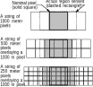
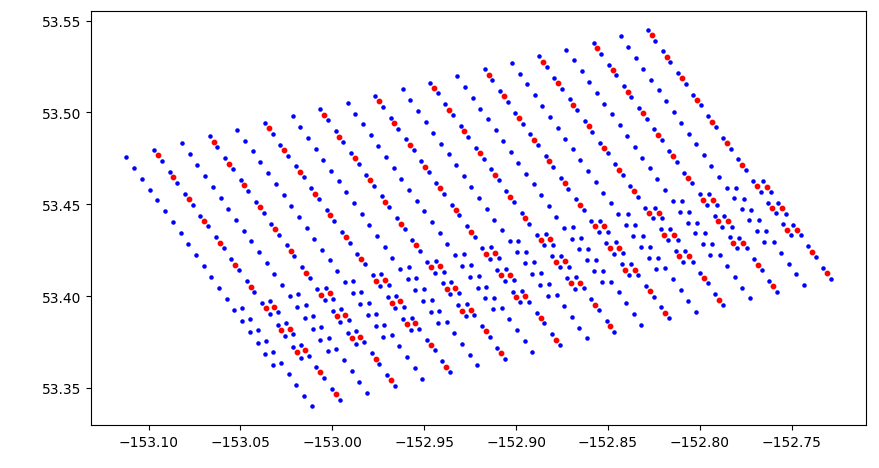
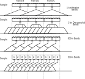
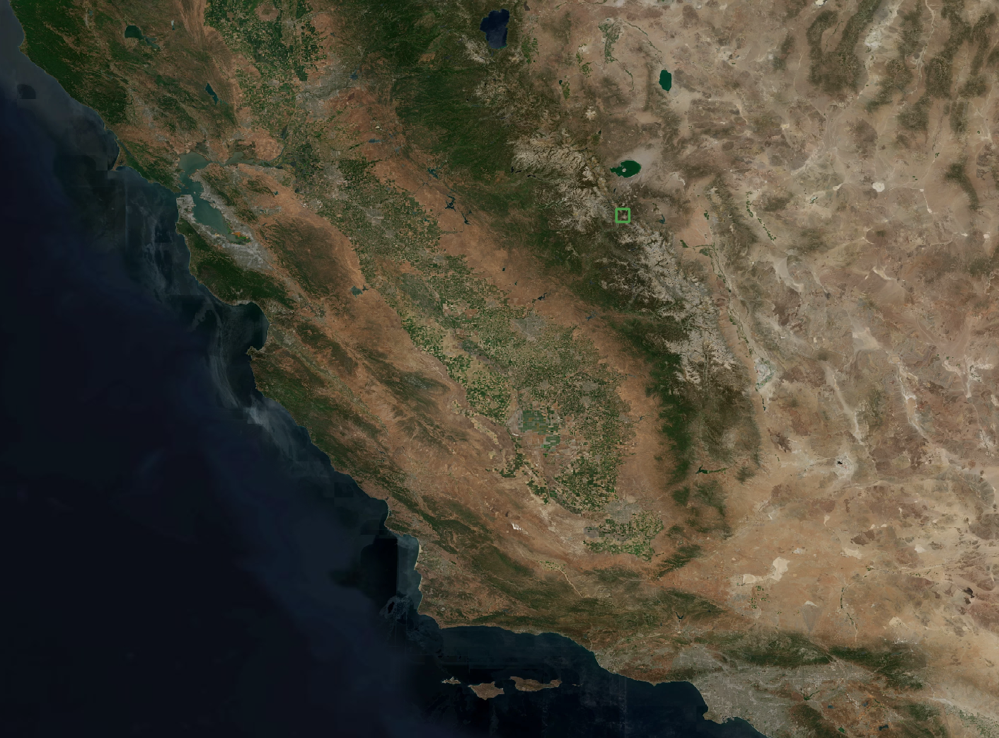

# Quotes
- "It is not about finding the same location and viewing geometry. It is about finding the same real estate"
- "Daily variations might be a result of varying locations in the regridded data"
- "ISINE" is weird
- Projected -> re projected ... might result in a precision loss of factor 5.
- MODIS is precise to 50 m. However, by (re)gridding, we loose location! 
- There is relevant noise in the SCA estimates, probably resulting from location precision loss
- Ned might say: MODIS might not be that precise. Finding good R0 might not be so important.
- We can discretize viewing geometry. E.g. 1 degree
- L2G is a great idea, but L2S might solve it
- "Most of the work we do is reprojecting shit"

[STARE for SPIReS](https://docs.google.com/presentation/d/105A7IveM2DTvQdlcLhhc9UWTZ8NQuTHo4UQu4JJpE0U/edit?usp=sharing)

# Introduction
## MODSCAG
MODSCAG [@Painter2009] simultaneously estimates the fractional snow cover and the snow grain size  from MODIS surface reflectance data. It does so by assuming that the signal that MODIS receives is a linear spectral mixture of endmembers within a pixel. 

$$R_\lambda = \epsilon_{\lambda} + \sum_{k=1}^N f_k* R_{\lambda, k}$$

With $R_\lambda$ being the mixed linear the sum of the the fractions $f_k$ of the endmember $k$  with reflectance of $R_{\lambda, k}$ and the residual error $\epsilon_{\lambda}$. For MODSCAG, the endmembers namely are snow, different types of rock, soil, vegetation, and lake ice. MODSCAG then minimizes the least square error of this linear combination of the end-member spectra to determine the snow endmember.

MODSCAG takes the assumption that snow does not behave as a lambertian surface and therefore the BRDF is negligible. This in term allows for the assumption that the shape of the snow's reflectance spectrum is independent of the the solar angle. MODSCAG exploits this by solving for the shape of the spectrum rather than the absolute reflectance. This is advantageous since errors in co-registration of image and DEM (which would be required for the determination of the solar angle) are circumvented.

This major advantage causes a problem at the same time. As we know from [@Warren1982]:

-   Reflectance of snow in the NIR decreases with increasing grain size
-   Reflectance of snow in the VIS decreases with increasing impurities

This means that the shape of the reflectance spectrum of snow with large grain sizes and high impurity concentration will have a similar spectral shape as fine-grained clean snow.

Consequently, MODSCAG will have challenges distinguishing between pure fine grained snow (lowest albedo) and dirty coarse grained snow (highest albedo) and will randomly pick one of these extremes in the snow-line area.

## Fixing MODSCAG
In order to avoid the confusion between fine-clean and coarse-dirty snow, the absolute reflectances have to be considered. This in term will make it necessary to also control for the illumination angle $\phi$. In
order to increase the buffer of over-determination, instead of solving for the non-snow endmembers, we can avoid solving for the non-snow endmembers by instead measured it during the summer through a continuum approach.

The reflectances at the MODIS sensor consequently are a function of:

$$R_{\lambda} + \epsilon_{\lambda} = F(f_{snow}, \lambda, r_{snow}, h, \phi, c_{dust}, r_{dust}, c_{soot}, r_{soot}, R_{NS})$$

Where $f_{snow}$ is the snow-cover area, $r_{snow}$ the grain size, $h$ the elevation, $\phi$ the illumination angle $c_{dust}$ and $c_{soot}$ the dust and soot concentration $r_{soot}$ and $r_{soot}$ the dust and soot grain sizes and $R_{NS}$ the background/non-snow reflectance.

With an appropriate reflectance and radiative transfer model, the above equation can be used to minimize the root least square error:
$$\begin{split}
min.\; RMSE \\
 RMSE = \sqrt{ \frac{1}{n_{\lambda}} \sum_{\lambda=1}^{n_\lambda} * \epsilon_{\lambda}^2}
 \end{split}$$

## SCAGD / SPIReS
Alike its predecessor, [MODSCAG], the current implementation of [SCAGD] is based on spectral unmixing.

MODSCAG assume linear mixing of endmembers in each field of view. MODSCAG further assumes specular behaviour of snow. With this simplification, the viewing geometry will only have an influence on the magnitude, but not on the shape of the snow's reflectance spectrum. MODSCAG consequently only has to optimize two parameters to fit measurements to the spectral mixing model: The shape of the spectrum, given by it's grainsize and impurities and the scale of the spectrum, given by its share of pixel cover. The problem becomes a linear optimization problem (overlayed with a brute force/permutation evaluation of the non-snow endmembers).

MODSCAG however fails to distinguish between finegrained clean snow and coarsegrained dirty snow, whose spectral shape look similar.

SCAGDG similarly follows the assumption that the reflectances "measured" at the (MODIS) sensor are linear combinations of the reflectance of snow and not-snow. [SCAGD]{acronym-label="SCAGD"
acronym-form="singular+short"} however takes the assumption that the reflectance of the not-snow part $R_{NS}$ of each pixel's field-of-view is know from a time-continuum approach (i.e. has been measured during summer/snow-free times). To avoid the confusion between finegrained clean snow and coarsegrained dirty snow, which, under the assumption of fixed illumination can be distinguish by their difference in magnitude, SCAGD treats the illumination angle as yet another unknown that needs to
be solved for.

Consequently, [SCAGD] has to solve for the following parameters:

- the snowcover area $f_{snow}$
- the grain size $r_{snow}$
- the illumination angle $\phi$
- the dust and soot concentration $c_{dust}$, $c_{soot}$
- the dust and soot grain sizes $r_{soot}$, $r_{soot}$

Considering the error $\epsilon_{\lambda}$ at wavelength $\lambda$, the measured reflectance $R_{\lambda}$ then will be modeled as:

$$R_{\lambda} + \epsilon_{\lambda} = F(f_{snow}, \lambda, r_{snow}, \phi, c_{dust}, r_{dust}, c_{soot}, r_{soot}, R_{NS})$$

or, more explicitly:

$$\begin{split}
        R_{\lambda} + \epsilon_{\lambda} = f_{snow} * R_{snow}  + (1-f_{snow}) * R_{NS}  \\
        R_{snow} = F(\lambda, r_{snow}, \phi, c_{dust}, r_{dust}, c_{soot}, r_{soot})
    \end{split}$$

With an appropriate model for scattering on snow, dust and soot through Mie-theory.
In order to find the above parameters, a least square error over all bands then is minimized.

$$\begin{split}
        min. RMSE \\
        RMSE = \sqrt{ \frac{1}{n_{\lambda}} \sum_{\lambda=1}^{n_\lambda} * \epsilon_{\lambda}^2}
    \end{split}$$

Note that the relation between between $\phi$ and $R_{snow}$ as modeled according to [@Wiscombe1980] is not linear. The problem however could be converted into a mixed-integer problem by pre-calculating a library of Mie-Scattering scenarios.


## Spires Issues
The issue the SPIReS team were conveying to as can be summarized as follows: Their snowcover estimates has a too high noise/variation for a given location over time. 

They assume that the culprit might be the gridded nature of their input data, MOD09GA.  The MOD09GA gridding algorithm is a binning algorithm that bins each level 1 MOD09 observation into a grid cell (This is referred to as L2G pointer) and then selects one of those observations as the best one (subject to clouds, viewing geometry and others). The issue hereby is that the actual footprint (both its size and actual location) of each one of those binned observation may greatly vary. This may mean two temporarily successive values of a grid cell may have come from observations of two very different areas. Specifically in the mountains, characterized by their high terrain variability, this very likely will lead to large uncertainties.

Another, possibly smaller, concern is that given its gridded nature, MOD09GA does not give us (trivially accessible) information about the viewing geometry of the observations. This is unfortunate since SPIReS uses a snow-free observation for each grid cell as an R0. Ideally, this R0 should be recorded under similar viewing geometries as the R that the snowcover should be estimated for.

The second issue could theoretically be solved by backtracking the pointer files to identify the viewing geometry of each of the MOD09GA values. However, these pointer files are not accessible to the public (or rather: are not archived). Leveraging our contacts to Robert Wolfe, we made slight process in this direction. But as of our last correspondence, the pointer files would have to be regenerated; an effort that might require a bit of a larger favor than I myself might be able ask for.

The first issue may be resolved by foregoing gridded data and adapting SPIReS to work on level 2 MOD09 data. STARE may be an enabling technology here. However, at its current implementation, STARE does not have a good model to represent iFOVs. STARE is powerful in representing the geolocation of the center of the iFOV and encode the size of the iFOV, however, it has no representation of the cover of the iFOV. Arguably, this may be better for SPIReS than the gridded data, but it is not obvious that it is.  In a scenario where we were interested in a specific geographic region; e.g. a meadow, a control point, or a basin, STARE would be very helpful in finding each iFOV that intersects this ROI. And this might just be what SPIReS needs. A challenge for this to work on the other side is to find an R0 for each iFOV. Since potentially each and every iFOV was a different SID, this might become tedious. 

- Location binning

# Methods
## R0 library
Given is an observation R. Our challenge is to find another observation R0 that is spatially close (both in terms of center location and in terms of scan line position). Due to the size of the search space, finding spatially close observations cannot be found by comparisons of the geodetic coordinates. Data therefore needs to be indexed. 

We could solve it with bins (MOD09GA). However, bins do not necessarily guarantee that the observations (center) overlap nicely. Especially in mountain terrain, this might matters. Two observations could have been binned in the same bin, but have their observation center location being in the opposite corners of the bin cell. Also, we might need MOD03 information (viewing geometry). The bin cell therefore might just be a method to find candidates. For the candidates, we then could e.g. do center distance and viewing geometry distance calculations to find the best other observation.

MOD09GA bins data rather than compositing it. Further, detailed information on the original observation can be retraced.

- Create a grid of Level 17 trixels
- R0 is not necessarily the darkest pixels. Darkest pixels might be shade or sunset.
	- https://github.com/edwardbair/SPIRES/blob/master/prepInputs/createR0.m
	- Remove values that MOD35 masks as cloud, snow/ice or saltpans
	- Highest NDVI, lowest NDVI
	- Remove values where b3 is < 0.1
1. Filter out values that are masked by MOD35 as clouds or snow  
2. Filter out values that have a band3 value of less than 0.1
2. Filter out values with a SensorZenith of more than 30 %
3. For each cell, if the minimum NDSI is larger than 1:  R0 is the spectrum with the largest B3 value; else: R0 is the spectrum with the maximum NDVI value  

We obtained all MODIS terra surface reflactance (MOD09[^mod09]) and geolocation MOD03 granules intersecting our ROI from LADSWEB for the timespan between 2000-02-01 and 2022-08-01; a total of 13102 granules each and created sidecars for them. We then loaded all 500 m resolution variable of each set of MOD09, MOD03, and stare sidecar into a STAREDataFrame and subset them to the ROI (from 144e12 to 243e6 iFOVs).

$$4060*2708*13102 \approx 144e12$$ 

```bash
python3 get_urls.py --product MOD03 --collection 6 --region mammoth --start 2000-02-01 --stop 2022-08-01 --day

python3 get_urls.py --product MOD09 --collection 6 --region mammoth --start 2000-02-01 --stop 2022-08-01 --day

python3 download.py --file_list file_lists/mammoth_MOD09_2000-02-01-2022-08-01.csv --folder /tablespace/spires/m  
od09/

create_sidecar_files.py --folder /tablespace/spires/mod09/ --out_path /tablespace/spires/mod09/ --product mod09  
--workers 63 --parallel_files --archive /tablespace/spires/mod09/0_sidecar_archive.csv
```

[^mod09]: DOI: 10.5067/MODIS/MYD09.006

## Resolution interpolation
MODIS collects data at 1 km, 500 m and 250 m resolution. Unfortunately, only the geolocation of the \SI{1}{\kilo\meter} locations are distributed (and possibly calculated). E.g. in the calibrated surface reflectance product MOD09, data for all three resolutions exist, however merely the geolocation of the \SI{1}{\kilo\meter} resolution is included. It is not fully obvious what to do about the 500 m and 250 m geolocation:

A private communication with the MODIS support suggested the following ([from github](https://github.com/SpatioTemporal/STAREmaster/issues/42#issuecomment-678774303))

> "Since the MODIS geolocation is estimated at 1km only, so it is provided for 1km datasets only. The best way to use the 1m geolocation will be to co-locate each 500m/250m observations within the corresponding 1km pixel and then use the corresponding 1km geolocation."

The MOSIS Level 1A Earth Location ATBD [@MashNishihamaRobertWolfe1997] contradicts this statement: “MODIS is built so that the start of the weighting function for the 500 m pixel is the same as the start of the weighting function for the 1 km pixel. This means that four 500 m pixels are not contained within a 1 km pixel.”  



[@Wolfe2002], further explains: “To the first order, the MODIS point-spread function is triangular in the scan direction. The centers of the integration areas of the first observation in each scan are aligned, in a 'peak-to-peak' alignment.“. And:  “In the track direction, the point-spread function is rectangular and the observations at the different resolutions are nested, allowing four rows of 250 m observations and two rows of 500 m observations to cover the same area as one row of 1 km observations.” 

The MODIS Level 1B User Guide [@Toller2009] also suggests: “Interpolation may be used to recover latitude and longitude of all pixels [..]. Note that, due to the overlap between consecutive scans, interpolation across scan boundaries such as is done by these HDF-EOS swath functions, can produce inaccurate results. Near scan boundaries, it is better to extrapolate from within the same scan, than to interpolate with values from the adjacent scan” 

[@MashNishihamaRobertWolfe1997] "The samples for each band are delayed by an appropriate amount so that all samples in a frame of data start at the same point on the ground. 






https://docs.google.com/document/d/1Nn2evt3QOtzz4gIx7ScBE7LEdhNvFb9kPMpivpMo0t4/edit

https://docs.google.com/presentation/d/105A7IveM2DTvQdlcLhhc9UWTZ8NQuTHo4UQu4JJpE0U  

References:
Wolfe, Yang: "MODIS level 2 grid with the ISIN map projection" [10.1109/IGARSS.2001.978332](10.1109/IGARSS.2001.978332)


# Results
Our ROI is a 0.1° bounding box around mammoth lakes[^mammothbbox], this area covers 531 cells of the MOD09GA tile H08V05 (from x 551 to 575, y 1353 to 1373)

[^mammothbbox]: west = -119.1 north =  37.7 east =  119.0 south = 37.6


## 2017-12-11
For this day, we have MOD09GA, MOD09, and worldview ground truth.
- Ground truth for every cell vs gridded SPIRES for every cell
- Ground trurh for every iFVO vs SPIRES for every iFOV


# Timeseries

- Time period: For when we have validation Data available
- Viewable snow only


# Outlook
Cross-sensor: include NOAA20 and Suomi VIIRS, landsat, aqua