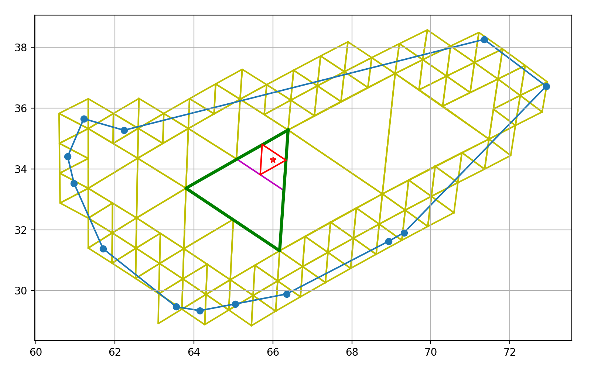

# Abstract

# Introduction

> "location, location, location"

> Lord Harold Samuel

Runoff from snowmelt provides water for a large portion of the world [@Mankin2015] and is a forcing on global climate and weather [@Hansen2004]. Knowledge of the spatial extent and distribution of snowcover and the snow's properties is therefore crucial in the domains of water resource management and climate and weather modeling. 

Satellite remote sensing observations provide us with the ability to measure snow cover on a global and regional scale. A commonly used method to estimate snow cover from multi-spectral satellite data is the Normalized Difference Snow Index (NDSI), described by [@Dozier1989; @Hall1995] and used in the Moderate Resolution Imaging Spectroradiometer (MODIS) and the Visible Infrared Imaging Radiometer Suite (VIIRS) standard snow cover products (MOD10A1/VNP10A1[^mod10a1]). NDIS is an effective and simple method to identify snow cover and works well in homogeneous regions where pixels are either entirely snow-covered or not. 

$$NDSI = \frac{R\lambda(VIS)−R\lambda(SWIR)}{R\lambda(VIS)+R\lambda(SWIR)}$$

[^mod10a1]: [@MOD10A1], [@VNP10A1]

However, in large parts of the world and especially in mountainous terrain, the snow cover varies at higher resolutions than the resolution of medium resolution space-born remote sensors such as MODIS or VIIRS, requiring the ability to identify fractional snow cover areas (fSCA) of a pixel, i.e. at sub-pixel level [@Selkowitz2014]. While the NDSI should not be interpreted as fSCA[@Stillinger2022], [@Salomonson2004; @Salomonson2006] developed a regression based approach to conclude fSCA from NDSI:

$$
fSCA = −0.01 + (1.45 × NDSI)
$$

This regression approach has a high margin of error, systematically underestimating fractional snow cover for pixels with less than 50% snow cover and underestimating it for pixels with less than 50 % snow cover [@Rittger2013]. Higher accuracy of fractional (sub-pixel) snow covered area estimations can be achieved through spectral analysis from multi-spectral measurements [@Stillinger2022]. Spectral analysis may also allow to conclude on snow properties, such as the grain size and the presence of light absorbing particles (LAP). 

The MODIS snow-covered area and grain size (MODSCAG) algorithm [@Painter2009]  makes use of the unique spectra of snow, vegetation and soil/rock and simultaneously estimates the fractional snow cover and the snow grain size from MODIS surface reflectance data. It does so by assuming that the reflectance signal that MODIS receives $R$ is a linear spectral mixture of the reflectance spectra $R_k$ of the constituent endmembers $k$ (i.e. snow, vegetation, soil/rock) within a pixel. 

$$R_\lambda = \epsilon_{\lambda} + \sum_{k=1}^N f_k* R_{\lambda, k}$$

$R_\lambda$ is the observed reflectance at wavelength $\lambda$ that is modeled as the mixed weighted sum of the the weights/fractions $f_k$ of the endmember $k$  with reflectance of $R_{\lambda, k}$ and the residual error $\epsilon_{\lambda}$.  For MODSCAG, the endmembers namely are snow, different types of rock and soil, vegetation, and shade. The reflectances $R_{\lambda, k}$ of the rock/soil vegetation endmembers are measured in the field and in laboratory. For the snow endmember, MODSCAG uses a snow endmember library containing snow reflectance spectra for varying grain sizes and solar zenith angles. MODSCAG then finds the snow endmember and endmember fraction that minimizes the least square error of the linear combination.
$$minimize \sum_{k_\lambda=0}^{n} \epsilon_\lambda^2$$
The Snow Property Inversion From Remote Sensing (SPIReS) algorithm follows a similar approach. However, rather than solving for the non-snow endmembers, SPIReS exploits the fact that for any given location (in the following referred to as a cell in a grid), the (mixed) non-snow background endmember spectrum $R_0$ can actually be measured during the summer (this, of course, excludes regions of permanent snow-cover, such as the arctic regions or glaciers). SPIReS creates a snow-free endmember reflectance library containing a single snow-free reflectance spectrum for each grid cell. This single snow-free reflectance spectrum is selected from all measured spectra for a given grid cell subject to a set of criteria: The snow-free spectrum must not be quality flagged, be cloud and cloud shadow free, and have an NDSI value of less than zero. From the spectra that pass those criteria, the spectrum with the highest NDVI is selected as the snow-free reference spectrum[^exception]. Additional advancements of SPIReS include a correction for canopy cover, persistence filters to eliminate false-positive caused by cloud presence, temporal smoothing, as well as cell clustering in which similar cells are grouped prior to computing to improve performance.

[^exception]:  If for a given cell, no spectrum with an NDSI of less than zero exist, the spectrum with the lowest band 3 reflectance is selected. 

# SPIReS uncertainty and possible causes 
Both MODSCAG and SPIReS use _gridded_ (i.e. level 3) surface reflectance products as their inputs (e.g. MOD09GA[^mod09ga]). Using the gridded products greatly simplifies verification efforts where observations from other instruments (typically with much higher spatial resolutions such as Landsat) have to be spatially associated with the MODIS-based snow cover estimates. In the case of SPIReS, the (fractionally) snow covered observations also have to be spatially associated with snow-free observation of the same location, which is trivial using a gridded product and challenging for an ungridded product.

[^mod09ga]: DOI: [10.5067/MODIS/MOD09GA.006](http://dx.doi.org/10.5067/MODIS/MOD09GA.006)


While the gridded products bring the above stated simplifications, they also introduce a source of uncertainty. 
The "level 3"[^L2G] MOD09GA granules are produced by gridding and composing ungridded "level 2" MOD09 observations. The methodology first associates/grids/bins each MOD09[^mod09] observation geolocation into a grid cell and then selects one of those binned observations as the best one (subject to clouds, viewing geometry and others) [Wolfe1998; @Yang2001]. 

The binning reduces the spatial resolution by an order of magnitude: While the geolocation of an individual observation (aka: instantaneous field of view (iFOV)) are precise to approximately \SI{50}{\meter} [@Wolfe2002], they get binned into grid cells of approximately \SI{500}{\meter}. The actual extent/footprint of each one of those binned observation consequently may greatly vary both its size and location. This may mean two observations binned into the same grid cell may have been for two very different areas. Figure \ref{redslake_centers} shows the wide spread of of MODIS iFOVs center locations associated with a single cell at Reds Lake. 

[^L2G]: MOD09GA is actually referred to as an "L2G" product; a hybrid between level 2 and level 3. Additionally to level 3 data,  L2G products contain "additional observations" for each cell, which are values that have been binned to a cell, but not selected as the best observation in the composition step.


But it is not only the iFOV center locations that are different for each observation. MODIS is a passive, imaging spectroradiometer. It uses a continuously rotating double-sided scan mirror rotating at 20.3 rpm. The mirrors rotation axis is in the same plane as the spacecraft's ground track. At a spacecraft altitude of \SI{705}{\kilo\meter}, the earth is in sight for about \SI{110}{\degree} of the mirrors entire rotation [@Barbieri1997]. This means that for each mirror rotation (scan), observations are retrieved under viewing angles ranging form \SIrange{-55}{+55}{\degree} (c.f. figure \ref{spacecraft}). When the sensor is at a viewing angle of \SI{+-55}{\degree} (at the beginning/end of a scan), the observed footprint is consequently significantly large than when the sensor is pointing straight down at nadir/\SI{0}{\degree}. Figure \ref{footprints} shows approximations of the extent of four iFVOs associated with this same cell. Clearly visible are the variations in the center locations and the approximated extents/footprints that the iFOVs cover depending on the viewing angle of the sensor.

[^mod09]: DOI: [10.5067/MODIS/MOD09.006](http://dx.doi.org/10.5067/MODIS/MOD09.006)


Specifically in the mountains, characterized by high topographic variability, the irregularity of the actual iFOV footprints leads to significant noise in derived estimands. Figure \ref{gridded_timeline} displays timeseries of NDSI, the normalized difference vegetation index (NDVI)), and fSCA estimates from SPIReS[^visible_snow] for an _apparently_ fixed location: A MODIS grid cell at Reds Lake in Mammoth. We observe strong fluctuations of NDVI, NDSI, and the fractional snow cover. We also note that the fractional snow cover stays well above 0 during the late summer months for which we know the area was snow-free. Part of the noise can be explained by uncertainties in the atmospheric corrections, the cloud cover and cloud shadow, smoke presence, and variations in the solar and sensor zenith. In the following, we will demonstrate that a large portion of the noise is however introduced by the variations in the observation footprint: The estimands in figure \ref{gridded_timeline} are merely apparently for a fixed location. In reality, the footprints of the underlying observations dramatically vary both in terms of size and in terms of center location. It is thus not that the fSCA estimates from SPIReS necessarily are inherently inaccurate; the estimates were simply made for varying footprints; some of which having larger fSCA than others.

[^visible_snow]: The fractional snow cover estimates are for visible snow only.


The question consequently arises of how the accuracy of any derived product in general, and the fSCA estimations in particular should be evaluated. Gridded products may tempt the assumption that each fSCA estimate is for the footprint of a grid cell. Under this assumption, we then may find observations of a (higher resolution) ground truth dataset that intersect the grid cell and compare the estimation with the ground-truth data. The assumption however is a false and causes the accuracy of the fSCA estimates to appear much worse than they actually are. Much rather, the actual footprint of each individual observation has to be considered and the ground truth observations covering this actual footprint have to found for the evaluation. Figure \ref{cell_vs_ifov} clearly visualizes the issue: While the fSCA is computed for the actual iFOV footprint (red), it will be evaluated against data from higher resolution covering the cell if we naively use gridded data.


The location uncertainty introduces an additional issue specifically for SPIReS: SPIReS does solve for the snow-free endmembers of a fractionally snow-covered observation, but rather uses a snow-free observation of the same location as the snow-free endmember. If gridded products are used, the snow-free observations for the "same" location is simply a snow-free observation associated with the same grid cell. Since the gridding blurs the location of the footprint of the observation, the snow-free observation is not necessarily for the same area as the fractionally snow-covered observation even though they have been binned to the same grid cell. It is e.g. conceivable that a fractional snow covered observation is a mixture of snow and forest, while the associated snow-free reference observation consists of soil and rock. 


Finally, a concern is that MOD09GA contains merely the sensors zenith angles, but no trivially accessible information about the actual viewing geometry of the observations[^pointers]. We thus have no information about whether an observation was acquired while the sensor was pointed left or right.  In mountainous terrain this however may be crucial since opposing faces of the same mountain may greatly vary in terms of composition of rocks/soil and vegetation.

[^pointers]: Theoretically the pointer files could be backtracked to identify the viewing geometry of each MOD09GA value. However, these pointer files are not archived and would have to be regenerated.


Figure \ref{leftright} shows NDVI values for observations at a fixed location at Reds Lake in Mammoth (within a radius of 50 m. C.f. figure \ref{ndvi_locs}) under varying viewing geometries (here represented as the along-scan position). The asymmetry demonstrates the influence of the viewing geometry on the reflectance spectrum: 
When the sensor passes east of the observed location (i.e. low along-scan position), it co-registers much of the eastern face of _Top of Chair 15_ (Paranoid Flats), which is mostly exposed rock (c.f. figure \ref{eastwest}).
However, when the sensor passes west of the observed location (high along-scan position), it co-registers much of the western ridge face below the lift line of Chair 14 which is covered with sparse trees (c.f. figure \ref{eastwest}). 

\begin{figure}
	\includegraphics[width=\textwidth]{images/C3/east.png}
	\includegraphics[width=\textwidth]{images/C3/west.png}
	\caption{View onto the same location at reds lake from the east (top) and the west (bottom). Note that looking west, a face with little vegetation will be co-registered, while looking east, a face with sparse trees will be co-registered.}
	\label{eastwest}
\end{figure}

Ideally, any fractionally snow-covered observation should thus not only be associated with a snow-free observation that is spatially as close as possible, but also was observed under a similar viewing geometry.

\newpage
\clearpage

# STARE Approach
In order to circumvent the introduction of uncertainties introduced by the gridding, we need to forego gridded data and work with ungridded level 2 data (i.e. MOD09/VNP09). Working with ungridded data is cumbersome with conventional technologies. We therefore use the alternative geolocation representation SpatioTemporal Resolution Encoding (STARE). STARE enables us firstly to associate each observation with a snow-free observation that truly was at the approximately same location and recorded under similar viewing geometries. It secondly allows us to evaluate the accuracy of the fSCA estimates by comparing the estimates to "ground-truth" data for the approximate footprints of each iFOV.

The remainder of the paper is structured as follows: We first give a quick overview of STARE. We then describe the data preparation and the creation of our snow-free reflectance library. Finally, we describe our evaluation methods and present metrics on the accuracy improvements achieved by forgoing gridded data using STARE.

## STARE primer
STARE, extensively described in [@Rilee2021; @Rilee2020a; @Rilee2019; @Rilee2016; @Kuo2017], is an alternative spatial geolocation representation based on a hierarchical triangular mesh (HTM). Rather than expressing points as e.g. latitudes and longitudes, STARE expresses locations/points as nodes (aka: trixels) in the HTM and arbitrarily shaped regions (polygons) as sets of trixels (c.f. figure. \ref{stare}).



In a sense, STARE is thus yet another gridding approach. However, in contrary to a conventional gridding, the grid resolution (the size of the bins in which individual observations get binned into) is not fixed, but adaptive. This brings immense advantages when working with data with inter- and intravariable resolutions. In STARE, identifying the intersection of irregularly shaped and spaced data at varying resolutions is trivial. We thus do not have to a-priori decide a grid resolution into which we have to bin data, but rather maintain the original resolution of the data.

The STARE concept is implemented in a collection of software. The collection contains software to convert conventional location representations into STARE representations, various storage backends, and the ability to perform STARE-based geoprocessing (such as unions, intersection, dissolves) and geospatial analysis.

## Data Preparation
Our study area is a region around Mammoth Lakes in the eastern Sierra Nevada spanning from Lake Thomas Edison to June Lake (c.f. figure. \ref{roi}). We acquired all Level 2 MODIS/Terra atmospherically corrected surface reflectance granules (MOD09) and their corresponding geolocation companion granules (MOD03) for the entire sensor lifetime from 2000-02-24 until 2022-09-15 (a total of 26466 granules, containing a total of 145e9 iFVOs, 243e6 of which intersecting our ROI.). We additionally acquired moderate resolution VIIRS/Suomi surface reflectance granules (VNP09MOD) and their corresponding geolocation companion granules (VNP03MOD). For verification purposes, we also acquired all gridded MOD09GA granules for tile H08V05[^ladsweb_dl].

[^ladsweb_dl]: we used the ladsweb_downloader to download all granules. Ladsweb_downloader is available at [https://github.com/NiklasPhabian/ladsweb_downloader](https://github.com/NiklasPhabian/ladsweb_downloader).


We then created STARE sidecar companion files for each granule. STARE sidecar companion files contain the geolocation for each iFOV in STARE representation. They are thus analogous to the MOD03/VNP03* companion files, which contain the geolocation of each iFOV in WGS84 coordinates. The MOD09 granules contain surface reflectances at \SI{1000}{\meter}, \SI{500}{\meter}, and \SI{250}{\meter} resolution. However MODIS geolocations are only distributed at \SI{1000}{\meter} resolution. Since we are intending to use the \SI{500}{\meter} surface reflectances, we thus had to create a geolocation interpolation algorithm described in section \ref{resadaption}.

Finally, we created estimations for the footprints of each iFOV subject to the viewing geometry. Those footprint approximations are used to evaluate the fSCA estimations against higher resolution binary snowmaps. The creation of the footprint estimates is described in section \ref{sec_iFOV}.

## Resolution interpolation \label{resadaption}
MODIS collects data at nominal resolutions of \SI{1000}{\meter}, \SI{500}{\meter}, and \SI{250}{\meter}. The calibrated surface reflectance product MOD09 contains reflectance spectra for all three resolutions, but merely the geolocation of the \SI{1}{\kilo\meter} resolution. We therefore need to interpolate the \SI{500}{\meter} resolution geolocations. This is not a completely trivial task since the Algorithm Theoretical Basis Document (ATBD) and the user manual merely give us hints on how to interpolate the higher resolution geolocations:

The MODIS Level 1A Earth Location ATBD [@MashNishihamaRobertWolfe1997] states[^github]: 

> "MODIS is built so that the start of the weighting function for the 500 m pixel is the same as the start of the weighting function for the 1 km pixel. This means that four 500 m pixels are not contained within a 1 km pixel."

[^github]: A private communication with the MODIS support contradicts this statement and suggests the following ([from github](https://github.com/SpatioTemporal/STAREmaster/issues/42#issuecomment-678774303)) "Since the MODIS geolocation is estimated at 1km only, [..] it is provided for 1km datasets only. The best way to use the 1m geolocation will be to co-locate each 500m/250m observations within the corresponding 1km pixel and then use the corresponding 1km geolocation."

![Pixel nesting of the 1 km, 500 m and 250 m resolutions of MODIS. Source: Figure 2-8 of MODIS Level 1A Earth Location [@MashNishihamaRobertWolfe1997]](images/C3/modis_pixel_nesting.svg)

[@Wolfe2002], further explains: 

> "To the first order, the MODIS point-spread function is triangular in the scan direction. The centers of the integration areas of the first observation in each scan are aligned, in a 'peak-to-peak' alignment.“. And:  “In the track direction, the point-spread function is rectangular and the observations at the different resolutions are nested, allowing four rows of 250 m observations and two rows of 500 m observations to cover the same area as one row of 1 km observations."

![Figure 3-13 of the MODIS Level 1A Earth Location: [@MashNishihamaRobertWolfe1997]](images/C3/sampling_rates.svg)

The MODIS Level 1B User Guide [@Toller2009] also suggests:

> “Interpolation may be used to recover latitude and longitude of all pixels [..]. Note that, due to the overlap between consecutive scans, interpolation across scan boundaries such as is done by these HDF-EOS swath functions, can produce inaccurate results. Near scan boundaries, it is better to extrapolate from within the same scan, than to interpolate with values from the adjacent scan” 

Finally, [@MashNishihamaRobertWolfe1997] states that 

> "The samples for each band are delayed by an appropriate amount so that all samples in a frame of data start at the same point on the ground. "

We combined these pieces of information in our geolocation interpolation algorithm[^get_500m]: We process one scan group at a time. For the \SI{1}{\kilo\meter} resolution, a scan group contains 10 iFOVs along-track and 1354 iFOVs along-scan. The first observations of all resolutions are aligned in scan direction. The first \SI{500}{\meter} resolution geolocations in scan direction therefore sit between the 1 km resolution in track direction offset by 1/4 of the distance to the next observation in track direction. The same is true for all other odd-numbered observations in scan direction. The even numbered observation in scan direction sit right half-way between the the odd-numbered observations. The last observation in scan direction has to be extrapolated. 

Figures \ref{500_start}, \ref{500_center}, and \ref{500_end} display the original 1km resolution geolocations (red) and the interpolated 500m geolocations (blue) for one and a half scan groups at the begining (\ref{500_start}), the center (\ref{500_center}), and  the end (\ref{500_end}) of a scan. Note how six \SI{500}{\meter} resolution observations nest into one \SI{1000}{\meter} resolution observation.

[^get_500m]: [STAREMaster's 500m interpolation function on GitHub](https://github.com/SpatioTemporal/STAREMaster_py/blob/eb17c1a50cfb66de4a3737fbfc65f1855479ca7d/staremaster/products/mod09.py#L33)


\clearpage

## iFOV approximation \label{sec_iFOV}
In order to evaluate the accuracy of a sub-pixel estimand in general and the fSCA from SPIReS in particular, we typically compare the estimated values against ground truth data. In practice the ground truth data will often be binary data derived from sensors with higher spatial resolutions. E.g. a MODIS iFOV at nadir may have an approximate footprint of $\SI{500}{\meter} \;x\; \SI{500}{\meter}$[^cell_size], covering about 250 Landsat pixels. 

[^cell_size]: The actual cell size is $w * w$. With  $w = T / n= \SI{463.31271653}{\meter}$,  $T=\SI{1111950}{\meter}$ being the height and width of each MODIS tile in the projection plane, and $n=2400$ the number of cells in a MODIS [@Meister2008].


The comparison of MODIS subpixel estimands of an iFOV against the verification data requires us to evaluate spatial coincidence between the iFOV footprints and the verification datasets. To achieve this, we need an approximate spatial representation for the iFOV footprints. As previously discussed, we consider a grid cell at constant resolution of $\SI{500}{\meter} \;x\;  \SI{500}{\meter}$ as an inapt footprint approximation. We instead create two alternative approximations:

The first approximation assumes that the iFOV's footprint is a circle around the geolocation with a constant resolution equaling the nominal resolution; i.e. \SI{500}{\meter} for MODIS and \SI{750}{\meter} for VIIRS. 

The second approximation assumes that the iFOV's footprint has the shape of an ellipse. We make use of the fact that we have some idea of the distortion introduced by the sensor's zenith angle. From the MODIS Level 1A Earth Location ATBT [@MashNishihamaRobertWolfe1997], we know that the resolution of a 1 km spatial element at a \SI{55}{\degree} scan angle has ground dimensions of approximately \SI{4800}{\meter} along-scan and \SI{2000}{\meter} along-track. We can further derive a relation between scan angle (sensor zenith) and along-scan and along-track iFOV size (c.f. figure \ref{ifov_growth}.) We approach it with: 

$$ length = \frac{e^{a*x}}{b} + c$$

With:

|             | a   | b    |c     |
|:--          |:--- |:---  |:---  | 
| along-scan  |0.09 | \SI{40.9}{\per\kilo\meter} | \SI{1.00}{\kilo\meter} |
| along-track |0.07 | \SI{35.2}{\per\kilo\meter} | \SI{0.98}{\kilo\meter} |

Using the derived along-track and the along-scan lengths, we now create ellipses around the geolocation of each iFOV, using the along-track length as the length of semi-minor axis and the along-scan length as the length semi-major axis. We finally orient each ellipse according to the sensor's instantaneous azimuth angle. A set of resulting ellipse footprint approximations are visualized in figure \ref{footprints}. Figure \ref{circles} displays iFOV as approximated as circles with constant radius and as ellipses with semi-minor and semi-major axes lengths subject to the sensor zenith and orientation given by the sensor azimuth.


\newpage
\clearpage

## Viewing geometry discretization
Our thesis is that we can improve the accuracy of SPIReS' fSCA estimates by using snow-free reference reflectances $R_0$ that have been observed under a similar viewing geometry as the spectrum of the observation $R$ for which the fractionally snow covered is to be estimated.


MODIS has an orbital repeat cycle of 16 days [@King2003; @Wolfe2002]. This means that every 16 days, the ground track repeats. Consequently, there are 16 distinct viewing geometries for any given location above outside ob a latitude of approximately \SI{+-30}{\degree}. Due to orbital dynamics and orbit drift, the overpasses are not exactly the same. Figure \ref{viewing_geoms} displays along-scan positions under which MODIS/Terra observations were taken for a fixed location over time. Clearly visible are the 16 ground track groups of MODIS' 16-day orbital repeat cycle. It is noteworthy to draw attention to the 'bumps', presumably caused by orbital anomalies and consequent corrective satellite maneuvers. Towards the end of the timeseries, the uncorrected orbital drift[^drift]  is observable. MODIS is drifting towards earlier equator crossing times (conceptually: drifting westwards), causing observations of fixed location to be made increasingly earlier in the day and thus at lower along scan positions[^scan]. If MODIS was to remain in this drifting orbit long enough, the gaps between the orbit track groups will eventually fill.

[^drift]: [https://terra.nasa.gov/about/terra-orbital-drift-information](https://terra.nasa.gov/about/terra-orbital-drift-information?_ga=2.113741903.959412644.1666982590-2093997614.1657309207)

[^scan]: For daytime observations, MODIS is flying south and scans from west to east.

The along-scan position is a proxy for the viewing geometry. It gives us information about both the sensor zenith (and thus the extent of the iFOV) and whether the sensor was looking left, right, or (approximately) straight down. Since we want to find a $R_0$ for every $R$ that was observed under a similar viewing geometry, we discretize the along-scan position at different resolutions. At a discretization of 1, we do not distinguish between different viewing geometries. At a discretization of 2, we only distinguish if the sensor was looking left or right. At a discretization of three, we distinguish between the sensor looking left, right, or approximately straight down. At higher discretizations, we add further fidelity to the viewing geometry.


## Snow-Free Reflectance (R<sub>0</sub>) Library
To compute the fSCA for a reflectance spectrum $R$ observed for a given location, SPIReS requires a snow-free reflectance spectrum $R_0$ for the same location. The question of what "same location" means immediately arises considering that each observation has a unique geolocation and footprint. One could imagine finding the spatially closest observation by evaluating geodesic distances. However, evaluating possibly trillions of distance ad-hoc from is computationally infeasible. The right answer is that some degree of location discretization is required. 

The discretization enables us to bin observations that are sufficiently close to each other and consider them spatially coincidental. When using the standard gridded surface reflectance products, we assume every observation binned to the same grid cell is spatially coincident. As previously stated, our thesis is that this is a too strong coarsening, especially considering that the geolocation is known to sub \SI{50}{\meter}. We thus create a $R_0$ library at a higher spatial resolution.

The algorithm for finding a $R_0$ for each grid cell works as follows[^create_r0]:

```{caption="Algorithm for finding an $R_0$ for each grid cell" label=r0_algo}
For each cell:
	1. Consider all observed spectra for the cell
	2. Discard observations with a SensorZenith > 30°
	3. Find the observation with the lowest NDSI
	4. If lowest NDSI < 0:
		1. Discard observations that 
			1. Have internal cloud mask set, or
			2. Have internal snow mask set, or
			3. Have MOD35 cloudmask set, but not saltpan
		2. The observation with maximum NDVI is R0
	5. Else: (e.g permament snow)
		1. Discard observations with Band 3 < 0.1
		2. The observation with lowest Band 3 value is R0
```

[^create_r0]: [createR0.m on github](https://github.com/edwardbair/SPIRES/blob/master/prepInputs/createR0.m)

We adapt this algorithm to create $R_0$ for STARE trixels, rather than for grid cells at different STARE quadfurcation levels. We additionally take the viewing geometry, represented by the along-scan position into account. The choice of the quadfurcation level and the along-scan position discretization hereby is a nexus: While conceptually we want to have a high resolution in terms of geolocation and viewing geometry, we decrease the number of candidate snow-free reflectances per bin with increasing resolution. If the count of the number of candidates per bin is too low, we may not find good (i.e. cloud-free, snow free, and not quality flagged) snow-free spectra.

At the latitude of our ROI, a \SI{500}{\meter} x \SI{500}{\meter} cell is roughly observed once per day (revisit period is one day). Considering a data range of 8239 days (from 2000-02-24 to 2022-09-15), this gives about 8239 candidate spectra to choose from when discretizing to the MODIS grid cells. A STARE trixel at quadfurcation level 14 has roughly the same area as a MODIS grid cell and we would thus also roughly expect roughly one observation per day falling into a level 14 trixel. At level 15, we would expect a revisit period to be $1/4$ of that since a level 15 trixel is four times smaller than a level 14 trixel. Table \ref{trixel_sizes} displays the areas and edge lengths of trixels at varying quadfurcation levels. It also contains the estimated _revisit periods_ which is the nominal resolution divided by the area of the trixels, assuming one overpass per day. It is to be understood as the maximum possible revisit period. The column _visit count_ is the revisit period multiplied by the data duration (8239 days). It gives us a rough approximation of how many candidate spectra we will have per spatial bin.

Note that the average trixel area $A_{trixel}$  and edge length $l_{trixel}$ can be computed as indicated below. However, depending on the position of of the trixels in the initial solid's faces, the trixel areas vary across the globe. The values in table \ref{trixel_sizes} are the actual areas and lengths computed for trixels in our ROI.

$$
\begin{split}
r_{earth} &= \SI{6371007}{\meter} \\
A_{earth} &= 4*\pi * r_{earth}^2 \\
A_{trixel} &= A_{earth} / 8 / (4^{level}) \\
l_{trixel} &= (A_{trixel}*2)^{0.5}
\end{split}
$$

The MODIS geolocation precision is approximately \SI{50}{\meter} [@Wolfe2002] (\SI{2.5e3}{\meter\squared}), matching trixel areas at quadfurcation level between 16 and 17. This gives us the upper bound for the quadfurcation level. A cell with an edge length of \SI{463.3}{\meter} has an area of \SI{2.14e5}{\meter\squared}, matching quadfurcation level between 14 and 15, giving us the lower bound for the quadfurcation level.

Table: Approximate trixel areas, edge lengths and MODIS revisit periods and total visits for the data duration of 8239 days \label{trixel_sizes}

|   Level | Area                          | Edge                  | Revisit Period   |    n Visits |
|--------:|:------------------------------|:----------------------|----------------: |------------:|
|      12 | \SI{5.11e+06}{\meter\squared} | \SI{3.20e+03}{\meter} | 0.05 days        | 167 544.0   |
|      13 | \SI{1.28e+06}{\meter\squared} | \SI{1.60e+03}{\meter} | 0.20 days        |  41 885.9   |
|      14 | \SI{3.19e+05}{\meter\squared} | \SI{7.99e+02}{\meter} | 0.78 days        |  10 471.5   |
|      15 | \SI{7.99e+04}{\meter\squared} | \SI{4.00e+02}{\meter} | 3.13 days        |   2 617.9   |
|      16 | \SI{2.00e+04}{\meter\squared} | \SI{2.00e+02}{\meter} | 12.52 days       |     654.5   |
|      17 | \SI{4.99e+03}{\meter\squared} | \SI{9.99e+01}{\meter} | 50.08 days       |     163.6   |
|      18 | \SI{1.25e+03}{\meter\squared} | \SI{5.00e+01}{\meter} | 200.32 days      |      40.9   |

We created $R_0$ libraries for quadfurcation levels 14 to 17 using the same logic as in listing \ref{r0_algo}. We then further binned the observations for each trixel by their viewing geometry, discretized in 1 to 7 groups. This would lead to a total of 28 $R_0$ libraries. Recognizing that at high spatial resolution and high viewing geometry discretization, we end up with too few candidate spectra, we discarded the $R_0$ libraries with quadfurcation level of above 16 and[^and] viewing geometry discretizations above 4, leaving us with a total of 22 $R_0$ libraries. 

Table \ref{trixel_revisits} gives the actual average number of candidates for trixels at different quadfurcation levels, closely matching our theoretically expected number of revisits in table \ref{trixel_sizes}. Figure \ref{r0} visualizes the number of observations that fell into each trixel of a level 15 STARE grid in our ROI. 

[^and]: logical and

Table: Number of observations that fell into trixels at varying quadfurcation levels \label{trixel_revisits}

|   Level | n Visits (mean)  |
|--------:|----------:|
|      14 | 6 696      | 
|      15 | 1 767      | 
|      16 |  486       | 
|      17 |  145       | 
|      18 |  49        | 


{height=600px}

## Computation of fSCA
To compute the fSCA in our STARE approach for a given reflectance spectrum $R$, we proceed as follows:
First, we choose the discretization level of our $R_0$ library. This means that we a) select a spatial resolution at which we evaluate spatial coincidence and b) select a viewing geometry discretization. 

Then we iterate over all observations we want to calculate the fSCA for. Using the STARE spatial index value (SID) of each observation with spectrum $R$, we find the $R_0$ that spatially coincide. Of those, then find the $R_0$ that has the most similar along-scan position to $R$. We then feed $R$ and $R_0$ to SpiPy[^spipy], which returns fSCA, the fractional shade cover (fShade), the snow's grain size, and dust concentration.

[^spipy]: https://github.com/edwardbair/SpiPy

\clearpage

# Evaluation and Results
We carry out two evaluation efforts. In the first, we evaluate the accuracy of fSCA retrievals for a short period of time over a large ROI. We hereby evaluate the influence of the spatial resolution and viewing angle discretization for the choice of $R_0$. We evaluate the accuracy by comparing the fSCA values to high resolution binary snowmaps of the approximate iFOV footprints. The task is hereby twofold:

- We ensure that each fractionally snow-covered observation is associated with a snowfree observation that is as close as possible in terms of location and viewing geometry. 
- We use the approximate footprint of each iFOV to allow more accurate comparison to ground-truth data in order to get a better evaluation of the fSCA accuracy.

In the second effort, we evaluate the plausibility of seasonal fSCA time-series over small selected locations. We further attempt to join fSCA retrievals from MODIS/Terra and VIIRS/Suomi.

## fSCA accuracy
For the evaluation of the fSCA accuracy, we use a Binary Viewable Snow Covered Area Validation Mask [@Stillinger_Bair_2020] derived from cloud-free WorldView-2/3 data for the 2017-12-11 over our ROI. 

Assuming that in the days before and after this date no significant melting occurred, and knowing that no snow accumulation event happened, we assume that the snow cover did not significantly change in the days prior and after 2017-12-11. We can verify this assumption using snow depth measurements at McCoy station from the Cold Regions Research and Engineering Laboratory and University of California – Santa Barbara Energy Site (CUES)[^cues] [@Colee_2016], displayed in figure \ref{snow_depth}. No significant snow melt nor snow precipitation events appeared in the period between 2017-12-05 and 2017-12-15. We consequently assume the Binary Snow Covered Area Mask to be representative for the time span between 2017-12-07 and 2017-12-13.

[^cues]: Data retrieved from [https://snow.ucsb.edu/](https://snow.ucsb.edu/)


We computed the fSCA for each iFVO falling into our ROI using snow-free endmembers for all of our $R_0$ libraries for six days between 2017-12-07 and 2017-12-13, skipping 2017-12-09 because it had a very far-off nadir viewing angle for MODIS/Terra over our ROI. We additionally computed the fSCA using an standard gridded $R_0$ library as reference. 

The six days contained six distinctly different MODIS overpasses, as displayed in figure \ref{overpasses}: Two overpasses appeared close to nadir, two overpasses far-off nadir, and tow overpasses at intermediate distance, one each with MODIS passing east and west of our ROI. We can notice a slight influence of smoke from the Thomas Fire in Santa Barbara and Ventura county (c.f. figure \ref{thomas}) over our ROI. A total of 13709 MODIS and 8912 VIIRS iFOVs fell into our spatiotemporal bounding box.


We then use our iFOV footprint approximations to retrieve the pixels of the high-resolution Binary Snow Covered Area Masks that intersect each footprint. For each footprint, we then compute the "ground truth" fractional snow cover $fSCA_{gt}$ as the ratio of pixels marked as snow covered to the total number of pixels intersecting the footprint. We then declare the difference between the fSCA retrieved for the footprint by SPIReS $fSCA_{spires}$ and the $fSCA_{gt}$ as the estimate error. Finally, calculate the Mean Absolute Error, the Root Mean Square Error, and the variance for all iFVOs.

$$
fSCA_{gt} = \frac{n_{snow}}{n_{total}}
$$

$$
MAE = \sum_{i=0}^n abs(\frac{|fSCA_{spires} -fSCA_{gt}|}{n}
$$
$$
RMSE = \sqrt{\sum_{i=0}^n \frac{(fSCA_{spires} -fSCA_{gt})^2}{n}}
$$
### MODIS
The fSCA errors are displayed in figure \ref{results_modis_full}. The three leftmost columns are the errors of fSCA computed using MODIS-grid $R_0$ values. In the leftmost column, we assumed the iFOV's footprints to be the MODIS grid cells. This scenario is thus equivalent to the conventional SPIReS approach. In the second column, we assumed the iFOV's footprint to be a circle with constant radius. In the third column, we assumed the iFOV's footprint to be an ellipse. The following columns represent the errors of the fSCA computed using $R_0$ values at increasing spatial resolution and viewing angle discretization. We can immediately observe the following results:

1) The fSCA estimates accuracy improve when assuming a circular iFOV footprint centered over the iFVO's geolocation and improve marginally further when assuming an ellipse as the iFOV footprint
2) There is fSCA estimate accuracy improvement even when using a spatial resolution similar to the grid cells (level 14). This may be explained by inaccuracies being introduced through oversampling for the gridded cases.
3) The fSCA estimates accuracy improve when using an $R_0$ that is spatially closer to the $R$ (i.e. with increasing STARE quadfurcation levels).
4) The fSCA estimates improve when the viewing geometry is taken into account: If only one viewing geometry bin is chosen (the estimates are worse for stare15_1, stare16_1, stare17_1).
5) The best fSCA estimates are for high spatial resolution (quadfurcation level 16 and 17) and a medium number viewing geometry bins (4). The highest accuracy was achieved for STARE level 16 and 17 and 4 viewing geometry bins.


Table \ref{tab_res_modis} shows the mean absolute error (MAE), the root mean square error (RMSE), and the Variance of the fSCA estimates for the above named scenarios. [@Bair2021] and [@Stillinger2022] state the RMSE for SPIReS with 0.12 and 0.1, respectively. Those values approximately match the RMSE of our conventional scenario of 0.0915. In terms of MAE, the best STARE-based accuracy is achieved at spatial resolution of 17 and 4 viewing geometry discretizations. The MAE is almost halved compared to the conventional grid-based approach.

Table: Mean absolute Error, root mean square error, and variance of the fSCA estimates fore different $R_0$ scenarios. \label{tab_res_modis}

| $R_0$ res          |$R_0$ view bins    | iFOV extent | MAE    | RMSE   |  Variance |
|:--------------  |:----------     |:----------- |-------:|-------:|-----------:|
| grid            | 1              | cell        | 0.0644 | **0.0915** |     0.0081 |
| grid            | 1              | circle      | 0.0534 | 0.0736 |     0.0051 |
| grid            | 1              | ellipse     | 0.0520 | 0.0718 |     0.0049 |
| level 14        | 1              | ellipse     | 0.0432 | 0.0632 |     0.0039 |
| level 14        | 2              | ellipse     | 0.0421 | 0.0621 |     0.0038 |
| level 14        | 3              | ellipse     | 0.0410 | 0.062  |     0.0038 |
| level 14        | 4              | ellipse     | 0.0400 | 0.0611 |     0.0037 |
| level 14        | 5              | ellipse     | 0.0401 | 0.0616 |     0.0038 |
| level 14        | 6              | ellipse     | 0.0392 | 0.0609 |     0.0037 |
| level 14        | 7              | ellipse     | 0.0387 | 0.0606 |     0.0037 |
| level 15        | 1              | ellipse     | 0.0404 | 0.0616 |     0.0038 |
| level 15        | 2              | ellipse     | 0.0394 | 0.0608 |     0.0037 |
| level 15        | 3              | ellipse     | 0.0384 | 0.0608 |     0.0037 |
| level 15        | 4              | ellipse     | 0.0374 | 0.0600 |     0.0036 |
| level 15        | 5              | ellipse     | 0.0377 | 0.0605 |     0.0037 |
| level 15        | 6              | ellipse     | 0.0372 | 0.0600 |     0.0036 |
| level 15        | 7              | ellipse     | 0.0370 | 0.0602 |     0.0036 |
| level 16        | 1              | ellipse     | 0.0387 | 0.0607 |     0.0037 |
| level 16        | 2              | ellipse     | 0.0375 | 0.0598 |     0.0036 |
| level 16        | 3              | ellipse     | 0.0368 | 0.0597 |     0.0035 |
| level 16        | 4              | ellipse     | **0.0365** | 0.0596 |     0.0035 |
| level 17        | 1              | ellipse     | 0.0371 | 0.0591 |     0.0035 |
| level 17        | 2              | ellipse     | 0.0374 | 0.0603 |     0.0036 |
| level 17        | 3              | ellipse     | 0.0367 | 0.0603 |     0.0036 |
| level 17        | 4              | ellipse     | **0.0366** | 0.0602 |     0.0036 |


### VIIRS
We conducted the same analysis for VIIRS surface reflectance data as we did for the MODIS surface reflectance data. Considering the similar band-passes of MODIS and VIIRS, we additionally evaluated the accuracy of fSCA estimates are when using VIIRS spectra for $R$ and MODIS $R_0$ values. This is insofar interesting as creating an $R_0$ library at high spatial requires a long data range, which is not available for relatively new sensors. Thus, allowing to use $R_0$ from a different sensor as $R$ would allow calculating fSCA estimates as soon as a new sensor becomes available.

Table \ref{res_tab_viirs} summarizes the accuracy metrics of fSCA estimates from VIIRS observations. The overall fSCA accuracy is lower for VIIRS surface reflectance data than for the MODIS surface reflectance data. This may partially be explained by the lower spatial resolution. The viewing geometry discretization does not seem to improve the fSCA accuracy for VIIRS data. This makes sense considering the quasi constant spatial resolution of VIIRS iFOVs. For VIIRS, the highest accuracy is achieved for higher quadfurcation levels than for the MODIS data. Again, this may be explained by the lower spatial resolution of VIIRS. 

Table: Mean absolute Error, root mean square error, and variance of the fSCA estimates fore different $R_0$ scenarios \label{res_tab_viirs}

| $R_0$ res       |$R_0$ view bins | MAE    | RMSE   | Variance |
|:--------------  |:----------     |-------:|-------:|---------:|
| level 14        | 1              | 0.0763 | 0.1048 |   0.0107 |
| level 14        | 2              | 0.0834 | 0.1102 |   0.0116 |
| level 14        | 3              | 0.0795 | 0.1071 |   0.0111 |
| level 14        | 4              | 0.0775 | 0.1059 |   0.011  |
| level 14        | 5              | 0.0764 | 0.1048 |   0.0107 |
| level 14        | 6              | 0.074  | 0.1028 |   0.0104 |
| level 14        | 7              | 0.0742 | 0.1037 |   0.0106 |
| level 15        | 1              | 0.0742 | 0.1048 |   0.0108 |
| level 15        | 2              | 0.0798 | 0.1072 |   0.0112 |
| level 15        | 3              | 0.0765 | 0.1051 |   0.0109 |
| level 15        | 4              | 0.0745 | 0.1044 |   0.0108 |
| level 15        | 5              | 0.0738 | 0.1038 |   0.0107 |
| level 15        | 6              | **0.0721** | 0.1043 |   0.0108 |
| level 15        | 7              | **0.0721** | 0.1052 |   0.011  |
| level 16        | 1              | 0.0743 | 0.1107 |   0.0122 |
| level 16        | 2              | 0.0779 | 0.1072 |   0.0113 |
| level 16        | 3              | 0.0757 | 0.1089 |   0.0118 |
| level 16        | 4              | 0.0742 | 0.1095 |   0.012  |
| level 17        | 1              | 0.076  | 0.118  |   0.0139 |
| level 17        | 2              | 0.0775 | 0.1147 |   0.0131 |
| level 17        | 3              | 0.0801 | 0.1248 |   0.0156 |
| level 17        | 4              | 0.0812 | 0.1298 |   0.0168 |

We found that similar accuracy can be achieved when calculating fSCA from VIIRS observations using $R$ libraries from MODIS observations. The AME range from 0.072 to 0.081. 

| level_0       |    AME |   RMSE |   Variance |
|:--------------|-------:|-------:|-----------:|
| stare15_1     | 0.0771 | 0.1048 |     0.0106 |
| stare15_2     | 0.0808 | 0.1078 |     0.0112 |
| stare15_3     | 0.0774 | 0.1047 |     0.0107 |
| stare15_4     | 0.076  | 0.1038 |     0.0105 |
| stare15_5     | 0.0747 | 0.1025 |     0.0103 |
| stare15_6     | 0.074  | 0.1021 |     0.0103 |
| stare15_7     | 0.073  | 0.1014 |     0.0102 |
| stare16_1     | 0.0746 | 0.1029 |     0.0104 |
| stare16_2     | 0.079  | 0.1065 |     0.011  |
| stare16_3     | 0.0755 | 0.1032 |     0.0105 |
| stare16_4     | 0.0745 | 0.1027 |     0.0104 |
| stare17_1     | 0.072  | 0.1005 |     0.0099 |
| stare17_2     | 0.0771 | 0.1049 |     0.0108 |
| stare17_3     | 0.0738 | 0.1022 |     0.0103 |
| stare17_4     | 0.0731 | 0.1019 |     0.0103 |

## Evaluation of Time series Plausibility
Figure \ref{fsca_gridded} shows a timeseries of fSCA computed for a grid cell at Reds Lake and at CUES using a grid-based $R_0$ library. Two things are immediately observable: 

1) Strong temporal fluctuations of the fSCA, which are not plausible for a fixed location. 
2) The fSCA values significantly larger than zero for the summer months, even though there was no snow present at the two locations for the late summer months. Neither in late 2021, nor in 2022.

\begin{figure}
	\includegraphics[width=\textwidth]{images/C3/fsca_gridded_reds.png}
	\includegraphics[width=\textwidth]{images/C3/fsca_gridded_cues.png}
	\caption{SPIReS fSCA for a single grid cell at Reds lake (top) and CUES (bottom).
	Reds Lake: x = 1373; y = 566. CUES x = 1379; y = 565 of tile H08V05}
	\label{fsca_gridded}
\end{figure}

The noise in the timeseries is induced by the iFOV footprint variations and the spatial missmatching of $R$ and $R_0$.  Additional noise is causes by the oversampling, 'forcing' one observation per day to be associated with each grid cell, even though the actual observation may have been far from the grid cell (c.f. figure \ref{oversampling}).

In figure \ref{fsca_stare_reds}, we display the fSCA computed for a level 15 trixel at Reds Lake and in figure \ref{fsca_stare_cues} at CUES for MODIS, VIIRS. 

We used the STARE $R_0$ library at level 17 and 3 viewing geometry bins. For comparison, we added the snow depth measured at CUES to identify snow precipitation events. Note that we do not expect the fSCA for neither Reds Lake nor CUES to be proportional to the fSCA, however, they are clearly correlated. The timeseries includes all iFOVs whose geolocation fell into the respective trixels. The blue dots in figure \ref{timeseries_locations} are the geolocations of the iFOVs associated with the grid cell around Reds Lake used for figure \ref{fsca_gridded}. The red dots are the geolocations of the iFOVs that fell into the level 15 trixel used for figure \ref{fsca_stare_reds}. We traded off temporal resolution for location accuracy, leading us to a significantly less noisy signal. The timing of the snow precipitation events closely match the increases in fSCA. We also note that the fSCA during the summer months are closer to zero. This is likely caused by a better spatial match of $R$ and $R_0$. The remaining noise in the summer months may partially be caused by wildfire smoke. The difference between the MODIS fSCA and the VIIRS fSCA can be explained by their differing spatial resolution of \SI{500}{\meter} vs \SI{750}{\meter}. 

It is noteworthy to mention that we did not filter out any observations subject to their sensor zenith angle. Figure \ref{fsca_stare_reds} and \ref{fsca_stare_reds} thus contain iFOVs with significantly larger footprints than others. However, the iFOV centers were all at approximately the same location. Since MODIS and VIIRS have a triangular sensor response function, it may be assumed that the majority of the information of any given pixel does come from the area close to the center location, explaining the smoothness of the curves despite possibly large differences in the iFOV footprint sizes.


\clearpage
# Conclusion

# Outlook
Cross-sensor: include NOAA20 and NOAA20 VIIRS, landsat, aqua
Much bigger ROI

\newpage
\clearpage
# References
