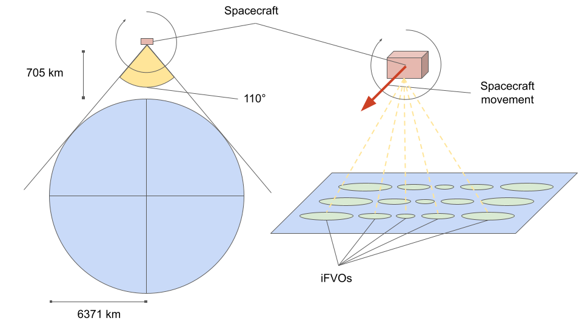
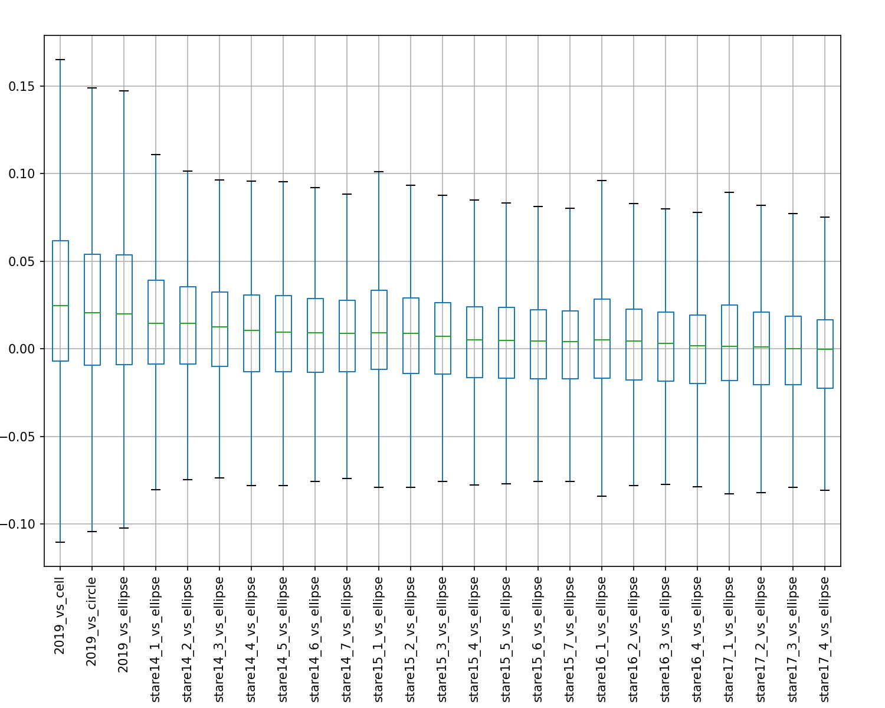

# Abstract {-}
Gridding of remote sensing products discretizes space and thus makes the evaluation of geospatial coincidence trivial. This dramatically simplifies the development of algorithms that require multiple observations of a single location as their input and further allows for easy algorithm accuracy evaluation against ground truth data. However, the loss in location precision leads to unnecessary noise in algorithm outputs. The (SPIReS) algorithm estimates (+fSCA) for surface reflectance observations using a snow-free observation of the same location as a reference. We demonstrate how the discretization of (+MODIS) surface reflectance data leads to spatial mismatching that propagates to errors in the estimation of fractional (+fSCA). We employ an approach forgoing gridded products and instead use the full spatial accuracy of (+MODIS) and (+VIIRS). Our approach uses a (+HTM) to represent the locations of individual ungridded observations, allowing us to spatially match fractionally snow-covered observations accurately with snow-free reference observations. This reduces the a (+MAE) of (+fSCA) estimates from 0.064 to 0.037. 

\glsresetall

# Introduction
Due to its high reflectance and large land cover, snow is an important forcing on Earth's radiation balance and hence the climate [@Durand2017; @Hansen2004]. Further, significant portions of Earth's population rely on water originating from snowmelt [@Barnett2005; @Durand2017]. 

It is, therefore, crucial to understand, estimate, and predict the spatial distribution and properties of snow, requiring spatially resolved measurements of the snowpack in terms of extent/cover, depth, density, and water content (summarizable in the (+SWE)), temperature profile, and albedo [@Dozier2004]. 

Traditional ways of measuring the snowpack are snow pillows, snow courses, and metrological surveys. While these measurements allow for detailed insights into the snowpack's properties, they are sparse, infrequent, and subject to inhomogeneous conditions. 

Conversely, remote sensing can provide spatiotemporally continuous data on the global extent of snow [@Dozier2004; @Nolin2010]: Snow extent can be retrieved from multispectral surface reflectance data and from (passive and active) microwave [@Frei2012] data. Global active microwave data is available from, e.g., QuickSCAT. However, only for the period between 1999 and 2009. Global passive microwave data has been continuously available since the 1970s. However, passive microwave data is only available at coarse spatial resolutions.

Specifically for mountainous regions characterized by high topographic heterogeneity, spatial resolutions need to be fine enough to capture the temporal and spatial variability of the snowpack sufficiently. [@Lettenmaier2015] suggests spatial resolutions of snow extent not coarser than $\approx \SI{100}{\meter}$ and temporal resolution of not more than one week. Hence, passive microwave data is unsuitable for mountainous areas' snow extent measurements. The required spatiotemporal resolution also exceeds the spatiotemporal resolution of multispectral surface reflectance data of spaceborne remote sensing instruments. While Landsat may have a sufficient spatial resolution, it lacks temporal resolution; conversely, while moderate resolution sensors such as (+MODIS) and (+VIIRS) have a sufficient temporal resolution, they lack spatial resolution. Since their pixels (aka (+^IFOV)) are too large to observe pure constituents, it, therefore, is necessary to map snow cover at sub-pixel accuracy [@Dozier2004].

Several algorithms to classify pixels into 'snow' or 'non-snow' (i.e., binary snowmaps) as well as algorithms to estimate (+fSCA) (i.e., sub-pixel) from multispectral surface reflectance data exist [@Nolin2010]:

Both snow and clouds are highly reflective in the visible part of the spectrum. However, contrary to clouds, snow is highly absorptive in the (+SWIR) part of the spectrum, allowing us to distinguish snow from clouds by using the ratio of visible and (+SWIR) [@Hall2011] surface reflectances. With the launch of Landsat 4 (+TM), which included sensors for (+SWIR), it became possible to discriminate snow from clouds on a global scale [@Lettenmaier2015] for the first time. [@Dozier1989] herefore introduced the normalized differences of a visible band and a (+SWIR) band (later termed (+NDSI) [@Hall1995]) to identify snow. Combined with threshold values of this difference, e.g., Landsat (+TM) pixels can be categorized into snow-covered and snow-free. The appeal of (+NDSI) lies in its simplicity:  An observation/pixel is identified as snow if its (+NDSI) exceeds a threshold of $NDSI \geq 0.4$,[@Dozier1989; @Hall1995].

$$NDSI = \frac{R\lambda(VIS)-R\lambda(SWIR)}{R\lambda(VIS)+R\lambda(SWIR)}$$

A challenge in snow-cover mapping is trees obscuring the snow beneath the canopy. [@Klein1998] therefore introduced a combination of (+NDVI) and (+NDSI) to reduce the error of snow cover detection in dense vegetation. The approach was adapted by [@Hall2002; @Hall2001] to introduce the operational global level-3 snow mapping products for (+MODIS) and (+VIIRS) (MOD10A1[^mod10a1]/VNP10A1[^VNP10A1]). The approach also includes thermal masks to identify "spurious snow": A pixel is determined not to be snow if its temperature is greater \SI{277}{\kelvin}). 

[^mod10a1]: [@MOD10A1]. [DOI: 10.5067/MODIS/MOD10A1.006](https://dx.doi.org/10.5067/MODIS/MOD10A1.006)

[^VNP10A1]: [@VNP10A1]. [DOI: 10.5067/VIIRS/VNP10A1.001]((https://dx.doi.org/10.5067/VIIRS/VNP10A1.001)

While the (+NDSI) itself should not be interpreted as (+fSCA) [@Stillinger2022], [@Salomonson2004; @Salomonson2006] developed a regression-based approach to conclude (+fSCA) from (+NDSI): The model is fitted with binary snowmap data from Landsat (+ETM) and results in the following relationships for MODIS/Terra:

$$
fSCA = -0.01 + (1.45 * NDSI)
$$

This regression approach fails in the transitional periods during accumulation and melt, overestimates (+fSCA) in some areas of the world while underestimating it in others, and has a high median error [@Rittger2013]. 

Higher accuracy of (+fSCA) estimations can be achieved through spectral analysis of multispectral measurements [@Stillinger2022]. Spectral mixing is the assumption that a measured spectrum is a combination of multiple constituent (aka endmembers) spectra. With spectral unmixing, the measured spectrum is decomposed into the spectra of the constituents, allowing the determination of the proportionate contributions of each constituent to the mixed spectrum [@Dozier1981; @Dozier2004]. Hence, spectral unmixing provides a method to retrieve sub-pixel detail [@Keshava2003].

E.g., we may assume that the reflectance spectrum $R$ that a sensor observes is a linear spectral mixture of the reflectance spectra $R_k$ of the constituent endmembers $k$ within a pixel. 

$$R_\lambda = \epsilon_{\lambda} + \sum_{k=1}^N f_k* R_{\lambda, k}$$

$R_\lambda$ is the observed reflectance at wavelength $\lambda$ that is modeled as the weighted sum of the constrained weights/fractions $f_k$ of the endmember $k$ with a reflectance of $R_{\lambda, k}$ and the residual error $\epsilon_{\lambda}$. Using a library of endmember reflectance spectra, we then may find the endmember fractional combination (i.e., all $f_k$) that minimizes the square error of the linear combination.

$$minimize \sqrt{\sum_{k_\lambda=0}^{n} \epsilon_\lambda^2}$$

[@Painter2003] describe (+MEMSCAG), a method derived from (+MESMA) [@Roberts1998], to obtain subpixel snow cover, grain size, and albedo for (+AVIRIS) pixels using spectral unmixing. [@Painter2009] describes (+MODSCAG), an progression of (+MEMSCAG) to work on multispectral (+MODIS) pixels rather than hyperspectral (+AVIRIS) pixels.  (+MEMSCAG) and (+MODSCAG) use endmembers libraries of snow, different rock and soil types, vegetation, and shade. The reflectances $R_{\lambda, k}$ of the rock/soil vegetation endmembers are measured in the field and the laboratory, while the snow endmembers are modeled for varying grain sizes and solar zenith angles.

The (+SPIReS) algorithm follows a similar approach. However, rather than solving for the non-snow endmembers, (+SPIReS) exploits the fact that for any given location (in the following referred to as a grid cell), the (mixed) non-snow endmember spectrum $R_0$ can be measured during the summer[^summer]. (+SPIReS) uses a snow-free endmember reflectance library containing a single snow-free spectrum for each grid cell. This single snow-free reflectance spectrum is selected from all measured spectra for a given grid cell subject to a set of criteria: The snow-free spectrum must not be quality flagged, be cloud and cloud shadow-free, and have an (+NDSI) of less than zero. From the spectra that pass those criteria, the spectrum with the highest (+NDVI) is selected as the snow-free reference spectrum[^exception]. Additional advancements of (+SPIReS) include a correction for canopy cover, persistence filters to eliminate false-positive caused by cloud presence, temporal smoothing, and cell clustering in which similar cells are grouped prior to computing to improve performance.

[^summer]: This, of course, excludes regions of permanent snow cover, such as the arctic regions or glaciers

[^exception]:  If no spectrum with an NDSI of less than zero exists for a given cell, the spectrum with the lowest band-3 reflectance is selected. 

# SPIReS uncertainty and possible causes 
> "location, location, location."

> Lord Harold Samuel

Both (+MODSCAG) and (+SPIReS) use _gridded_ (i.e., level 3) surface reflectance products as their inputs (e.g., MOD09GA[^mod09ga]). Gridded products bin irregularly spaced observations into a discretized space. Using gridded products greatly simplifies verification efforts in which snow cover estimates derived from other instruments (e.g., high-resolution binary snowmaps) have to be spatially associated with the snow cover estimates. In the case of (+SPIReS), the (fractionally) snow-covered observations also have to be spatially associated with snow-free observations of the same location, which is trivial using a gridded product and challenging for an ungridded product.

[^mod09ga]: [@MOD09GA]. [DOI [10.5067/MODIS/MOD09GA.006](http://dx.doi.org/10.5067/MODIS/MOD09GA.006)

While the gridded products bring the above-stated simplifications, they also introduce a source of uncertainty. The "level 3" (+MODIS) MOD09GA granules are produced by gridding and composing the irregularly spaced "level 2" MOD09[^mod09] observations. The methodology first spatially associates/grids/bins each MOD09 observation into a grid cell and then selects one of those binned observations as the best (subject to clouds, viewing geometry, and others)[^L2G] [@Wolfe1998; @Yang2001]. 

[^mod09]: [@MOD09] [DOI: 10.5067/MODIS/MOD09.006](http://dx.doi.org/10.5067/MODIS/MOD09.006)

[^L2G]: MOD09GA is an "(+L2G)" product, a hybrid between level 2 and level 3. In addition to the level 3 data, (+L2G) products contain "additional observations" for each cell. Those additional observations are values binned to a cell but not selected as the best observation in the composition step.


The spatial binning of MOD09GA reduces the spatial resolution by one order of magnitude: While the geolocations of individual (+^IFOV) are precise to approximately \SI{50}{\meter} [@Wolfe2002], they get binned into grid cells of approximately \SI{500}{\meter}. Figure \ref{redslake_centers} shows the wide spread of (+MODIS) (+^IFOV) center locations associated with a single cell.



However, it is not only the center locations that differ for each (+IFOV). (+MODIS) is a passive imaging spectroradiometer using a continuously rotating double-sided scan mirror. The mirror's rotation axis is in the same plane as the spacecraft's ground track. At a spacecraft altitude of \SI{705}{\kilo\meter}, the Earth is in sight for about \SI{110}{\degree} of the mirror's rotation/scan [@Barbieri1997]. Consequently, observations are retrieved under viewing/sensor zenith angles ranging from \SIrange{-55}{+55}{\degree} (c.f. figure \ref{spacecraft}). When the sensor is at a viewing angle of \SI{+-55}{\degree} (at the beginning/end of a scan), the observed footprint is significantly large than when the sensor is pointing straight down at nadir/\SI{0}{\degree}. 

The actual extent/footprint of each (+IFOV) thus varies significantly in size and location, which means that two (+^IFOV) binned into the same grid cell may have been for two very different areas. Figure \ref{footprints} shows approximations of the extent of four (+^IFOV) associated with the same cell. It visualizes the significant differences in the approximated extents/footprints that the (+^IFOV) cover depending on the sensor's viewing angle.


Specifically, in the mountains, characterized by high topographic variability, the irregularity of the actual (+IFOV) footprints leads to significant noise in derived estimands. Figure \ref{gridded_timeline} displays the time series of (+NDSI), (+NDVI), and (+fSCA) estimates from SPIReS[^visible_snow] for a _seemingly_ fixed location: A (+MODIS) grid cell at Reds Lake in Mammoth. We observe strong (+NDVI), (+NDSI), and (+fSCA) fluctuations. We also note that the estimated (+fSCA) stays well above `0` during the late summer months, for which we know the area was snow-free. Uncertainties in the atmospheric corrections, cloud cover and shadow, smoke presence, and variations in the solar and sensor zenith may explain some of the noise. In the following, we will demonstrate that the gridding introduces a large portion of the noise: The estimands in figure \ref{gridded_timeline} are only seemingly for a fixed location. In reality, the underlying observations' footprints dramatically vary in size and center location. It is thus not that the (+fSCA) estimates from SPIReS necessarily are inherently noisy; the estimates simply were made for varying footprints, some of which have larger (+fSCA) than others.

[^visible_snow]: The fractional snow cover estimates are for visible snow only.


The question consequently arises of how the accuracy of any derived product, in general, and the (+fSCA) estimations, in particular, should be evaluated. Gridded products may tempt the assumption that each (+fSCA) estimate is for the footprint of a grid cell. Under this assumption, we may find observations of a (higher resolution binary) ground-truth dataset intersecting the grid cell and compare the (+fSCA) estimation with the ground-truth data. The assumption, however, is false and causes the accuracy of the (+fSCA) estimates to appear much worse than they are. Instead, the actual footprint of each observation has to be considered, and the ground truth observations covering this footprint have to be found for the evaluation. Figure \ref{cell_vs_ifov} visualizes the issue: While the (+fSCA) is computed for the actual (+IFOV)footprint (red), it will be evaluated against data covering the cell if we naively use gridded data.


The location uncertainty introduces an additional issue specifically for (+SPIReS): (+SPIReS) does not solve for the snow-free endmembers of a fractionally snow-covered observation but instead uses a snow-free observation of the same location as the snow-free endmember. If gridded products are used, the snow-free observations for the "same" location is a (snow-free) observation associated with the same grid cell. Since the gridding blurred the location of the footprints of the observations, this snow-free observation may be for a different area than the fractionally snow-covered observation (even though they have been binned to the same grid cell). It is, e.g., conceivable that a fractionally snow-covered observation covers a region consisting of snow and forest while the associated snow-free observation covers a region consisting of soil and rock. 


Finally, a concern is that MOD09GA contains merely the sensors' zenith angles but no trivially accessible information about the actual viewing geometry of the observations[^pointers]. The sensor zenith angle alone does not provide information about whether an observation was acquired while the sensor was pointed left or right. However, knowing the actual viewing geometry may be crucial in mountainous terrain where opposing faces of the same mountain may significantly vary regarding the composition of rocks/soil and vegetation.

[^pointers]: Theoretically, the pointer files could be backtracked to identify the viewing geometry of each MOD09GA value. However, these pointer files are not archived and would have to be regenerated.


Figure \ref{leftright} shows (+NDVI) values for observations at a fixed location at Reds Lake in Mammoth (within a radius of \SI{50}{\meter}. C.f. figure \ref{ndvi_locs}) under varying viewing geometries (here represented as the along-scan position). The asymmetry demonstrates the influence of the viewing geometry on the reflectance spectrum: 
When the sensor passes east of the observed location and thus is looking west (i.e., low along-scan position), it co-registers the eastern face of _Top of Chair 15_ (Paranoid Flats), which is mainly exposed rock (c.f. figure top \ref{eastwest}). However, when the sensor passes west of the observed location and thus is looking east (i.e., high along-scan position), it co-registers the western face below the lift line of Chair 14, which is covered with sparse trees (c.f. figure bottom \ref{eastwest}). 

\begin{figure}
	\includegraphics[width=\textwidth]{images/C3/east.png}
	\includegraphics[width=\textwidth]{images/C3/west.png}
	\caption{View onto the same location at Reds Lake from the east (top) and the west (bottom). Note that looking west, a face with little vegetation will be co-registered while looking east, a face with sparse trees will be co-registered.}
	\label{eastwest}
\end{figure}

Part of the asymmetry in figure \ref{leftright} may be explained by the forward scattering behavior of vegetation (the Terra overpass at our (+ROI) is before noon). However, we observe similar asymmetric behavior for locations where the eastern face of a ridge has more vegetation than the western face. We display the (+NDVI) over the along-scan position for four additional exemplary locations in figure \ref{combined}. An apparent asymmetry is observable for all locations, which cannot be explained by the forward scattering alone.


Ideally, any fractionally snow-covered observation should thus not only be associated with a snow-free observation that is spatially as close as possible and was observed under a similar viewing geometry.

\newpage


# STARE Approach
In order to circumvent the introduction of uncertainties introduced by the gridding, we need to forego gridded data and work with ungridded level 2 data (i.e., MOD09/VNP09MOD). Working with ungridded data is cumbersome with conventional technologies. We, therefore, use the alternative geolocation representation (+STARE). (+STARE) firstly enabled us to associate each observation with a snow-free observation at approximately the same location and recorded under similar viewing geometries. Secondly, (+STARE) allows us to evaluate the accuracy of the (+fSCA) estimates by comparing them to "ground-truth" data for the approximate footprints of each (+IFOV).

The remainder of the paper is structured as follows: We first give a quick overview of (+STARE). We then describe the data preparation and the creation of our snow-free reflectance library. Finally, we describe our evaluation methods and display metrics on the accuracy improvements achieved by forgoing gridded data using (+STARE).

## STARE primer
(+STARE), extensively described in [@Rilee2021; @Rilee2020a; @Rilee2019; @Rilee2016; @Kuo2017], is an alternative spatial geolocation representation based on a (+HTM). Rather than expressing points as, e.g., latitudes and longitudes, (+STARE) express locations/points as nodes (aka trixels) in the (+HTM) and arbitrarily shaped regions (polygons) as sets of trixels (c.f. figure. \ref{stare}).


In a sense, (+STARE) is thus yet another gridding approach. However, contrary to conventional gridding, the grid resolution (the size of the bins into which individual observations are binned) is not fixed but adaptive. This brings immense advantages when working with data with inter- and intravariable resolutions. In (+STARE), identifying the intersection of irregularly shaped and spaced data at varying resolutions is trivial. We thus do not have to decide apriori a grid resolution into which we have to bin data, but rather maintain the original resolution of the data.

The (+STARE) concept is implemented in a collection of software. The collection contains software to convert conventional location representations into (+STARE) representations, various storage backends, and the ability to perform (+STARE)-based geoprocessing (such as unions, intersections, and dissolves) and geospatial analysis.

## Data Preparation
Our study area (+ROI) is around Mammoth Lakes in the eastern Sierra Nevada spanning from Lake Thomas Edison to June Lake (c.f. figure. \ref{roi}). We acquired all Level 2 (+MODIS)/Terra atmospherically corrected surface reflectance granules (MOD09[^mod09]) and their corresponding geolocation companion granules (MOD03[^mod03]) for the entire sensor lifetime from 2000-02-24 until 2022-09-15 (a total of \num{26466} granules, containing a total of \num{145e9} (+^IFOV), \num{243e6} of which intersecting our (+ROI)). We additionally acquired moderate-resolution VIIRS/Suomi surface reflectance granules (VNP09[^vnp09]) and their corresponding geolocation companion granules (VNP03MOD[^vnp03mod]) for the entire sensor lifetime from 2012-01-19 to 2022-09-15. We also acquired all gridded MOD09GA[^mod09ga] granules for tile H08V05[^ladsweb_dl] for verification purposes.

[^vnp09]: [@VNP09]. [DOI: 10.5067/VIIRS/VNP09.001](https://dx.doi.org/10.5067/VIIRS/VNP09.001)

[^mod03]: [@MOD03]. [DOI: 10.5067/MODIS/MOD03.061](https://dx.doi.org/10.5067/MODIS/MOD03.061)

[^vnp03mod]: [@VNP03MOD]. [DOI: 10.5067/VIIRS/VNP03MOD.002](https://dx.doi.org/10.5067/VIIRS/VNP03MOD.002)

[^ladsweb_dl]: we used the ladsweb_downloader to download all granules. Ladsweb_downloader is available at [https://github.com/NiklasPhabian/ladsweb_downloader](https://github.com/NiklasPhabian/ladsweb_downloader).


We then created (+STARE) sidecar companion files for each granule. (+STARE) sidecar companion files contain the geolocation for each (+IFOV) in (+STARE) representation. They are thus analogous to the MOD03/VNP03* companion files, which contain the geolocation of each (+IFOV) in WGS84 coordinates. The MOD09 granules contain surface reflectances at \SI{1000}{\meter}, \SI{500}{\meter}, and \SI{250}{\meter} resolution. However, (+MODIS) geolocations are only distributed at \SI{1000}{\meter} resolution. Since we intend to use the \SI{500}{\meter} surface reflectances, we thus created a geolocation interpolation algorithm described in section \ref{resadaption}.

Finally, we created estimations for each (+IFOV) footprint subject to the viewing geometry. Those footprint approximations are used to evaluate the (+fSCA) estimations against higher-resolution binary snowmaps. The creation of the footprint estimates is described in section \ref{sec_IFOV}.

## Resolution interpolation \label{resadaption}
(+MODIS) collects data at nominal resolutions of \SI{1000}{\meter}, \SI{500}{\meter}, and \SI{250}{\meter}. The calibrated surface reflectance product MOD09 contains reflectance spectra for all three resolutions, but merely the geolocation of the \SI{1}{\kilo\meter} resolution is distributed. In order to use the \SI{500}{\meter} resolution data, we, therefore, need to interpolate the \SI{500}{\meter} resolution geolocations. This is not an entirely trivial task since the (+MODIS) Level 1A Earth Location (+ATBD) [@MashNishihamaRobertWolfe1997] and the (+MODIS) Level 1B user manual [@Toller2009] merely give us hints on how to interpolate the higher-resolution geolocations:

The (+MODIS) Level 1A Earth Location (+ATBD) [@MashNishihamaRobertWolfe1997]  states[^github]: 

> "MODIS is built so that the start of the weighting function for the 500 m pixel is the same as the start of the weighting function for the 1 km pixel. This means that four 500 m pixels are not contained within a 1 km pixel."

[^github]: A private communication with the (+MODIS) support contradicts this statement and suggests the following ([from github](https://github.com/SpatioTemporal/STAREmaster/issues/42#issuecomment-678774303)) "Since the (+MODIS) geolocation is estimated at 1km only, [..] it is provided for 1km datasets only. The best way to use the 1m geolocation will be to co-locate each 500m/250m observations within the corresponding 1km pixel and then use the corresponding 1km geolocation."

![Pixel nesting of the \SI{1}{\kilo\meter}, \SI{500}{\meter}, and \SI{250}{\m eter} resolutions of MODIS. Source: Figure 2-8 of (+MODIS) Level 1A Earth Location  [@MashNishihamaRobertWolfe1997]. \label{pixel_nesting}](images/C3/modis_pixel_nesting.pdf)

This is visible in figure \ref{pixel_nesting}. [@Wolfe2002] further explains: 

> "To the first order, the (+MODIS) point-spread function is triangular in the scan direction. The centers of the integration areas of the first observation in each scan are aligned, in a 'peak-to-peak' alignment. ". And: "In the track direction, the point-spread function is rectangular and the observations at the different resolutions are nested, allowing four rows of 250 m observations and two rows of 500 m observations to cover the same area as one row of 1 km observations."

![MODIS triangular point-spread function for all resolutions. Figure 3-13 of the (+MODIS) Level 1A Earth Location: [@MashNishihamaRobertWolfe1997]. \label{pointspread}](images/C3/sampling_rates.pdf)

This is visualized in figure \ref{pointspread}. The (+MODIS) Level 1B User Guide [@Toller2009] further suggests:

> "Interpolation may be used to recover latitude and longitude of all pixels [..]. Note that, due to the overlap between consecutive scans, interpolation across scan boundaries, such as is done by these HDF-EOS swath functions, can produce inaccurate results. Near scan boundaries, it is better to extrapolate from within the same scan, than to interpolate with values from the adjacent scan." 

Finally, [@MashNishihamaRobertWolfe1997] states that: 

> "The samples for each band are delayed by an appropriate amount so that all samples in a frame of data start at the same point on the ground. "

We combined these pieces of information in our geolocation interpolation algorithm[^get_500m]: We process one scan group at a time. For the \SI{1}{\kilo\meter} resolution, a scan group contains 10 (+^IFOV) along-track and 1354 (+^IFOV) along-scan. The first observations of all resolutions are aligned in scan direction. The first \SI{500}{\meter} resolution geolocations in scan direction, therefore, sit between the \SI{1000}{\meter} resolution in track direction offset by 1/4 of the distance to the following observation in track direction. The same is true for all other odd-numbered observations in scan direction. The even-numbered observations in scan direction sit halfway between the odd-numbered observations. The last observation in scan direction has to be extrapolated. 

Figures \ref{500_start}, \ref{500_center}, and \ref{500_end} display the original \SI{1000}{\meter} resolution geolocations (red) and the interpolated \SI{500}{\meter} geolocations (blue) for one and a half \SI{1000}{\meter} scan groups at the beginning (\ref{500_start}), the center (\ref{500_center}), and the end (\ref{500_end}) of a scan. Note how six \SI{500}{\meter} resolution observations nest into one \SI{1000}{\meter} resolution observation.

[^get_500m]: [STAREMaster's \SI{500}{\meter} interpolation function on GitHub](https://github.com/SpatioTemporal/STAREMaster_py/blob/eb17c1a50cfb66de4a3737fbfc65f1855479ca7d/staremaster/products/mod09.py#L33)


## IFOV approximation \label{sec_IFOV}
In order to evaluate the accuracy of a sub-pixel estimand in general and the (+fSCA) from (+SPIReS) in particular, we compare the estimated values against ground truth data. In practice, the ground truth data will often be binary data derived from sensors with higher spatial resolutions. E.g., a (+MODIS) (+IFOV) at nadir may have an approximate footprint of $\SI{500}{\meter} \;x\; \SI{500}{\meter}$[^cell_size], covering about 250 Landsat pixels. 

[^cell_size]: The actual cell size is $w * w$. With  $w = T / n= \SI{463.31271653}{\meter}$.  $T=\SI{1111950}{\meter}$ is the height and width of each (+MODIS) tile in the projection plane, and $n=2400$ the number of cells in a (+MODIS) tile in width and height direction [@Meister2008].


Comparing subpixel estimands of an (+IFOV) against verification data requires us to evaluate spatial coincidence between the (+IFOV) footprints and the verification data. We thus need an approximate spatial representation for the (+IFOV) footprints to achieve this. As previously discussed, we consider a grid cell at a constant resolution of $\SI{500}{\meter} \;x\;  \SI{500}{\meter}$ as an inapt footprint approximation. We instead created two alternative approximations:

The first approximation assumes that the (+IFOV)'s footprint is a circle around the geolocation with a constant diameter equaling the nominal resolution, i.e., \SI{500}{\meter} for (+MODIS) and \SI{750}{\meter} for (+VIIRS). 

The second approximation assumes that the (+IFOV)'s footprint has the shape of an ellipse. We use the fact that we have some idea of the distortion introduced by the sensor's zenith angle. From the (+MODIS) Level 1A Earth Location (+ATBD) [@MashNishihamaRobertWolfe1997], we know that the resolution of a \SI{1}{\kilo\meter} spatial element at a \SI{55}{\degree} scan angle has ground dimensions of approximately \SI{4800}{\meter} along-scan and \SI{2000}{\meter} along-track. We can further derive a relation between scan angle (sensor zenith) and along-scan and along-track (+IFOV) size (c.f. figure \ref{ifov_growth}.) We approach it with the following: 

$$ length = \frac{e^{a*x}}{b} + c$$

With:

|             | a   | b    |c     |
|:--          |:--- |:---  |:---  | 
| along-scan  |0.09 | \SI{40.9}{\per\kilo\meter} | \SI{1.00}{\kilo\meter} |
| along-track |0.07 | \SI{35.2}{\per\kilo\meter} | \SI{0.98}{\kilo\meter} |

Using the derived along-track and the along-scan lengths, we create ellipses around each (+IFOV) geolocation, using the along-track length as the length of the semi-minor axis and the along-scan length as the length semi-major axis. We finally orient each ellipse according to the sensor's instantaneous azimuth angle. A set of resulting ellipse footprint approximations are visualized in figure \ref{footprints}. Figure \ref{circles} displays (+^IFOV) approximated as circles with constant diameter and as ellipses with semi-minor and semi-major axes lengths adjusted to the sensor zenith angle and orientation adjusted to the sensor azimuth angle.


## Viewing geometry discretization
Our thesis is that we can improve the accuracy of (+SPIReS)' (+fSCA) estimates by using snow-free reference reflectances $R_0$ that have been observed under a similar viewing geometry as the reflectances $R$ of the observation for which the (+fSCA) is to be estimated.


(+MODIS) has an orbital repeat cycle of 16 days [@King2003; @Wolfe2002]. This means that every 16 days, the ground track repeats. Consequently, there are 16 distinct viewing geometries under which (+MODIS) observations are made for any given location outside of latitudes of approximately \SI{+-30}{\degree}. Due to orbital dynamics and orbit drift, the overpasses in each orbital track vary slightly. Figure \ref{viewing_geoms} displays along-scan positions under which MODIS/Terra observations were taken for a fixed location over time. The 16 ground track groups of (+MODIS)'s 16-day orbital repeat cycle are visible. It is noteworthy to draw attention to the 'bumps,' presumably caused by orbital anomalies and consequent corrective satellite maneuvers. Towards the end of the time series, the uncorrected orbital drift[^drift]  is observable. (+MODIS) is drifting towards earlier equator crossing times (conceptually: drifting westwards), causing observations for a fixed location to be made increasingly earlier in the day and thus at lower along scan positions[^scan]. If (+MODIS) were to remain in this drifting orbit long enough, the gaps between the orbit track groups would eventually fill.

[^drift]: [https://terra.nasa.gov/about/terra-orbital-drift-information](https://terra.nasa.gov/about/terra-orbital-drift-information?_ga=2.113741903.959412644.1666982590-2093997614.1657309207)

[^scan]: (+MODIS) flies south and scans west to east for daytime observations.

The along-scan position is a proxy for the viewing geometry. It gives us information about the sensor zenith (and thus the extent of the (+IFOV)) and whether the sensor looked left, right, or (approximately) straight down. Since we want to find a $R_0$ for every $R$ observed under a similar viewing geometry, we discretize the along-scan position at different resolutions. At a discretization of 1, we do not distinguish between different viewing geometries. At a discretization of 2, we only distinguish whether the sensor looked left or right. At a discretization of 3, we distinguish between the sensor looking left, right, or approximately straight down. At higher discretizations, we add further fidelity to the viewing geometry.

## Snow-Free Reflectance (R<sub>0</sub>) Library
To compute the (+fSCA) for a reflectance spectrum $R$ observed for a given location, (+SPIReS) requires a snow-free reflectance spectrum $R_0$ for the same location. The question of what "same location" means immediately arises, considering that each observation has a unique geolocation and footprint. One could find the spatially closest observation by evaluating geodesic distances. However, evaluating possibly trillions of distances ad-hoc is computationally infeasible. The correct answer is that some degree of location discretization is required. 

Discretization enables us to bin observations sufficiently close to each other and consider them spatially coincidental. When using the standard gridded surface reflectance products, we assume every observation binned to the same grid cell is spatially coincident. As previously stated, our thesis is that this is a too strong coarsening considering that the geolocation is known to approximately \SI{50}{\meter}. We thus create a $R_0$ library at a higher spatial resolution.

The algorithm for finding a $R_0$ for each grid cell works as follows[^create_r0]:

```{caption="Algorithm for finding an $R_0$ for each grid cell" label=r0_algo}
For each cell:
	1. Consider all observed spectra for the cell
	2. Discard observations with a SensorZenith > 30 degree
	3. Find the observation with the lowest NDSI
	4. If the lowest NDSI < 0:
		1. Discard observations that 
			1. Have internal cloud mask set, or
			2. Have internal snow mask set, or
			3. Have MOD35 cloudmask set, but not saltpan
		2. The observation with maximum NDVI is R0
	5. Else: (e.g., permanent snow)
		1. Discard observations with Band 3 < 0.1
		2. The observation with the lowest Band 3 value is R0
```

[^create_r0]: [createR0.m on github](https://github.com/edwardbair/SPIRES/blob/master/prepInputs/createR0.m)

We adapt this algorithm to create $R_0$ for (+STARE) trixels rather than for grid cells and create $R_0$ libraries at different (+STARE) quadfurcation levels. We additionally take the viewing geometry, represented by the along-scan position, into account. The choice of the quadfurcation level and the along-scan position discretization is a nexus. While conceptually, we want a high resolution in geolocation and viewing geometry, we decrease the number of candidate snow-free reflectances per bin with increasing resolution. If the count of the number of candidates per bin is too low, we may not find good (i.e., cloud-free, snow-free, and not quality-flagged) snow-free spectra.

At the latitude of our (+ROI), a \SI{500}{\meter} x \SI{500}{\meter} cell is roughly observed once per day (the revisit period is one day). Considering a data range of 8239 days (from 2000-02-24 to 2022-09-15), this gives about 8239 candidate spectra to choose from when discretizing to the (+MODIS) grid cells. A (+STARE) trixel at quadfurcation level 14 has roughly the same area as a (+MODIS) grid cell. We thus expect roughly one observation per day falling into a level 14 trixel. At level 15, we expect the revisit period to be $ 1/4 $ of that since a level 15 trixel is four times smaller than a level 14 trixel. 

Table: Approximate trixel areas, edge lengths, and (+MODIS) revisit periods and total visits for the data duration of 8239 days \label{trixel_sizes}

|   Level | Area                          | Edge                  | Revisit Period   |    n Visits |
|--------:|:------------------------------|:----------------------|----------------: |------------:|
|      12 | \SI{5.11e+06}{\meter\squared} | \SI{3.20e+03}{\meter} | 0.05 days        | 167 544.0   |
|      13 | \SI{1.28e+06}{\meter\squared} | \SI{1.60e+03}{\meter} | 0.20 days        |  41 885.9   |
|      14 | \SI{3.19e+05}{\meter\squared} | \SI{7.99e+02}{\meter} | 0.78 days        |  10 471.5   |
|      15 | \SI{7.99e+04}{\meter\squared} | \SI{4.00e+02}{\meter} | 3.13 days        |   2 617.9   |
|      16 | \SI{2.00e+04}{\meter\squared} | \SI{2.00e+02}{\meter} | 12.52 days       |     654.5   |
|      17 | \SI{4.99e+03}{\meter\squared} | \SI{9.99e+01}{\meter} | 50.08 days       |     163.6   |
|      18 | \SI{1.25e+03}{\meter\squared} | \SI{5.00e+01}{\meter} | 200.32 days      |      40.9   |

Table \ref{trixel_sizes} displays the areas and edge lengths of trixels at varying quadfurcation levels. It also contains the estimated _revisit periods_ which is the nominal resolution divided by the area of the trixels, assuming one overpass per day. It is to be understood as the maximum revisit period. The column _visit count_ is the revisit period multiplied by the data duration (8239 days). It gives us a rough approximation of how many candidate spectra we will have per spatial bin.

Note that the average trixel area $A_{trixel}$  and edge length $l_{trixel}$ may be naively computed as indicated below. However, depending on the position of the trixels in the initial solid's faces, the trixel areas vary across the globe. Table \ref{trixel_sizes} shows the actual areas and lengths computed for trixels in our (+ROI).

$$
\begin{split}
r_{earth} &= \SI{6371007}{\meter} \\
A_{earth} &= 4*\pi * r_{earth}^2 \\
A_{trixel} &= A_{earth} / 8 / (4^{level}) \\
l_{trixel} &= (A_{trixel}*2)^{0.5}
\end{split}
$$

The (+MODIS) geolocation precision is approximately \SI{50}{\meter} [@Wolfe2002] (\SI{2.5e3}{\meter\squared}), matching trixel areas at quadfurcation level between 16 and 17. This gives us the upper bound for the quadfurcation level. A cell with an edge length of \SI{463.3}{\meter} has an area of \SI{2.14e5}{\meter\squared}, matching quadfurcation level between 14 and 15, giving us the lower bound for the quadfurcation level.

We created $R_0$ libraries for quadfurcation levels 14 to 17 using the same logic as in listing \ref{r0_algo}. We then further binned the observations for each trixel by their viewing geometry, discretized in 1 to 7 groups. This would lead to a total of 28 $R_0$ libraries. We recognize we have too few candidate spectra at high spatial resolution and viewing geometry discretization. We, therefore, discarded the $R_0$ libraries with quadfurcation levels above 16 and[^and] viewing geometry discretizations above 4. This leaves us with a total of 22 $R_0$ libraries. 

[^and]: logical and

Table \ref{trixel_revisits} gives the actual average number of observations falling into trixels at different quadfurcation levels, approximately matching our theoretically expected number of revisits in table \ref{trixel_sizes}. Figure \ref{r0} visualizes the number of observations that fell into each trixel of a level 15 (+STARE) grid in our (+ROI). 

Table: Number of observations that fell into trixels at varying quadfurcation levels \label{trixel_revisits}

|   Level | n Visits (mean)  |
|--------:|----------:|
|      14 | 6 696      | 
|      15 | 1 767      | 
|      16 |  486       | 
|      17 |  145       | 
|      18 |  49        | 


{height=600px}

## Computation of fSCA
To compute the (+fSCA) in our (+STARE) approach for a given reflectance spectrum $R$, we proceed as follows: First, we choose the discretization level of our $R_0$ library. This means we:
 
a) select a spatial resolution ((+STARE) quadfurcation level) at which we evaluate spatial coincidence, and 
b) select a viewing geometry discretization. 

Secondly, we iterate over each observation $O$ for which we want to calculate the (+fSCA). Using (+STARE), we find all snow-free observations $O_0$ that spatially coincide with each $O$. From those, we find the observation with the most similar along-scan position to $O$. We then feed the reflectance spectra of $O$ and $O_0$ ($R$ and $R_0$, respectively) to SpiPy[^spipy], which returns the (+fSCA), the fractional shade cover (fShade), the snow's grain size, and dust concentration for $O$.

[^spipy]: https://github.com/edwardbair/SpiPy

# Evaluation and Results
We carry out two evaluation efforts. First, we evaluate the accuracy of (+fSCA) retrievals for a short period over a large (+ROI). We here evaluate the influence of the spatial resolution and viewing angle discretization of the $R_0$ library. We evaluate the accuracy by comparing the (+fSCA) values to high-resolution binary snowmaps of the approximate (+IFOV) footprints. The task is twofold:

- We ensure that each fractionally snow-covered observation is associated with a snow-free observation that is as close as possible regarding location and viewing geometry. 
- We use the approximate footprint of each (+IFOV) to allow a more accurate comparison to ground-truth data to better evaluate the (+fSCA) accuracy.

In the second effort, we evaluate the plausibility of seasonal (+fSCA) time series over small selected locations. We further attempt to join (+fSCA) retrievals from (+MODIS)/Terra and (+VIIRS)/Suomi.

## fSCA accuracy
To evaluate the (+fSCA) accuracy, we use a Binary Viewable Snow Covered Area Validation Mask [@Stillinger_Bair_2020] derived from cloud-free WorldView-2/3 data for 2017-12-11 over our (+ROI). 

In figure \ref{snow_depth}, we display snow depth measured at the (+CUES) [@Colee_2016] in the vicinity of McCoy Station in Mammoth, for the days before and after 2017-12-11[^cues]. Since we observe only a slight variations in snow depth during this period, we conclude that neither significant melting nor a snow accumulation event occurred. We consequently assume the Binary Snow Covered Area Mask to be representative of the period between 2017-12-07 and 2017-12-13.

[^cues]: Data retrieved from [https://snow.ucsb.edu/](https://snow.ucsb.edu/)


We compute the (+fSCA) for each (+MODIS) and (+VIIRS) (+IFOV) falling into our (+ROI) using snow-free endmembers for all of our $R_0$ libraries for six days between 2017-12-07 and 2017-12-13, skipping 2017-12-09 since it had a far-off nadir viewing angle for MODIS/Terra over our (+ROI). A total of \num{13709} (+MODIS) and \num{8912} (+VIIRS) (+^IFOV) fell into our spatiotemporal bounding box. We additionally compute the (+fSCA) using a standard MODIS-grid $R_0$ library as a reference. 

### MODIS
The six days contained six distinctly different (+MODIS) overpasses, as displayed in figure \ref{overpasses}: Two overpasses appeared close to the nadir, two overpasses far off-nadir, and two overpasses at an intermediate distance, one each with (+MODIS) passing east and west of our (+ROI). We can notice a slight influence of smoke from the Thomas Fire in Santa Barbara and Ventura county (c.f. figure \ref{thomas}) over our ROI. 


We then use our (+IFOV) footprint approximations to retrieve the pixels of the high-resolution Binary Viewable Snow Covered Area Validation Mask that intersect each footprint. For each footprint, we compute the "ground truth" fractional snow cover $fSCA_{gt}$ as the ratio of pixels marked as snow-covered to the total number of pixels intersecting the footprint. We then declare the difference between the (+fSCA) retrieved for the footprint from (+SPIReS) $fSCA_{spires}$ and the $fSCA_{gt}$ as the estimation error and calculate the (+MAE), (+RMSE), and the variance over all (+^IFOV).

$$
fSCA_{gt} = \frac{n_{snow}}{n_{total}}
$$

$$
MAE = \sum_{i=0}^n \frac{|fSCA_{spires} -fSCA_{gt}|}{n}
$$
$$
RMSE = \sqrt{\sum_{i=0}^n \frac{(fSCA_{spires} -fSCA_{gt})^2}{n}}
$$

### MODIS
The (+fSCA) errors are displayed in figure \ref{results_modis_full}. The three leftmost columns are the errors of (+fSCA) computed using (+MODIS)-grid $R_0$ library values. In the leftmost column, we assumed the (+IFOV) footprints to be the (+MODIS) grid cells. This scenario is thus equivalent to the conventional (+SPIReS) approach. In the second column, we assume the (+IFOV) footprints to be circles with a constant radius. In the third column, we assumed the (+IFOV) footprints to be ellipses. The following columns represent the errors of the (+fSCA) computed using STARE-based $R_0$ values at increasing spatial resolution and viewing angle discretization. We can immediately observe the following results:

1) The (+fSCA) estimates accuracy improves when assuming a circular (+IFOV) footprint centered over the (+IFOV)'s geolocation and improves marginally further when assuming an ellipse as the (+IFOV) footprint
2) The (+fSCA) estimate accuracy is better for the (+STARE) $R_0$ libraries than for the (+MODIS) grid $R_0$ libraries. This is also true for quadfurcation level 14, which has a similar spatial resolution as the (+MODIS) grid.
3) The (+fSCA) estimates accuracy improves with the quadfurcation levels and viewing geometry discretization. 
4) The best (+fSCA) estimates are for high spatial resolution (quadfurcation levels 16 and 17) and a medium number of viewing geometry bins (4). The highest accuracy was achieved for (+STARE) quadfurcation levels 16 and 17 and 4 viewing geometry bins.



Table \ref{tab_res_modis} shows the mean absolute error (+MAE), the (+RMSE), and the variance of the (+fSCA) estimates for the scenarios named above. [@Bair2021] and [@Stillinger2022] state the (+RMSE) for (+SPIReS) with 0.12 and 0.1, respectively. Those values approximately match the (+RMSE) of our conventional scenario (0.0915). In terms of (+MAE), the best STARE-based accuracy is achieved at a spatial resolution of 17 and 4 viewing geometry discretizations. The (+MAE) is almost halved compared to the conventional grid-based approach.

Table: Mean absolute error, root mean square error, and variance of the (+fSCA) estimates for different $R_0$ scenarios. \label{tab_res_modis}

| $R_0$ res          |$R_0$ view bins    | IFOV extent | MAE    | RMSE   |  Variance |
|:--------------  |:----------     |:----------- |-------:|-------:|-----------:|
| grid            | 1              | cell        | 0.0644 | **0.0915** |     0.0081 |
| grid            | 1              | circle      | 0.0534 | 0.0736 |     0.0051 |
| grid            | 1              | ellipse     | 0.0520 | 0.0718 |     0.0049 |
| level 14        | 1              | ellipse     | 0.0432 | 0.0632 |     0.0039 |
| level 14        | 2              | ellipse     | 0.0421 | 0.0621 |     0.0038 |
| level 14        | 3              | ellipse     | 0.0410 | 0.062  |     0.0038 |
| level 14        | 4              | ellipse     | 0.0400 | 0.0611 |     0.0037 |
| level 14        | 5              | ellipse     | 0.0401 | 0.0616 |     0.0038 |
| level 14        | 6              | ellipse     | 0.0392 | 0.0609 |     0.0037 |
| level 14        | 7              | ellipse     | 0.0387 | 0.0606 |     0.0037 |
| level 15        | 1              | ellipse     | 0.0404 | 0.0616 |     0.0038 |
| level 15        | 2              | ellipse     | 0.0394 | 0.0608 |     0.0037 |
| level 15        | 3              | ellipse     | 0.0384 | 0.0608 |     0.0037 |
| level 15        | 4              | ellipse     | 0.0374 | 0.0600 |     0.0036 |
| level 15        | 5              | ellipse     | 0.0377 | 0.0605 |     0.0037 |
| level 15        | 6              | ellipse     | 0.0372 | 0.0600 |     0.0036 |
| level 15        | 7              | ellipse     | 0.0370 | 0.0602 |     0.0036 |
| level 16        | 1              | ellipse     | 0.0387 | 0.0607 |     0.0037 |
| level 16        | 2              | ellipse     | 0.0375 | 0.0598 |     0.0036 |
| level 16        | 3              | ellipse     | 0.0368 | 0.0597 |     0.0035 |
| level 16        | 4              | ellipse     | **0.0365** | 0.0596 |     0.0035 |
| level 17        | 1              | ellipse     | 0.0371 | 0.0591 |     0.0035 |
| level 17        | 2              | ellipse     | 0.0374 | 0.0603 |     0.0036 |
| level 17        | 3              | ellipse     | 0.0367 | 0.0603 |     0.0036 |
| level 17        | 4              | ellipse     | **0.0366** | 0.0602 |     0.0036 |


We interpret the 4 previous findings as follows:

1) Using an (+IFOV) footprint approximation centered around the geolocation is relevant. The circles and ellipses around the relatively precise geolocation are a better approximation of the (+IFOV) than cells of a fixed grid. The triangular point-spread function likely causes the merely marginal improvement of ellipse vs. circle: Most of the information that a sensor collects comes from the area immediately around the center. Therefore, respecting the center location is mainly relevant, while the exact shape of the (+IFOV) approximation may not play a significant role.
2) The (+MODIS) gridding algorithm 'forces' there to be one observation per grid cell per day. On days with far-off nadir overpasses, this leads to oversampling, meaning that a single observation is associated with multiple grid cells (c.f. figure \ref{oversampling}). Since each grid cell has its own $R_0$, each one of those grid cells will have a different (+fSCA) estimate, but not for the right reason. If we compute (+fSCA) for (+^IFOV) rather than for grid cells, we circumvent this error, explaining the immediate accuracy improvement even at (+STARE) quadfurcation level 14.
3) The $R_0$ library quadfurcation level dictates how closely $O$ and $O_0$ center locations are matched, while the viewing geometry discretization dictates how closely the footprint of the (+^IFOV) of $O$ and $O_0$ are matched. The closer the footprints match, the less noise from co-registration appears. Higher resolutions, therefore, result in higher accuracy. We would not expect further gains at resolutions higher than the geolocation accuracy.
4) The number of candidates to choose an ideal snow-free observation during the creation of the $R_0$ library decreases with increasing resolutions (both in terms of quadfurcation level and viewing geometry discretization). At too high resolutions, some bins will end up with suboptimal $R_0$ spectra (e.g., cloud or smoke contamination), driving down the overall accuracy.

### VIIRS
We conducted the same analysis for the (+VIIRS) surface reflectance data as we did for the (+MODIS) surface reflectance data. Considering the similar band-passes of (+MODIS) and (+VIIRS), we also evaluated the accuracy of (+fSCA) estimates when using (+VIIRS) spectra for $R$ and (+MODIS) $R_0$ spectra. This is interesting as creating an $R_0$ library at high resolutions requires a long data range, which is not available for new sensors. Thus, the ability to use $R_0$ from a different sensor than $R$ allows calculating (+fSCA) estimates with (+SPIReS) as soon as a new sensor becomes available.

Table \ref{res_tab_viirs} summarizes the accuracy metrics of (+fSCA) estimates from (+VIIRS) observations. The overall (+fSCA) accuracy is lower for the (+VIIRS) surface reflectance data than for the (+MODIS) surface reflectance data. (+VIIRS)' lower spatial resolution may partially explain this. The viewing geometry discretization does not improve the (+fSCA) accuracy for (+VIIRS) data. This makes sense considering the quasi-constant spatial resolution of (+VIIRS) (+^IFOV). For (+VIIRS), the highest accuracy is achieved for lower quadfurcation levels than for the (+MODIS) data. Again, this may be explained by the lower spatial resolution of VIIRS. 

Table: Mean absolute error, root mean square error, and variance of the (+fSCA) estimates for different $R_0$ scenarios \label{res_tab_viirs}

| $R_0$ res       |$R_0$ view bins | (+MAE)    | RMSE   | Variance |
|:--------------  |:----------     |-------:|-------:|---------:|
| level 14        | 1              | 0.0763 | 0.1048 |   0.0107 |
| level 14        | 2              | 0.0834 | 0.1102 |   0.0116 |
| level 14        | 3              | 0.0795 | 0.1071 |   0.0111 |
| level 14        | 4              | 0.0775 | 0.1059 |   0.011  |
| level 14        | 5              | 0.0764 | 0.1048 |   0.0107 |
| level 14        | 6              | 0.074  | 0.1028 |   0.0104 |
| level 14        | 7              | 0.0742 | 0.1037 |   0.0106 |
| level 15        | 1              | 0.0742 | 0.1048 |   0.0108 |
| level 15        | 2              | 0.0798 | 0.1072 |   0.0112 |
| level 15        | 3              | 0.0765 | 0.1051 |   0.0109 |
| level 15        | 4              | 0.0745 | 0.1044 |   0.0108 |
| level 15        | 5              | 0.0738 | 0.1038 |   0.0107 |
| level 15        | 6              | **0.0721** | 0.1043 |   0.0108 |
| level 15        | 7              | **0.0721** | 0.1052 |   0.011  |
| level 16        | 1              | 0.0743 | 0.1107 |   0.0122 |
| level 16        | 2              | 0.0779 | 0.1072 |   0.0113 |
| level 16        | 3              | 0.0757 | 0.1089 |   0.0118 |
| level 16        | 4              | 0.0742 | 0.1095 |   0.012  |
| level 17        | 1              | 0.076  | 0.118  |   0.0139 |
| level 17        | 2              | 0.0775 | 0.1147 |   0.0131 |
| level 17        | 3              | 0.0801 | 0.1248 |   0.0156 |
| level 17        | 4              | 0.0812 | 0.1298 |   0.0168 |

We found similar accuracies when calculating (+fSCA) from (+VIIRS) observations using $R_0$ libraries from (+MODIS) observations. The (+^MAE) range from 0.072 to 0.081. 

| $R_0$ res    | $R_0$ view bins    |    AME |   RMSE |   Variance |
|:----------|:-------         |-------:|-------:|    -------:|
| level 14  | 1	              | 0.0796 | 0.1064 | 0.0108 |
| level 14  | 2               | 0.0827 | 0.1090 | 0.0113 |
| level 14  | 3	              | 0.0798 | 0.1063 | 0.0108 |
| level 14  | 4	              | 0.0780 | 0.1048 | 0.0106 |
| level 14  | 5	              | 0.0768 | 0.1039 | 0.0105 |
| level 14  | 6	              | 0.0763 | 0.1035 | 0.0104 |
| level 14  | 7	              | 0.0754 | 0.1028 | 0.0103 |
| level 15  | 1               | 0.0771 | 0.1048 | 0.0106 |
| level 15  | 2               | 0.0808 | 0.1078 | 0.0112 |
| level 15  | 3               | 0.0774 | 0.1047 | 0.0107 |
| level 15  | 4               | 0.076  | 0.1038 | 0.0105 |
| level 15  | 5               | 0.0747 | 0.1025 | 0.0103 |
| level 15  | 6               | 0.074  | 0.1021 | 0.0103 |
| level 15  | 7               | 0.073  | 0.1014 | 0.0102 |
| level 16  | 1               | 0.0746 | 0.1029 | 0.0104 |
| level 16  | 2               | 0.079  | 0.1065 | 0.011  |
| level 16  | 3               | 0.0755 | 0.1032 | 0.0105 |
| level 16  | 4               | 0.0745 | 0.1027 | 0.0104 |
| level 17  | 1               | **0.072**  | 0.1005 | 0.0099 |
| level 17  | 2               | 0.0771 | 0.1049 | 0.0108 |
| level 17  | 3               | 0.0738 | 0.1022 | 0.0103 |
| level 17  | 4               | 0.0731 | 0.1019 | 0.0103 |

## Time series Plausibility
Figure \ref{fsca_gridded} shows a time series of (+fSCA) computed for a grid cell at Reds Lake and (+CUES) using a MODIS-grid $R_0$ library. Two things are immediately observable: 

1) There are substantial fluctuations in the (+fSCA). These fluctuations are not plausible and thus are to be interpreted as noise[^noise].
2) The (+fSCA) values were significantly larger than zero for the summer months. However, there was no snow at the two locations for the late summer months - neither in late 2021 nor 2022.

[^noise]: Whether to consider the fluctuations noise or errors depends on the point of view. If we assume that the location precision is irreversibly lost due to gridding, we may call the fluctuations noise. If we on the other side assume that gridding unnecessarily coarsened the resolution, we would conclude the fluctuations to be errors.

\begin{figure}
	\includegraphics[width=\textwidth]{images/C3/fsca_gridded_reds.png}
	\includegraphics[width=\textwidth]{images/C3/fsca_gridded_cues.png}
	\caption{SPIReS (+fSCA) for a single grid cell at Reds lake (top) and CUES (bottom).
	Reds Lake: x = 1373; y = 566. CUES x = 1379; y = 565 of tile H08V05}
	\label{fsca_gridded}
\end{figure}

While part of the noise certainly is caused by uncertainties in the atmospheric corrections, cloud cover and shadow, or smoke presence, a significant part of the noise in the time series is induced by the (+IFOV) footprint variations, the spatial mismatching of $R$ and $R_0$, and oversampling. 


In figure \ref{fsca_stare_reds}, we display the (+fSCA) computed for a level 15 trixel at Reds Lake, and in figure \ref{fsca_stare_cues} for a level 15 trixel at (+CUES) for (+MODIS) and (+VIIRS). We computed the (+fSCA) in figure \ref{fsca_stare_reds} and \ref{fsca_stare_cues} with the (+STARE) $R_0$ library at level 17 and 3 viewing geometry bins. For comparison, we added the snow depth measured at (+CUES) to identify snow precipitation events. Note that we do not expect the snow depth to be proportional to the (+fSCA) at Reds Lake or CUES. However, they are correlated. The timing of the snow accumulation events closely matches the increases in (+fSCA). We also note that the (+fSCA) during the summer months is closer to zero than for the gridded data in figure \ref{fsca_gridded}. This is caused by a better spatial match of $R$ and $R_0$. The remaining noise in the summer months may partially be caused by wildfire smoke. The difference between the (+MODIS) (+fSCA) and the (+VIIRS) (+fSCA) can be explained by their differing spatial resolution of \SI{500}{\meter} vs. \SI{750}{\meter}. Overall, compared to \ref{fsca_gridded}, we traded off temporal resolution for location accuracy, leading to a significantly less noisy signal. 


The time series in figure \ref{fsca_stare_reds} and \ref{fsca_stare_cues} include all (+^IFOV) whose geolocation fell into the respective trixels. The blue dots in figure \ref{timeseries_locations} are the geolocations of the (+^IFOV) associated with the grid cell around Reds Lake used for figure \ref{fsca_gridded}. The red and green dots are the geolocations of the (+MODIS) and (+VIIRS) (+^IFOV) that fell into the level 15 trixel used for figure \ref{fsca_stare_reds}. 

We did not filter out any observations subject to their sensor zenith angle. Figure \ref{fsca_stare_reds} and \ref{fsca_stare_reds} thus contain (+^IFOV)with significantly larger footprints than others. However, the (+IFOV)centers were all at approximately the same location. Since (+MODIS) and (+VIIRS) have a triangular sensor response function, it may be assumed that the majority of the information of any given pixel does come from the area close to the center location, explaining the smoothness of the curves despite possibly significant differences in the (+IFOV)footprint sizes.

We generated the previous smooth (+fSCA) time series by pinning the location to a sufficiently small extent. However, more often than not, we are interested in the (+fSCA) of an arbitrarily shaped region, such as a control site, a meadow, or a lake. Using (+STARE), we may define such regions as a set of trixels. (+STARE) makes it easily possible to find all observations that intersect this region, regardless of at what resolution the observations were made. 

Figure \ref{reds_location} again displays the (+MODIS) cell around Reds lake. Additionally, we added the approximate extent of the meadow around the lake and all (+MODIS) and (+VIIRS) (+IFOV) geolocations intersecting this meadow. We then calculated the (+fSCA) for all those observations and resampled them to weekly values. The resulting signal is displayed in \ref{complex_timeline}. For comparison, we also plotted the (+fSCA) of the grid cell resampled to weekly values. The signal for the combined (+MODIS)-(+VIIRS)  observations is smoother and generally follows the timing of the snowing events. Also, note that the (+fSCA) estimates drop closer to 0 than they do for the gridded (+fSCA) estimates.


# Conclusions and outlook
Since (+SPIReS) requires finding a spatially coinciding snow-free reference spectrum to estimate the (+fSCA) of an observation, it is sensitive to the accuracy of spatial matching of observations. However, the spatial discretization of gridded data disallows for accurate spatial matching. Further, gridded data disallows for a precise evaluation of the estimation accuracy. Gridded data simply does not allow us to determine for what exact area an (+fSCA) estimation was done. Therefore, finding the ground truth data that precisely intersects an observation is impossible. Using (+STARE), we were able to work directly with ungridded swath data. By forgoing gridded data and working directly with ungridded swath data, we were able to exploit the full spatial fidelity of (+MODIS) surface reflectance data. This allowed us to find snow-free observations that more closely match the area and viewing geometry of observations for which the (+fSCA) are to be estimated. Further, we defined approximate footprints of (+^IFOV), which enabled us to find the ground truth data that actually intersect the footprints, allowing us to improve the accuracy evaluation. The improvements almost halve the mean absolute error in the (+fSCA) estimations.
We further demonstrate that noise in (+fSCA) timeseries can be reduced by pinning down the spatial location and thus trading spatial resolution for temporal resolution. This may be considered a more physic-based smoothing than post-hoc artificial temporal smoothing.

Further efforts will focus on integrating other datasets, such as surface reflectance data from NOAA20 (+VIIRS), Landsat, (+MODIS) aqua, and GOES. Larger (+^ROI) with different topography should be processed to evaluate the influence of the topography on the results. Finally, more research needs to be carried out to understand the relation between (+fSCA) estimate accuracy and spatial matching of $R_0$, the matching of viewing geometries, the oversampling, and specular effects.

\newpage
\clearpage

# Acknowledgements {.unlisted .unnumbered}
We appreciate the founding through NASA's ACCESS 17, which allowed us to develop the core functionality of the (+STARE) software collection. We thank our project collaborators at Bayesics LLC and (+OPeNDAP). We extend our gratefulness to Timbo Stillinger, Ned Bair, and Karl Rittger for their invaluable guidance on remote sensing of snow.

# References
